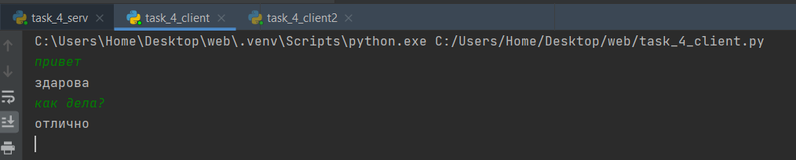

# Первая Лаба

### Цель работы
Овладеть практическими навыками и умениями реализации web-серверов и использования сокетов.

## Ход работы

### Первое задание - Hello

Реализовать клиентскую и серверную часть приложения. Клиент отсылает серверу
сообщение `Hello, server`. Сообщение должно отразиться на стороне сервера.
Сервер в ответ отсылает клиенту сообщение `Hello, client`. Сообщение должно
отобразиться у клиента. Реализовать с помощью протокола UDP

Код сервера:
``` py title="task_1_server.py" linenums="1"
import socket

# Создаем сокет UDP
s_socket = socket.socket(socket.AF_INET, socket.SOCK_DGRAM)

# Привязываем сокет к адресу и порту
s_address = ('localhost', 12345)
s_socket.bind(s_address)

print('Сервер ожидает сообщения...')

while True:
    # Получаем данные от клиента
    data, c_address = s_socket.recvfrom(1024)
    udata = data.decode()
    print(f'Получено сообщение от {c_address}: ' + udata)

    # Отправляем ответ клиенту
    response = 'Hello, client'
    s_socket.sendto(response.encode(), c_address)
```


Код клиента:

``` py title="task_1_client.py" linenums="1"
import socket

# Создаем сокет UDP
c_socket = socket.socket(socket.AF_INET, socket.SOCK_DGRAM)

# Адрес и порт сервера
s_address = ('localhost', 12345)

# Отправляем сообщение серверу
message = 'Hello, server'
c_socket.sendto(message.encode(), s_address)

# Получаем ответ от сервера
data, s_address = c_socket.recvfrom(1024)
udata = data.decode()
print(f'Получен ответ от сервера: ' + udata)

# Закрываем сокет клиента
c_socket.close()
```


Результат:

``` py title="task_1_server.py" 
Сервер ожидает сообщения...
Получено сообщение от ('127.0.0.1', 56880): Hello, server
```

``` py title="task_1_client.py" 
Получен ответ от сервера: Hello, client
```

### Второе задание - Теорема Пифагора

Реализовать клиентскую и серверную часть приложения. Клиент запрашивает у
сервера выполнение математической операции, параметры, которые вводятся с
клавиатуры. Сервер обрабатывает полученные данные и возвращает результат
клиенту. Теорема Пифагора. Реализовать с помощью протокола TCP.

Код сервера:

``` py title="task_2_server.py" linenums="1"
import socket

# Создаем сокет TCP
s_socket = socket.socket(socket.AF_INET, socket.SOCK_STREAM)

# Привязываем сокет к адресу и порту
s_address = ('127.0.0.1', 12348)
s_socket.bind(s_address)

# Ожидаем соединений клиента
s_socket.listen(1)
print('Сервер ожидает подключения клиента...')

while True:
    # Принимаем соединение от клиента
    c_socket, c_address = s_socket.accept()
    print(f'Подключено клиентом {c_address}')

    try:
        # Получаем параметры от клиента
        a = float(c_socket.recv(1024).decode())
        b = float(c_socket.recv(1024).decode())

        # Выполняем математическую операцию (теорема Пифагора)
        c = (a ** 2 + b ** 2) ** 0.5

        # Отправляем результат клиенту
        c_socket.send(str(c).encode())
    except ValueError:
        print('Ошибка: Некорректные данные от клиента.')
    finally:
        # Закрываем соединение с клиентом
        c_socket.close()
```

Код клиента:

``` py title="task_2_client.py" linenums="1"
import socket

# Создаем сокет TCP
c_socket = socket.socket(socket.AF_INET, socket.SOCK_STREAM)

# Адрес и порт сервера
s_address = ('127.0.0.1', 12348)

# Подключаемся к серверу
c_socket.connect(s_address)

try:
    # Вводим параметры с клавиатуры
    a = float(input('Введите значение a: '))
    b = float(input('Введите значение b: '))

    # Отправляем параметры серверу
    c_socket.send(str(a).encode())
    c_socket.send(str(b).encode())

    # Получаем результат от сервера
    result = c_socket.recv(1024).decode()
    print(f'Результат: {result}')
except ValueError:
    print('Ошибка: Введите корректные числовые значения для a и b.')
finally:
    # Закрываем соединение с сервером
    c_socket.close()
```

Результат:

``` py title="task_2_server.py" 
Сервер ожидает подключения клиента...
Подключено клиентом ('127.0.0.1', 62646)
```

``` py title="task_2_client.py" 
Введите значение a: 3
Введите значение b: 4
Результат: 5.0
```

### Третье задание - HTML 

Реализовать серверную часть приложения. Клиент подключается к серверу. В ответ
клиент получает http-сообщение, содержащее html-страницу, которую сервер
подгружает из файла index.html.

Код сервера:

``` py title="task_3_server.py" linenums="1"
import socket

# Функция для чтения содержимого файла
def read_file(filename):
    try:
        with open(filename, 'r', encoding='utf-8') as file:
            return file.read()
    except FileNotFoundError:
        return "Файл не найден"


# Создаем сокет TCP
s_socket = socket.socket(socket.AF_INET, socket.SOCK_STREAM)

# Привязываем сокет к адресу и порту
s_address = ('localhost', 12345)
s_socket.bind(s_address)

# Ожидаем соединения клиента
s_socket.listen(1)
print('Сервер ожидает подключения клиента...')

while True:
    # Принимаем соединение от клиента
    c_socket, c_address = s_socket.accept()
    print(f'Подключено клиентом {c_address}')

    try:
        # Читаем содержимое файла index.html
        html_content = read_file('index.html')
        c_socket.recv(1024)
        # Создаем HTTP-ответ с HTML-страницей
        http_response = f"HTTP/1.1 200 OK\r\nContent-Length: {len(html_content)}\r\n\r\n{html_content}"

        # Отправляем HTTP-ответ клиенту
        c_socket.sendall(http_response.encode())
    except Exception as e:
        print(f'Ошибка: {str(e)}')
    finally:
        # Закрываем соединение с клиентом
        c_socket.close()

```

Код клиента:

``` py title="task_3_client.py" linenums="1"
import socket

# Создаем сокет TCP
c_socket = socket.socket(socket.AF_INET, socket.SOCK_STREAM)

# Адрес и порт сервера
s_address = ('localhost', 12345)

# Подключаемся к серверу
c_socket.connect(s_address)

try:
    # Отправляем HTTP-запрос
    http_request = 'GET / HTTP/1.1\r\nHost: localhost\r\n\r\n'
    c_socket.sendall(http_request.encode())

    # Получаем и выводим ответ от сервера
    response = ''
    while True:
        data = c_socket.recv(1024)
        if not data:
            break
        response += data.decode()

    # Отделяем тело HTTP-ответа от заголовков
    body_start = response.find('\r\n\r\n') + 4
    http_body = response[body_start:]

    print(http_body)
except Exception as e:
    print(f'Ошибка при получении HTML-страницы: {str(e)}')
finally:
    # Закрываем сокет клиента
    c_socket.close()
```

Код HTML-страницы:
``` html title="index.html" linenums="1"
<!DOCTYPE html>
<html>
<head>
    <title>HTML-page</title>
</head>
<body>
    <h1>Welcome</h1>
</body>
</html>
```

Результат:
``` html title="task_3_client" linenums="1"
<!DOCTYPE html>
<html>
<head>
    <title>HTML-page</title>
</head>
<body>
    <h1>Welcome</h1>
</body>
</html>
```

### Четвертое задание - Чат

Реализовать двухпользовательский или многопользовательский чат.
Реализовать с помощью протокола TCP – 100% баллов, с помощью UDP – 80%.
Обязательно использовать библиотеку threading.
Для реализации с помощью UDP, thearding использовать для получения
сообщений у клиента.
Для применения с TCP необходимо запускать клиентские подключения И прием
и отправку сообщений всем юзерам на сервере

Код сервера:

``` py title="task_4_server.py" linenums="1"
import socket
import threading

# Список для хранения подключенных клиентов
clients = []

# Создаем сокет TCP
s_socket = socket.socket(socket.AF_INET, socket.SOCK_STREAM)

# Привязываем сокет к адресу и порту
s_address = ('localhost', 12345)
s_socket.bind(s_address)

# Ожидаем соединений клиентов
s_socket.listen(5)
print('Сервер ожидает подключения клиентов...')

# Функция для обработки клиентских сообщений
def handle_client(c_socket):
    while True:
        try:
            message = c_socket.recv(1024).decode()
            if not message:
                # Если сообщение пустое, клиент отключился, удаляем его из списка
                clients.remove(c_socket)
                c_socket.close()
                break
            print(f'Получено сообщение: {message}')
            # Отправляем сообщение всем клиентам, кроме отправителя
            for client in clients:
                if client != c_socket:
                    client.send(message.encode())
        except Exception as e:
            print(f'Ошибка при обработке сообщения: {str(e)}')

while True:
    # Принимаем соединение от клиента
    c_socket, c_address = s_socket.accept()
    print(f'Подключен клиент: {c_address}')

    # Добавляем клиента в список
    clients.append(c_socket)

    # Запускаем поток для обработки сообщений клиента
    client_thread = threading.Thread(target=handle_client, args=(c_socket,))
    client_thread.start()
```

Код клиентов:
``` py title="task_4_client.py" linenums="1"
import socket
import threading

# Функция для отправки сообщений
def send_message():
    while True:
        message = input()
        c_socket.send(message.encode())

# Создаем сокет TCP
c_socket = socket.socket(socket.AF_INET, socket.SOCK_STREAM)

# Адрес и порт сервера
s_address = ('localhost', 12345)

# Подключаемся к серверу
c_socket.connect(s_address)

# Запускаем поток для отправки сообщений
send_thread = threading.Thread(target=send_message)
send_thread.start()

while True:
    try:
        # Получаем сообщения от сервера
        message = c_socket.recv(1024).decode()
        print(message)
    except Exception as e:
        print(f'Ошибка при получении сообщения: {str(e)}')
        break

# Закрываем сокет клиента
c_socket.close()
```

Результат:

Сервер:


Клиент 1:


Клиент 2:


## Вывод
В данной лабораторной работе я научился использовать сокеты и реализовывать web-серверы