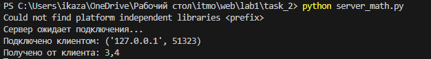
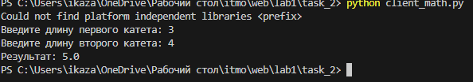

# Задание 2

Реализовать клиентскую и серверную часть приложения. Клиент запрашивает у сервера выполнение математической операции, параметры, которые вводятся с клавиатуры. Сервер обрабатывает полученные данные и возвращает результат клиенту.

Вариант: теорема Пифагора.

Использовать библиотеку socket.

Реализовать с помощью протокола TCP.

# Выполнение

### Cерверная часть

```python
import socket

def calculate_hypotenuse(a, b):
    return (a**2 + b**2)**0.5

def start_server():
    server_socket = socket.socket(socket.AF_INET, socket.SOCK_STREAM)

    server_address = ('localhost', 12124)
    server_socket.bind(server_address)

    server_socket.listen(1)
    print("Сервер ожидает подключения...")

    while True:
        client_socket, client_address = server_socket.accept()
        print(f"Подключено клиентом: {client_address}")

        data = client_socket.recv(1024).decode('utf-8')
        print(f"Получено от клиента: {data}")

        a, b = map(int, data.split(','))

        # Выполняем операцию (теорема Пифагора)
        result = calculate_hypotenuse(a, b)

        client_socket.send(str(result).encode('utf-8'))
        client_socket.close()

if __name__ == "__main__":
    start_server()

```

Данный код реализует простой TCP-сервер на Python с использованием модуля socket. Сервер устанавливает соединение на локальном хосте и порту 12124, ожидая подключения клиентов. При подключении клиен
та сервер принимает данные, вычисляет гипотенузу по теореме Пифагора для пары чисел, отправляет результат обратно клиенту и закрывает соединение. Этот процесс повторяется для каждого нового подключения.

### Клиентская часть

```python
import socket

def start_client():
    client_socket = socket.socket(socket.AF_INET, socket.SOCK_STREAM)
    server_address = ('localhost', 12124)
    client_socket.connect(server_address)
    
    a = int(input("Введите длину первого катета: "))
    b = int(input("Введите длину второго катета: "))
    
    data = f"{a},{b}"
    client_socket.send(data.encode('utf-8'))
    
    result = client_socket.recv(1024).decode('utf-8')
    print(f"Результат: {result}")
    
    client_socket.close()

if __name__ == "__main__":
    start_client()

```

Данный код представляет собой простого TCP-клиента на Python, который устанавливает соединение с сервером по локальному адресу localhost и порту 12124. Клиент запрашивает у пользователя значения длин двух катетов для вычисления гипотенузы по теореме Пифагора. После получения значений катетов, они отправляются серверу в формате "a,b". Затем клиент ожидает ответ о
т сервера, принимает его и выводит результат вычислений гипотенузы в консоль. После завершения обмена данными клиент закрывает соединение.



