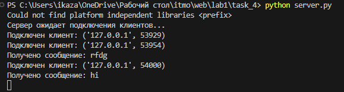
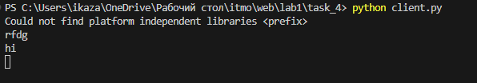
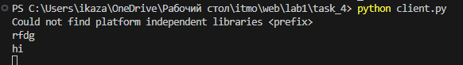
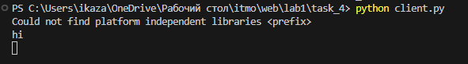

# Задание 4
Реализовать многопользовательский чат.

Использовать библиотеки socket, threading.

Использовать протокол TCP.

# Выполнение
### Серверная часть
```python
import socket
import threading

clients = []
s_socket = socket.socket(socket.AF_INET, socket.SOCK_STREAM)
s_address = ('localhost', 12413)
s_socket.bind(s_address)
s_socket.listen(5)
print('Сервер ожидает подключения клиентов...')

def handle_client(c_socket):
    while True:
        try:
            message = c_socket.recv(1024).decode()
            if not message:
                clients.remove(c_socket)
                c_socket.close()
                break
            print(f'Получено сообщение: {message}')
            for client in clients:
                if client != c_socket:
                    client.send(message.encode())
        except Exception as e:
            print(f'Ошибка при обработке сообщения: {str(e)}')

while True:
    c_socket, c_address = s_socket.accept()
    print(f'Подключен клиент: {c_address}')
    clients.append(c_socket)
    client_thread = threading.Thread(target=handle_client, args=(c_socket,))
    client_thread.start()
```

Данный код представляет собой многопоточный TCP-сервер на языке Python с использованием модулей socket и threading. Сервер устанавливает соединение на локальном хосте и порту 12413, ожидая подключения клиентов. При подключении к
лиента создается новый поток обработки для каждого клиента, что позволяет серверу обрабатывать несколько подключений одновременно.

### Клиентская часть
```python
import socket
import threading

def send_message():
    while True:
        message = input()
        c_socket.send(message.encode())

c_socket = socket.socket(socket.AF_INET, socket.SOCK_STREAM)
s_address = ('localhost', 12413)
c_socket.connect(s_address)
send_thread = threading.Thread(target=send_message)
send_thread.start()

while True:
    try:
        message = c_socket.recv(1024).decode()
        print(message)
    except Exception as e:
        print(f'Ошибка при получении сообщения: {str(e)}')
        break

c_socket.close()
```


Этот код представляет собой простого TCP-клиента на языке Python с использованием модулей socket и threading. Клиент устанавливает соединение с сервером на локальном хосте и порту 12413, после чего создает отдельный поток для отправки сообщений серверу. В основном потоке клиента происходит прием сообщений от сервера и их вывод в консоль.

Функция send_message() выполняется в отдельном потоке и ожидает ввода сообщения от пользователя. После ввода сообщения оно отправляется серверу через клиентский сокет. Основной поток клиента ожидает получения сообщений от сервера и выводит их в консоль, пока соединение с сервером не будет разорвано или не возникнет ошибка при приеме сообщения. После этого клиент закрывает соединение с сервером. Этот код позволяет клиенту отправлять и принимать сообщения через серверное соединение в многопоточном режиме.

### Пример работы программы





