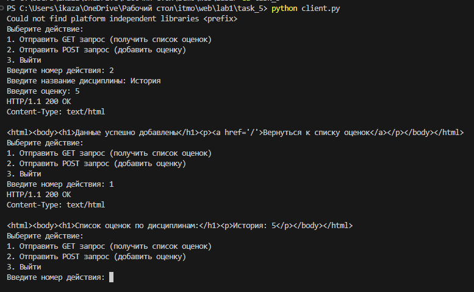
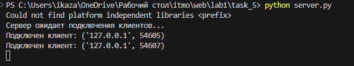

# Задание 5
Необходимо написать простой web-сервер для обработки GET и POST http-запросов средствами Python и библиотеки socket.

Задание: сделать сервер, который может:

* Принять и записать информацию о дисциплине и оценке по дисциплине.
* Отдать информацию обо всех оценках по дисциплине в виде html-страницы.

# Выполнение
### Серверная часть
```python
import socket
import threading

class WebServer:
    def __init__(self, host, port):
        self.host = host
        self.port = port
        self.server_socket = socket.socket(socket.AF_INET, socket.SOCK_STREAM)
        self.disciplines_data = {}
    
    def start(self):
        self.server_socket.bind((self.host, self.port))
        self.server_socket.listen(5)
        print('Сервер ожидает подключения клиентов...')
        
        while True:
            client_socket, client_address = self.server_socket.accept()
            print(f'Подключен клиент: {client_address}')
            client_thread = threading.Thread(target=self.handle_client, args=(client_socket,))
            client_thread.start()
    
    def handle_client(self, client_socket):
        try:
            request_data = client_socket.recv(1024).decode('utf-8')
            
            if "GET /" in request_data:
                self.handle_get_request(client_socket)
            elif "POST /" in request_data:
                request_body = request_data.split('\r\n\r\n')[1]
                self.handle_post_request(client_socket, request_body)
        except Exception as e:
            print(f'Ошибка при обработке запроса: {str(e)}')
        finally:
            client_socket.close()
    
    def handle_get_request(self, client_socket):
        response = "HTTP/1.1 200 OK\r\nContent-Type: text/html\r\n\r\n"
        response += "<html><body>"
        response += "<h1>Список оценок по дисциплинам:</h1>"
        for discipline, grades in self.disciplines_data.items():
            response += f"<p>{discipline}: {', '.join(grades)}</p>"
        response += "</body></html>"
        client_socket.send(response.encode('utf-8'))
    
    def handle_post_request(self, client_socket, data):
        try:
            data = data.split('&')
            discipline = data[0].split('=')[1]
            grade = data[1].split('=')[1]
            if discipline in self.disciplines_data:
                self.disciplines_data[discipline].append(grade)
            else:
                self.disciplines_data[discipline] = [grade]
            response = "HTTP/1.1 200 OK\r\nContent-Type: text/html\r\n\r\n"
            response += "<html><body>"
            response += "<h1>Данные успешно добавлены</h1>"
            response += "<p><a href='/'>Вернуться к списку оценок</a></p>"
            response += "</body></html>"
            client_socket.send(response.encode('utf-8'))
        except Exception as e:
            print(f'Ошибка при обработке POST запроса: {str(e)}')
            response = "HTTP/1.1 500 Internal Server Error\r\n\r\n"
            client_socket.send(response.encode('utf-8'))

if __name__ == "__main__":
    web_server = WebServer('localhost', 12413)
    web_server.start()
```

Данный код представляет собой простой веб-сервер на языке Python с использованием модулей socket, threading и класса WebServer. Сервер устанавливает соединение на локальном хосте и порту 12413, ожидая подключения клиентов. При подключении клиента создается отдельный поток для обработки запроса клиента.

Класс WebServer содержит методы для обработки GET и POST запросов. GET запрос выводит список оценок по дисциплинам, а POST за
прос добавляет новые данные об оценках. При обработке POST запроса сервер извлекает данные из тела запроса, парсит их и добавляет в
словарь disciplines_data, представляющий информацию о дисциплинах и оценках. В ответ на запросы сервер отправляет соответствующие HTTP-ответы, 
подтверждающие успешное выполнение операции или сообщающие об ошибке.

### Клиентская часть

```python
import socket

def send_get_request():
    client_socket = socket.socket(socket.AF_INET, socket.SOCK_STREAM)
    server_address = ('localhost', 12413)
    
    try:
        client_socket.connect(server_address)
        
        request = "GET / HTTP/1.1\r\nHost: localhost\r\n\r\n"
        client_socket.send(request.encode('utf-8'))
        
        response = client_socket.recv(1024).decode('utf-8')
        print(response)
    except Exception as e:
        print(f'Ошибка при отправке GET запроса: {str(e)}')
    finally:
        client_socket.close()

def send_post_request(discipline, grade):
    client_socket = socket.socket(socket.AF_INET, socket.SOCK_STREAM)
    server_address = ('localhost', 12413)
    
    try:
        client_socket.connect(server_address)
        
        data = f"discipline={discipline}&grade={grade}"
        request = f"POST / HTTP/1.1\r\nHost: localhost\r\nContent-Length: {len(data)}\r\n\r\n{data}"
        client_socket.send(request.encode('utf-8'))
        
        response = client_socket.recv(1024).decode('utf-8')
        print(response)
    except Exception as e:
        print(f'Ошибка при отправке POST запроса: {str(e)}')
    finally:
        client_socket.close()

if __name__ == "__main__":
    while True:
        print("Выберите действие:")
        print("1. Отправить GET запрос (получить список оценок)")
        print("2. Отправить POST запрос (добавить оценку)")
        print("3. Выйти")
        
        choice = input("Введите номер действия: ")
        
        if choice == "1":
            send_get_request()
        elif choice == "2":
            discipline = input("Введите название дисциплины: ")
            grade = input("Введите оценку: ")
            send_post_request(discipline, grade)
        elif choice == "3":
            break
        else:
            print("Неверный выбор. Попробуйте снова.")
```

Данный код представляет собой простую консольную программу на языке Python для отправки GET и POST запросов к веб-серверу через сокеты. Пользователю предлагается выбрать действие: отправить GET запрос для получения списка оценок или отправить POST запрос для добавления новой оценки. При выборе действия программа вызывает соответствующие функции send_get_request() или send_post_request(), которые устанавливают соединение с сервером, формируют и отправляют HTTP запросы, а затем выводят полученные ответы в консоль. Если пользователь выбирает выхо
д из программы, цикл завершается. Этот код предоставляет простой интерфейс для взаимодействия с веб-сервером через консольные команды.



