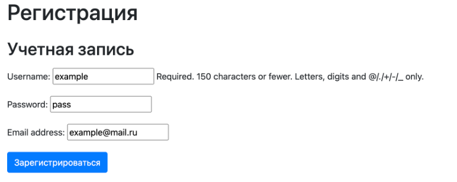
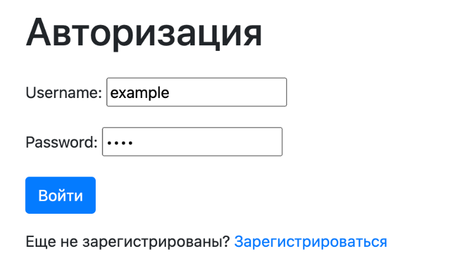
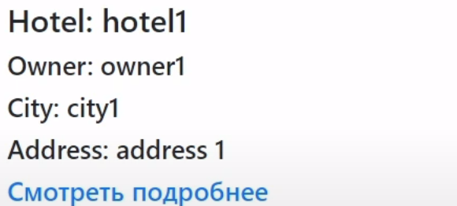
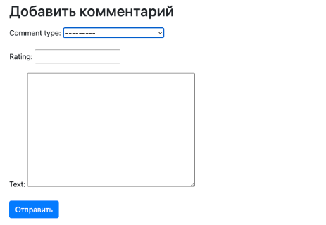
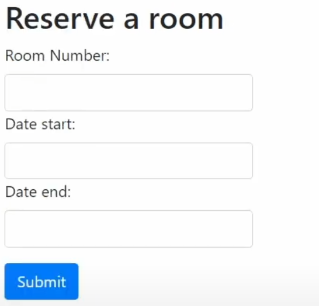

# Пример работы
Запустим программу с помощью python3 manage.py runserver. Перейдя по ссылке 127.0.0.1:8000, мы попадаем на главную страницу, где предлагается зарегистрироваться или войти в систему.

Зарегистрируем нового пользователя:

Теперь можно войти в систему:

После входа пользователь попадает на страницу с отелями:

Перейдём к профилю пользователя:

Удалим профиль пользователя:

