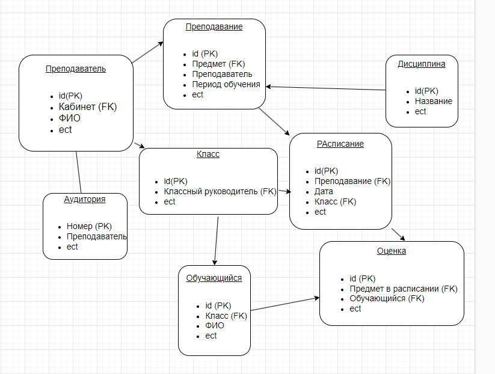

Схема базы данных
Ниже представлена схема базы данных

# Описание сущностей
## Преподаватель:

* id (PK): Уникальный идентификатор преподавателя
* ФИО: Фамилия, имя, отчество преподавателя
* Предмет (FK): Ссылка на сущность "Предмет"
* Дисциплина: Название дисциплины, которую преподает преподаватель
* Период обучения: Период, в течение которого преподаватель преподает дисциплину
## Предмет:

* id (PK): Уникальный идентификатор предмета
* Название: Название предмета
## Кабинет:

* id (PK): Уникальный идентификатор кабинета
* Номер: Номер кабинета
* Преподаватель (FK): Ссылка на сущность "Преподаватель"
## Расписание:

* id (PK): Уникальный идентификатор записи в расписании
* Дата: Дата занятия
* Класс (FK): Ссылка на сущность "Класс"
* Предмет в расписании (FK): Ссылка на сущность "Предмет"
* Преподаватель (FK): Ссылка на сущность "Преподаватель"
* Аудитория: Номер аудитории, где проводится занятие
## Класс:

* id (PK): Уникальный идентификатор класса
* Классный руководитель (FK): Ссылка на сущность "Преподаватель"
## Обучающийся:

* id (PK): Уникальный идентификатор обучающегося
* Класс (FK): Ссылка на сущность "Класс"
* ФИО: Фамилия, имя, отчество обучающегося
## Оценка:

* id (PK): Уникальный идентификатор оценки
* Обучающийся (FK): Ссылка на сущность "Обучающийся"
* Предмет в расписании (FK): Ссылка на сущность "Предмет"
* Оценка: Значение оценки
## Связи между сущностями:

### Преподаватель:
* 1:N связь с сущностью "Предмет"
* 1:N связь с сущностью "Кабинет"
* N:N связь с сущностью "Расписание"
### Предмет:
* 1:N связь с сущностью "Расписание"
### Кабинет:
* 1:N связь с сущностью "Расписание"
### Расписание:
* 1:N связь с сущностью "Оценка"
### Класс:
* 1:N связь с сущностью "Обучающийся"
* 1:N связь с сущностью "Расписание"
### Обучающийся:
* 1:N связь с сущностью "Оценка"