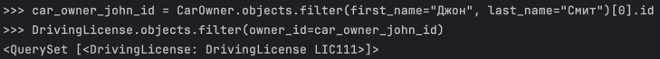
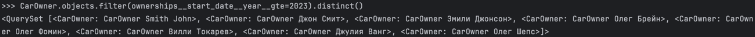

# Задание 2

# Условие
1. Где это необходимо, добавьте `related_name` к полям модели.
2. Выведите все машины марки "Toyota" (или любой другой марки, которая у вас есть).
3. Найдите всех водителей с именем "Олег" (или любым другим именем на ваше усмотрение).
4. Взяв любого случайного владельца, получите его ID, а затем по этому ID получите экземпляр удостоверения в виде объекта модели (можно в 2 запроса).
5. Выведите всех владельцев красных машин (или любого другого цвета, который у вас присутствует).
6. Найдите всех владельцев, чей год владения машиной начинается с 2010 (или любой другой год, который присутствует у вас в базе).

# Подготовка
Давайте добавим атрибут related_name к полям ForeignKey в моделях. Также определим метод __str__ для каждого класса для корректного отображения объектов. В результате, файл models.py будет выглядеть так:

```python
from django.contrib.auth.models import AbstractUser
from django.db import models


class Car(models.Model):
    registration_number = models.CharField(max_length=15)
    brand = models.CharField(max_length=20)
    model = models.CharField(max_length=20)
    color = models.CharField(max_length=30)

    def __str__(self):
        return f"Car {self.registration_number}"


class CarOwner(models.Model):
    last_name = models.CharField(max_length=30)
    first_name = models.CharField(max_length=30)
    birth_date = models.DateTimeField()
    cars = models.ManyToManyField(
        Car,
        through="Ownership",
        through_fields=("owner", "car"),
        related_name="owners"
    )

    def __str__(self):
        return f"Car {self.first_name} {self.last_name}"


class Ownership(models.Model):
    owner = models.ForeignKey(CarOwner, on_delete=models.CASCADE, related_name="ownerships", null=True)
    car = models.ForeignKey(Car, on_delete=models.CASCADE, related_name="ownerships", null=True)
    start_date = models.DateTimeField()
    end_date = models.DateTimeField(null=True)

    def __str__(self):
        return f"Ownership {self.car} of {self.owner}"


class DrivingLicense(models.Model):
    owner = models.ForeignKey(CarOwner, on_delete=models.CASCADE, related_name="licenses")
    license_number = models.CharField(max_length=10)
    type = models.CharField(max_length=10)
    issue_date = models.DateTimeField()

    def __str__(self):
        return f"DrivingLicense {self.license_number}"


class CustomUser(AbstractUser):
    passport_number = models.CharField(max_length=20)
    home_address = models.CharField(max_length=100)
    nationality = models.CharField(max_length=30)
```
Теперь у каждого класса есть метод __str__, который возвращает строковое представление объекта, а также определено имя обратной связи для ForeignKey с помощью атрибута related_name.

# Запросы

## Запрос 1

Выведем все машины марки Toyota:

```
Car.objects.filter(brand="Toyota")
``` 

Результат:


## Запрос 2

Выведем всех водителей с именем Олег


```
CarOwner.objects.filter(first_name="Олег")
``` 

Результат:


## Запрос 3

Найдём водительское удостоверение человека с именем Джон Смит. Для этого сначала определим его id, а далее по этому id найдём его удостоверение:

```
car_owner_john_id = CarOwner.objects.filter(first_name="Джон", last_name="Смит")[0].id
DrivingLicense.objects.filter(owner_id=car_owner_john_id)
``` 

Результат:



## Запрос 4

Выведем всех владельцев красных машин:

```
CarOwner.objects.filter(cars__color='Red').distinct()
``` 

Результат:


## Запрос 5

Выведем всех владельцев, чей год владения машиной начинается с 2023:

```
CarOwner.objects.filter(ownerships__start_date__year__gte=2023).distinct()
``` 

Результат:


