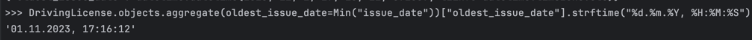
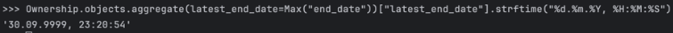
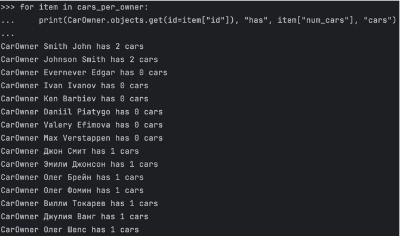
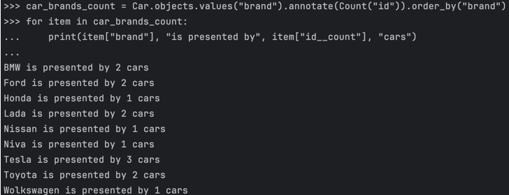
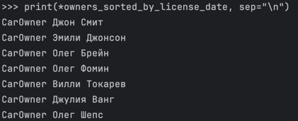

# Задание 3

# Условие
Необходимо реализовать следующие запросы c применением описанных методов:
1. Вывод даты выдачи самого старшего водительского удостоверения
2. Укажите самую позднюю дату владения машиной, имеющую какую-то из существующих моделей в вашей базе
3. Выведите количество машин для каждого водителя
4. Подсчитайте количество машин каждой марки
5. Отсортируйте всех автовладельцев по дате выдачи удостоверения (примечание: чтобы не выводить несколько раз одни и те же таблицы воспользуйтесь методом .distinct())

# Запросы

## Запрос 1

Самое старшее водительское удостоверение — удостоверение с минимальной датой начала:

```
DrivingLicense.objects.aggregate(oldest_issue_date=Min("issue_date"))["oldest_issue_date"].strftime("%d.%m.%Y, %H:%M:%S")
``` 

Результат:



## Запрос 2

Аналогично рассуждая, выведем дату максимального окончания владения автомобилем:

```
Ownership.objects.aggregate(latest_end_date=Max("end_date"))["latest_end_date"].strftime("%d.%m.%Y, %H:%M:%S")
``` 

Результат:



## Запрос 3

Выведем количество машин для каждого автовладельца:

```
cars_per_owner = CarOwner.objects.annotate(num_cars=Count("cars")).values("id", "num_cars")
for item in cars_per_owner:
    print(CarOwner.objects.get(id=item["id"]), "has", item["num_cars"], "cars")
``` 

Результат:



## Запрос 4

Выведем количество машин каждой марки:

```
car_brands_count = Car.objects.values("brand").annotate(Count("id")).order_by("brand")
for item in car_brands_count:
    print(item["brand"], "is presented by", item["id__count"], "cars")
``` 

Результат:




## Запрос 5

Отсортируем автовладельцев по дате выдачи удостоверения (для определённости будем брать самое ранее). Стоит отметить, что в представленной базе данных не у всех есть водительское удостоверение, поэтому предварительно нужно отфильтровать водителей без лицензии:
```
owners_sorted_by_license_date = CarOwner.objects.filter(
    licenses__isnull=False
).annotate(
    earliest_license_date=Min("licenses__issue_date")
).order_by(
    "earliest_license_date"
)
print(*owners_sorted_by_license_date, sep="\n")
``` 

Результат:


