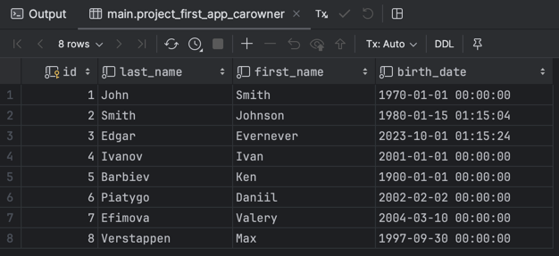
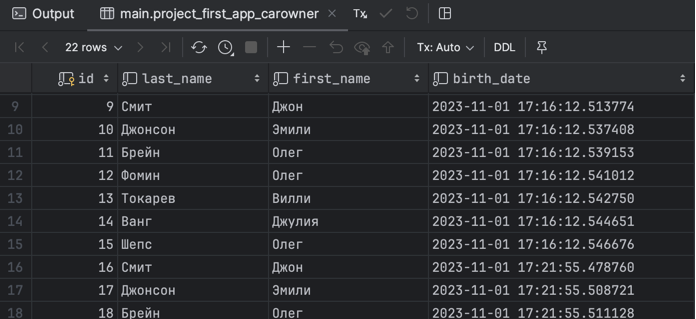

# Задание 1

# Условие
Воспользуйтесь проектом из практики 2.1 и напишите запрос на создание 6-7 новых автовладельцев и 5-6 автомобилей, каждому автовладельцу назначьте удостоверение и от 1 до 3 автомобилей. Задание можете выполнить либо в интерактивном режиме интерпретатора, либо в отдельном python-файле. Результатом должны стать запросы и отображение созданных объектов.

# Выполнение
Для создания объектов воспользуемся менеджером objects, чтобы сразу создать запись в базе данных. Воспользуемся методом create(). Создадим скрипт в директории проекта scripts/script1.py:

```python
from project_first_app.models import Car, CarOwner, Ownership, DrivingLicense
from django.utils import timezone

# Создание автовладельцев
owner1 = CarOwner.objects.create(last_name="Смит", first_name="Джон", birth_date=timezone.now())
owner2 = CarOwner.objects.create(last_name="Джонсон", first_name="Эмили", birth_date=timezone.now())
owner3 = CarOwner.objects.create(last_name="Брейн", first_name="Олег", birth_date=timezone.now())
owner4 = CarOwner.objects.create(last_name="Фомин", first_name="Олег", birth_date=timezone.now())
owner5 = CarOwner.objects.create(last_name="Токарев", first_name="Вилли", birth_date=timezone.now())
owner6 = CarOwner.objects.create(last_name="Ванг", first_name="Джулия", birth_date=timezone.now())
owner7 = CarOwner.objects.create(last_name="Шепс", first_name="Олег", birth_date=timezone.now())

# Создание автомобилей
car1 = Car.objects.create(registration_number="AAA111", brand="Toyota", model="Camry", color="White")
car2 = Car.objects.create(registration_number="BBB222", brand="Nissan", model="Altima", color="Black")
car3 = Car.objects.create(registration_number="CCC333", brand="Honda", model="Civic", color="Blue")
car4 = Car.objects.create(registration_number="DDD444", brand="Ford", model="Focus", color="Red")
car5 = Car.objects.create(registration_number="EEE555", brand="BMW", model="M3", color="Silver")

# Создание владений
Ownership.objects.create(owner=owner1, car=car1, start_date=timezone.now())
Ownership.objects.create(owner=owner2, car=car2, start_date=timezone.now())
Ownership.objects.create(owner=owner3, car=car3, start_date=timezone.now())
Ownership.objects.create(owner=owner4, car=car1, start_date=timezone.now())
Ownership.objects.create(owner=owner5, car=car2, start_date=timezone.now())
Ownership.objects.create(owner=owner6, car=car3, start_date=timezone.now())
Ownership.objects.create(owner=owner7, car=car4, start_date=timezone.now())

# Создание водительских удостоверений
DrivingLicense.objects.create(owner=owner1, license_number="LIC111", type="A", issue_date=timezone.now())
DrivingLicense.objects.create(owner=owner2, license_number="LIC222", type="B", issue_date=timezone.now())
DrivingLicense.objects.create(owner=owner3, license_number="LIC333", type="C", issue_date=timezone.now())
DrivingLicense.objects.create(owner=owner4, license_number="LIC444", type="D", issue_date=timezone.now())
DrivingLicense.objects.create(owner=owner5, license_number="LIC555", type="E", issue_date=timezone.now())
DrivingLicense.objects.create(owner=owner6, license_number="LIC666", type="F", issue_date=timezone.now())
DrivingLicense.objects.create(owner=owner7, license_number="LIC777", type="G", issue_date=timezone.now())
```
Далее исполним команды в интерактивном режиме. Для этого создадим следующий bash-скрипт в директории simple_drf_project и исполним его (в качестве аргумента передадим название python-файла, в нашем случае — script1.py):

```bash
#!/bin/bash
cd ../simple_django_web_project/django_project_Piatygo
python3 manage.py shell < scripts/$1
```

# Результат
Покажем результат выполнения скрипта на примере таблицы автовладельцев. Её содержимое до исполнения:




