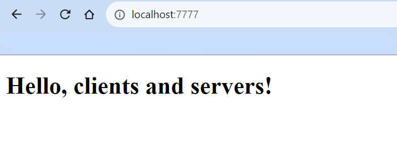

## Задание 3
Реализовать серверную часть приложения. Клиент подключается к серверу. В ответ
клиент получает http-сообщение, содержащее html-страницу, которую сервер
подгружает из файла index.html.


### index.html 
```html
<!DOCTYPE html>
<html lang="en">
<head>
    <meta charset="UTF-8">
    <title>Title</title>
</head>
<body>
    <h1>Hello, clients and servers!</h1>
</body>
</html>
```

### client.py
```python
import socket

sock = socket.socket(socket.AF_INET, socket.SOCK_STREAM)
server_address = ('localhost', 7777)
sock.connect(server_address)

http_request = f"GET / HTTP/1.1\r\nHost: http://{server_address[0]}:{str(server_address[1])}\r\n\r\n"
sock.send(http_request.encode('utf-8'))

while True:
    data = sock.recv(1024)
    if not data:
        break
    print(data.decode("utf-8"))

sock.close()
```
### server.py
```python
import socket

conn = socket.socket(socket.AF_INET, socket.SOCK_STREAM)
server_adress = ('localhost', 7777)

conn.bind(server_adress)
conn.listen(1)
print(f"Server is running on http://{server_adress[0]}:{server_adress[1]}")

def send_response(sock):
    with open('index.html', 'rb') as f:
        content = f.read()
        resp = b"HTTP/1.1 200 OK\r\n Content-Type: text/html\r\n"
        resp += b"Content-Length: " + str(len(content)).encode() + b"\r\n"
        resp += b"\r\n"
        resp += content

        sock.send(resp)

while True:
    sock, adr = conn.accept()
    print(f"Connection from {adr}")
    request = sock.recv(1024)
    print(request.decode())

    send_response(sock)
    sock.close()
```

