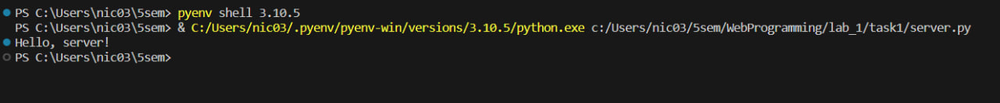
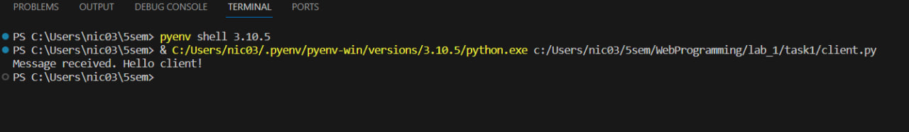

# Задание 1

### Текст задания

>*Реализовать клиентскую и серверную часть приложения. Клиент отсылает серверу*
>*сообщение «Hello, server». Сообщение должно отразиться на стороне сервера.*
>*Сервер в ответ отсылает клиенту сообщение «Hello, client». Сообщение должно*
>*отобразиться у клиента.*
>
>* *Обязательно использовать библиотеку `socket`*
>* *Реализовать с помощью протокола `UDP`*

### Код

``` py title="server.py"
import socket

sock = socket.socket(socket.AF_INET, socket.SOCK_DGRAM)
sock.bind(('127.0.0.1', 49001))


data, adr = sock.recvfrom(1024)
print(data.decode("utf-8"))
response = b"Message received. Hello client!"
sock.sendto(response, adr)

sock.close()

```

``` py title="client.py"
import socket

sock = socket.socket(socket.AF_INET, socket.SOCK_DGRAM)

server_address = ('127.0.0.1', 49001)
message = b"Hello, server!"

sock.sendto(message, server_address)

data, server = sock.recvfrom(1024)
print(data.decode("utf-8"))

sock.close()

```

### Пример работы




