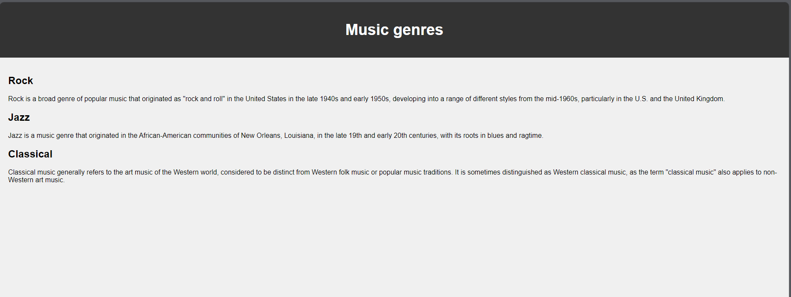

# Задание 3

### Текст задания

>*Реализовать серверную часть приложения. Клиент подключается к серверу. В ответ*
>*клиент получает http-сообщение, содержащее html-страницу, которую сервер*
>*подгружает из файла `index.html`.*

>* *Обязательно использовать библиотеку `socket`*

### Код

``` py title="server.py"
import socket

sock = socket.socket(socket.AF_INET, socket.SOCK_STREAM)
sock.bind(('127.0.0.1', 49001))  
sock.listen(1)

while True:
    conn, adr = sock.accept()
    data = conn.recv(1024).decode("utf-8")
    
    if not data:
        print('Какая-то ошибка')
        break

    with open('C:/Users/nic03/5sem/WebProgramming/lab_1/task3/index.html', 'r') as file:
        html_page = file.read()

    resp = f"HTTP/1.1 200 OK\r\nContent-Type: text/html\r\n\r\n{html_page}\r\n"
    conn.send(resp.encode("utf-8"))

conn.close()

```

``` py title="client.py"
import socket

sock = socket.socket(socket.AF_INET, socket.SOCK_STREAM)
sock.connect(('127.0.0.1', 49001)) 

req = "GET / HTTP/1.1\r\nHost: 127.0.0.1\r\n\r\n"

sock.send(req.encode("utf-8"))
data = sock.recv(1024).decode("utf-8")

print(data)

sock.close()

```
<details>
<summary>Тут хранится index.html</summary>
``` html title="index.html"
<!DOCTYPE html>
<html>
<head>
    <title>Task3</title>
    <style>
        body {
            font-family: Arial, sans-serif;
            background-color: #f0f0f0;
            margin: 0;
            padding: 0;
        }

        header {
            background-color: #333;
            color: #fff;
            text-align: center;
            padding: 20px;
        }

        h1 {
            font-size: 36px;
        }

        main {
            padding: 20px;
        }


    </style>
</head>
<body>
    <header>
        <h1>Music genres</h1>
    </header>

    <main>
        <section id="rock">
            <h2>Rock</h2>
            <p>Rock is a broad genre of popular music that originated as "rock and roll" in the United States in the late 1940s and early 1950s, developing into a range of different styles from the mid-1960s, particularly in the U.S. and the United Kingdom.</p>
        </section>

        <section id="jazz">
            <h2>Jazz</h2>
            <p>Jazz is a music genre that originated in the African-American communities of New Orleans, Louisiana, in the late 19th and early 20th centuries, with its roots in blues and ragtime.</p>
        </section>

        <section id="classical">
            <h2>Classical</h2>
            <p>Classical music generally refers to the art music of the Western world, considered to be distinct from Western folk music or popular music traditions. It is sometimes distinguished as Western classical music, as the term "classical music" also applies to non-Western art music.</p>
        </section>
    </main>

</body>
</html>
```
</details>

### Пример работы


