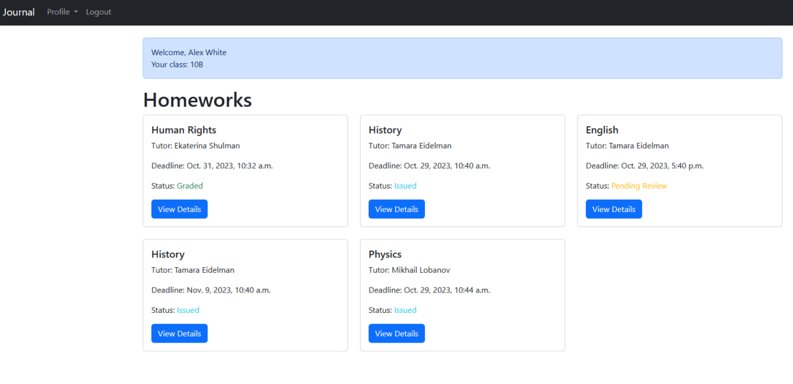

# Описание views.py

views.py у меня реализованы в двух приложениях - `Users` и `Journal`. В `Users` реализована логика с созданием пользователя, а в `Journal` - взаимодействие с остальным интерфейсом. Давайте разберемся подробнее:

## Journal

``` py title="journal/views.py"
from django.shortcuts import render, redirect
from django.views.generic import ListView, DetailView, CreateView, UpdateView, DeleteView, View
from .models import SubmittedHomework, Homework, GradeJournal, Profile
from django.contrib.auth.models import User
from .forms import PostHomework, EditHomework, GradeForm, SubmissionForm
from django.urls import reverse_lazy
from django.utils import timezone
from django.http import Http404


def custom_404(request, exception):
    return render(request, '404.html', status=404)

class HomePage(ListView):
    model = Homework
    template_name = 'home.html'
    context_object_name = 'homework_list'

    def get_queryset(self):
        if self.request.user:
            user = self.request.user
            homework_list = Homework.objects.all()
            if user.profile.role == 'student':
                homework_list = [
                    (homework, SubmittedHomework.objects.filter(student=user, homework=homework).first())
                    for homework in homework_list
                ]
                return homework_list
            
            if user.profile.role == 'teacher':
                homework_list = Homework.objects.filter(tutor=user)
                return homework_list
        else:
            pass
    
class HomeworkPage(DetailView):
    model = Homework
    template_name = 'homework_page.html'
    context_object_name = 'homework'  

    def get_context_data(self, **kwargs):
        context = super().get_context_data(**kwargs)
        submission = SubmittedHomework.objects.filter(student=self.request.user, homework=context['homework']).first()
        context['submission'] = submission  
        return context


class AddHomework(CreateView):
    model = Homework
    form_class = PostHomework
    template_name = 'new_hw.html'

    def get_form_kwargs(self):
        kwargs = super().get_form_kwargs()
        kwargs['user'] = self.request.user  
        return kwargs

    def form_valid(self, form):
        form.instance.tutor = self.request.user
        form.instance.save()

        students = User.objects.filter(profile__role='student')
        for student in students:
            SubmittedHomework.objects.create(student=student, homework=form.instance, status='issued')

        return super().form_valid(form)

class EditHomework(UpdateView):
    model = Homework
    form_class = EditHomework
    template_name = 'upd_hw.html'

    def form_valid(self, form):
        form.instance.status = 'issued'
        return super().form_valid(form)

class DeleteHomework(DeleteView):
    model = Homework
    template_name = 'del_hw.html'
    success_url = reverse_lazy('home')

class SubmitHomework(View):
    template_name = 'homework_page.html'

    def get(self, request, pk):
        homework = Homework.objects.get(pk=pk)
        submission = SubmittedHomework.objects.filter(student=request.user, homework=homework).first()
        if not submission:
            SubmittedHomework.objects.create(student=request.user, homework=homework, status='issued')
        if request.user.profile.role != 'student' or homework.tutor == request.user or submission.submitted == True:
            return render(request, 'error_page.html', {'message': 'You are not allowed to submit this homework.'})

        return render(request, self.template_name, {'homework': homework, 'submission': submission})

    def post(self, request, pk):
        homework = Homework.objects.get(pk=pk)
        submission = SubmittedHomework.objects.filter(student=request.user, homework=homework).first()
        if not submission:
            SubmittedHomework.objects.create(student=request.user, homework=homework, status='issued')
            submission = SubmittedHomework.objects.filter(student=request.user, homework=homework).first()
        
        if request.user.profile.role != 'student' or homework.tutor == request.user or submission.submitted == True:
            return render(request, 'error_page.html', {'message': 'You are not allowed to submit this homework.', 'homework': homework, 'submission': submission})

        if request.method == 'POST':
            form = SubmissionForm(request.POST)
            if form.is_valid():
                homework_body = form.cleaned_data['homework_body']
                
                submission.homework_body = homework_body
                submission.status = 'pending_review'
                submission.submitted_at = timezone.now()
                submission.submitted = True
                submission.save()

                return render(request, 'success_page.html', {'message': 'Homework submitted successfully', 'homework': homework, 'submission': submission})

        return render(request, self.template_name, {'homework': homework, 'submission': submission})


class GradeHomework(View):
    template_name = 'grade_homework.html'

    def get(self, request):
        if request.user.is_authenticated and request.user.profile.role == 'teacher':
           
            class_students = {}
            for student in User.objects.filter(profile__role='student'):
                clas = student.profile.student_class
                if clas not in class_students:
                    class_students[clas] = [student]
                else:
                    class_students[clas].append(student)
            ungraded_homework = SubmittedHomework.objects.filter(grade=0)
            graded_homework = GradeJournal.objects.all()
          
            return render(request, self.template_name, {
                'ungraded_homework': ungraded_homework,
                'graded_homework': graded_homework,
                'class_students': class_students,
            })
        else:
            return render(request, 'error_page.html', {'message': 'You are not allowed to grade homework.'})

class StudentGrades(View):
    template_name = 'student_grades.html'

    def get(self, request, student_id):
        student = User.objects.get(id=student_id)
        student_grades = GradeJournal.objects.filter(student_id=student_id)
        grades_by_subject = {}

        for grade in student_grades:
            subject = grade.subject
            if subject not in grades_by_subject:
                grades_by_subject[subject] = []
            grades_by_subject[subject].append(grade)
        return render(request, self.template_name, {'student': student, 'grades_by_subject': grades_by_subject})

class GradeStudentHomework(View):
    template_name = 'student_homework.html'

    def get(self, request, student_id, submission_id):
        try:
            student = User.objects.get(pk=student_id)
            submission = SubmittedHomework.objects.get(pk=submission_id)

            if request.user.profile.role != 'teacher' or submission.homework.tutor != request.user:
                return render(request, 'error_page.html', {'message': 'You are not allowed to grade this submission.'})
        except User.DoesNotExist:
            raise Http404("Student not found")
        except SubmittedHomework.DoesNotExist:
            raise Http404("Submission not found")

        return render(request, self.template_name, {'student': student, 'submission': submission})

    def post(self, request, student_id, submission_id):
        try:
            student = User.objects.get(pk=student_id)
            submission = SubmittedHomework.objects.get(pk=submission_id)

            if request.user.profile.role != 'teacher' or submission.homework.tutor != request.user:
                return render(request, 'error_page.html', {'message': 'You are not allowed to grade this submission.'})

            if 'grade' in request.POST:
                grade = request.POST['grade']
                submission.grade = grade
                submission.status = 'graded'
                submission.save()

                GradeJournal.objects.create(
                    student=student,
                    subject=submission.homework.subject,
                    grade=grade,
                    homework=submission
                )

        except User.DoesNotExist:
            raise Http404("Student not found")
        except SubmittedHomework.DoesNotExist:
            raise Http404("Submission not found")

        return redirect('grade-homework')


```
Здесь `HomePage` - это главная страница, куда попадает пользователь сразу после того, как залогинится. С нее осуществляется переход на карточки домашних заданий.

#### Пример работы




`HomeworkPage`, `AddHomework`, `EditHomework` и `DeleteHomework` отвечают за создание, просмотр, изменение и удаление карточки домашнего задания со стороны учителя.

#### Пример работы


`SubmitHomework` позволяет ученику прикрепить домашнее задание. При повторном посещении страницы ученик может только посмотреть текст домашнего задания, который он прикрепил. Изменять домашнее задание нельзя.

#### Пример работы


`GradeHomework` и `GradeStudentHomework` позволяет учителю просматривать все доступные ему домашние задания на проверку и выставлять им оценку. Оценку повторно изменять уже нельзя.

#### Пример работы


`StudentGrades` перенаправляет пользователя на электронный дневник. Учителя могут узнать оценки ученика только по своим предметам, а ученики могут посмотреть все свои оценки по всем предметам.

#### Пример работы


Дополнительно реализован переброс пользователя на кастомную страницу ошибки через `custom_404`

#### Пример работы


## User

``` py title="users/views.py"
from django.views import generic
from django.urls import reverse_lazy
from .forms import SignUpForm, EditForm

class UserRegister(generic.CreateView):
    form_class = SignUpForm
    template_name = 'registration/register.html'
    success_url = reverse_lazy('login')

class UserEditing(generic.UpdateView):
    form_class = EditForm
    template_name = 'registration/edit.html'
    success_url = reverse_lazy('home')

    def get_object(self):
        return self.request.user
    
```

Здесь использованы встроенные в Django представления о создании и изменении личных данных пользователя

#### Пример работы


