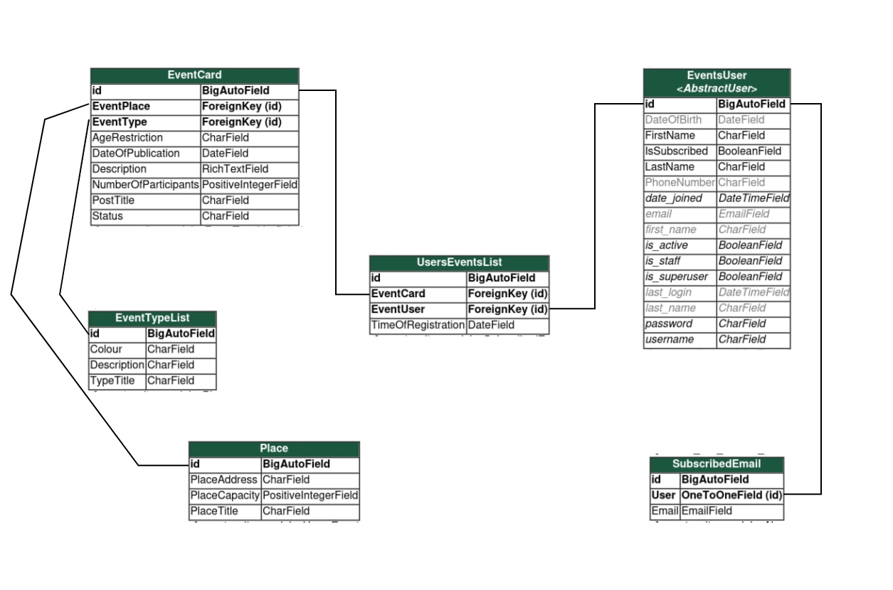

## Описание предметной области

У меня индивидуальный вариант, поэтому я решил создать сайт, на котором пользователи могут зарегистрироваться на разные мероприятия. Пользователь представлен абстрактным классом (`EventsUser`), который связан со встроенной моделью User. Также при регистрации он может указать почту, телефон и свой возраст.

Все мероприятия (`EventCard`) собраны на главной странице и имеют название, описание, тип (например, лекция или концерт), дату проведения, возрастное ограничение и максимальное количество мест. Список мероприятий представлен отдельной моделью (`EventTypeList`).

Мероприятия проходят в разных местах (`Place`), у которых есть название, адрес и вместимость. На мероприятие не может зарегистрироваться больше людей, чем может вмещать в себя площадка.

Также для пользователя действуют дополнительные ограничения. Он не может зарегистрироваться на мероприятие, если не проходит по возрасту, а также если мероприятие отменено или уже прошло.

Дополнительно пользователь в лк может поставить галочку, чтобы получать рассылку на почту. Почты также собираются в отдельной модели (`SubscribedEmail`).



## Реализация в django

В файле `models.py` представлены все модели, опсианные выше:

``` py title="models.py"
class EventsUser(AbstractUser): # Класс пользователя
    LastName = models.CharField(null=False, max_length=30)
    FirstName = models.CharField(null=False, max_length=30)
    DateOfBirth = models.DateField(null=True, blank=True)
    PhoneNumber = models.CharField(null=True, max_length=30, blank=True)
    IsSubscribed = models.BooleanField(default=False)

    def __str__(self):
        return f"user {self.LastName} {self.FirstName}"

class EventCard(models.Model): # Класс карточки мероприятия
    PostTitle = models.CharField(null=False, max_length=70)
    EventType = models.ForeignKey('EventTypeList', null=False, on_delete=models.CASCADE)
    Description = RichTextField(null=False)
    DateOfEvent = models.DateField(null=False, default=timezone.now)
    EventPlace = models.ForeignKey('Place', null=False, on_delete=models.CASCADE)
    NumberOfParticipants = models.PositiveIntegerField(null=False) 
    restictions = (
        ('18', '18+'),
        ('16', '16+'),
        ('12', '12+'),
        ('0', 'no age restriction'),
    )
    AgeRestriction = models.CharField(max_length=20, choices=restictions)
    statuses = (
        ('OPENED', 'opened'),
        ('CANCELED', 'canceled'),
        ('CLOSED', 'closed'),
    )
    Status = models.CharField(max_length=20, choices=statuses)
    
    def __str__(self):
        return self.PostTitle
    
    def clean(self):
        if self.NumberOfParticipants > self.EventPlace.PlaceCapacity:
            raise ValidationError("Number of participants can't exceed place capacity.")

class EventTypeList(models.Model): # Список типов мероприятий
    TypeTitle = models.CharField(null=False, max_length=20)
    Description = models.CharField(null=False, max_length=150)
    Colour = models.CharField(null=False, max_length=7)
    
    def __str__(self):
        return self.TypeTitle
    
class Place(models.Model): # Список мест для мероприятий
    PlaceTitle = models.CharField(null=False, max_length=30)
    PlaceAddress = models.CharField(null=False, max_length=70)
    PlaceCapacity = models.PositiveIntegerField(null=False)
    
    def __str__(self):
        return self.PlaceTitle
    
class UsersEventsList(models.Model): # Связь пользователь-мероприятие
    EventUser = models.ForeignKey('EventsUser', null=False, on_delete=models.CASCADE)
    EventCard = models.ForeignKey('EventCard', null=False, on_delete=models.CASCADE, related_name='events_users_list')
    TimeOfRegistration = models.DateField(null=False, default=timezone.now)
    
    class Meta:
        unique_together = ('EventUser', 'EventCard')
        
    def __str__(self):
        return f"{self.EventUser} {self.EventCard}"
    
    def clean(self):
        if self.EventCard.NumberOfParticipants <= self.EventCard.events_users_list.count():
            raise ValidationError("Registration is closed due to lack of available places")

    def save(self, *args, **kwargs):
        self.clean()
        super().save(*args, **kwargs)
    
class SubscribedEmail(models.Model): # Список пользователей, которые подписались на рассылку
    User = models.OneToOneField('EventsUser', on_delete=models.CASCADE)
    Email = models.EmailField(unique=True)
    
    def __str__(self):
        return self.Email
```

### Ограничения

Дополнительно я задал несколько ограничений:

* Ограничение на возможность создать мероприятие, когда администратор планирует больше людей, чем вмещает площадка
* Ограничение на возможность регистрироваться, когда закончились места на мероприятие
* Возможность регистрироваться каждому пользователю только один раз на каждое из мероприятий