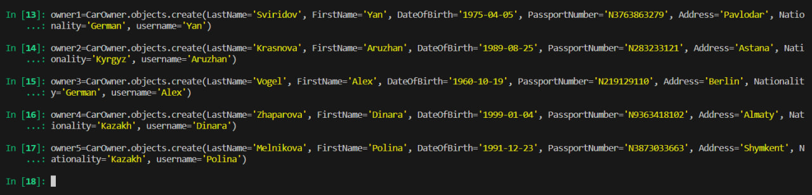
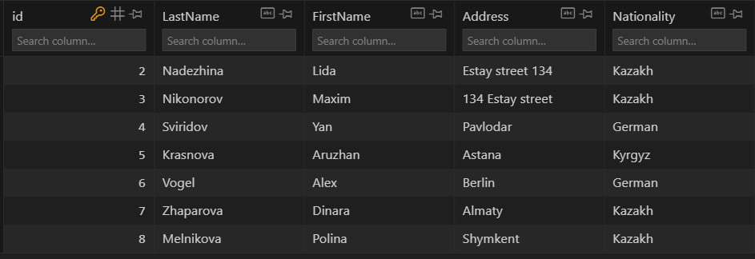
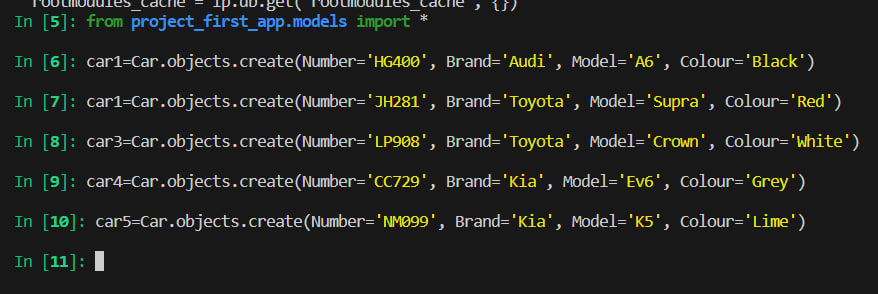
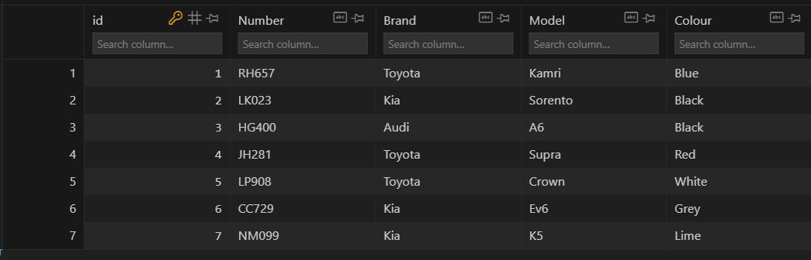
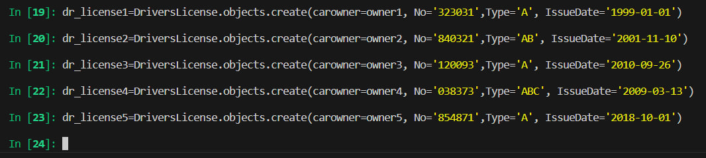
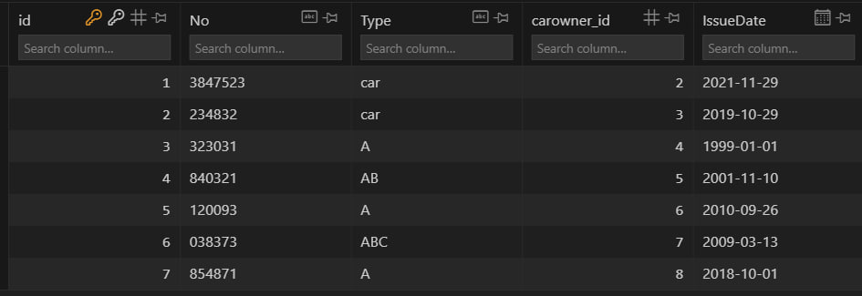
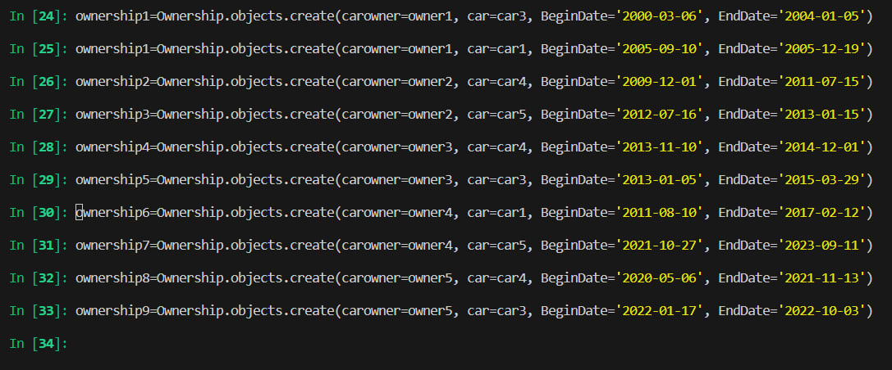

# Первая часть практической работы
## Задание 

>Напишите запрос на создание 6-7 новых автовладельцев и 5-6 автомобилей, каждому автовладельцу назначьте удостоверение и от 1 до 3 автомобилей. Задание можете выполнить либо в интерактивном режиме интерпретатора, либо в отдельном python-файле. Результатом должны стать запросы и отображение созданных объектов.

## Выполнение

Я вошел в интерактивный режим интерпретатора и добавил пять новых автовладельцев, а также пять автомобилей.

### Новые автовладельцы:

### Новые авто:

Далее осталось привязать удостоверения к водителям. Дополнительно я также связал каждого автомобилиста с двумя машинами.

### Водительские удостоверения:

### Связь авто и водителей:

На этом выполнение первого пункта закончено. 