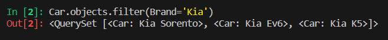
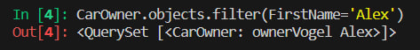
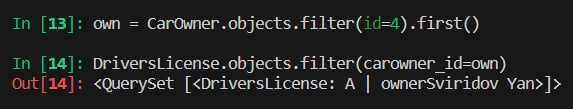
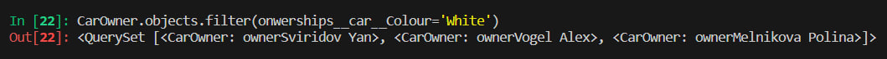
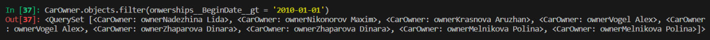
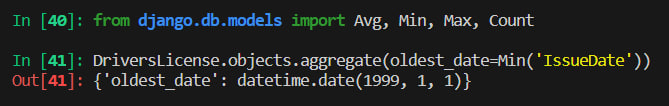
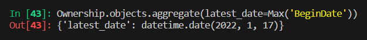
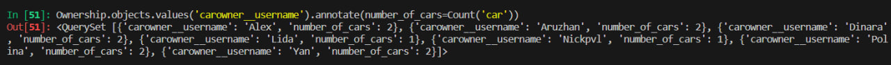
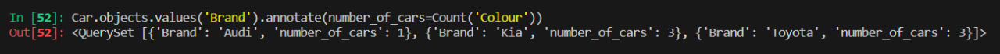
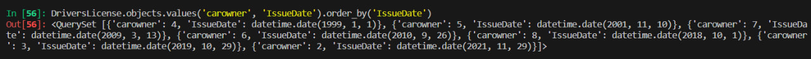

# Вторая и третья части практической работы

>Задание 1. По созданным в пр.1 данным написать следующие запросы на фильтрацию:

>* Где это необходимо, добавьте related_name к полям модели
>* Выведете все машины марки “Toyota” (или любой другой марки, которая у вас есть)
>* Найти всех водителей с именем “Олег” (или любым другим именем на ваше усмотрение)
>* Взяв любого случайного владельца получить его id, и по этому id получить экземпляр удостоверения в виде объекта модели (можно в 2 запроса)
>* Вывести всех владельцев красных машин (или любого другого цвета, который у вас присутствует)
>* Найти всех владельцев, чей год владения машиной начинается с 2010 (или любой другой год, который присутствует у вас в базе)

## Выполнение

Я добавил атрибут related_name к полям, которые ссылаются на другие модели, чтобы было удобно работать с запросами. Далее я вывел все машины марки Kia:

После я нашел всех водителей с именем Алекс:

В третьем пунке я взял автомобилиста с id=4 и вывел его удостоверение:

После этого я вывел всех владельцев белых машин:

И в конце я нашел всех владельцев, чей год владения машиной начинается с 2010:

>Задание 2.Необходимо реализовать следующие запросы c применением описанных методов:

>* Вывод даты выдачи самого старшего водительского удостоверения
>* Укажите самую позднюю дату владения машиной, имеющую какую-то из существующих моделей в вашей базе
>* Выведите количество машин для каждого водителя
>* Подсчитайте количество машин каждой марки
>* Отсортируйте всех автовладельцев по дате выдачи удостоверения 

В первом подзадании я вывел даты выдачи самого старшего водительского удостоверения, предварительно импортируя нужные функции:

Потом я нашел самую позднюю дату владения машиной, имеющую какую-то из существующих моделей в базе:

Далее я вывел количество машин для каждого водителя:

Здесь я посчитал количество машин каждой марки:

В конце осталось отсортировать всех автовладельцев по дате выдачи удостоверения:

На этом выполнение практической работы завершено.