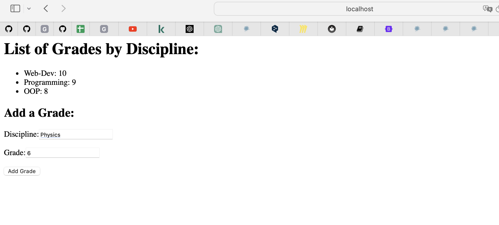

#Лабораторная 1
___
<br/>

#  Задание №1
___
Реализовать клиентскую и серверную часть приложения. Клиент отсылает серверу
сообщение «Hello, server». Сообщение должно отразиться на стороне сервера.
Сервер в ответ отсылает клиенту сообщение «Hello, client». Сообщение должно
отобразиться у клиента.
## Реализация
server.py

```python
import socket

server_socket = socket.socket(socket.AF_INET, socket.SOCK_DGRAM)

server_address = ('localhost', 12345)
server_socket.bind(server_address)

while True:
    print('Ожидание сообщения от клиента...')
    data, client_address = server_socket.recvfrom(1024)

    print(f'Получено от клиента: {data.decode()}')

    response_message = 'Привет, клиент!'
    server_socket.sendto(response_message.encode(), client_address)
```

client.py

```python
import socket

client_socket = socket.socket(socket.AF_INET, socket.SOCK_DGRAM)

server_address = ('localhost', 12345)

message_to_server = 'Привет, сервер!'
client_socket.sendto(message_to_server.encode(), server_address)

data, server_address = client_socket.recvfrom(1024)

print(f'Получено от сервера: {data.decode()}')

client_socket.close()
```

## Результаты 


# Задание №2
___
Реализовать клиентскую и серверную часть приложения. 
Клиент запрашивает у сервера выполнение математической операции, параметры, которые вводятся с клавиатуры. 
Сервер обрабатывает полученные данные и возвращает результат клиенту. 
Вариант: Решение квадратного уравнения.

## Реализация 

server_math.py 
```python
import socket

def calculate_hypotenuse(a, b):
    return (a**2 + b**2)**0.5

def start_server():
    server_socket = socket.socket(socket.AF_INET, socket.SOCK_STREAM)

    server_address = ('localhost', 12124)
    server_socket.bind(server_address)

    server_socket.listen(1)
    print("Сервер ожидает подключения...")

    while True:
        client_socket, client_address = server_socket.accept()
        print(f"Подключено клиентом: {client_address}")

        data = client_socket.recv(1024).decode('utf-8')
        print(f"Получено от клиента: {data}")

        a, b = map(float, data.split(','))

        # Выполняем операцию (теорема Пифагора)
        result = calculate_hypotenuse(a, b)

        client_socket.send(str(result).encode('utf-8'))
        client_socket.close()

if __name__ == "__main__":
    start_server()
```
client_math.py
```python
import socket

def start_client():
    client_socket = socket.socket(socket.AF_INET, socket.SOCK_STREAM)
    server_address = ('localhost', 12124)
    client_socket.connect(server_address)
    
    a = float(input("Введите длину первого катета: "))
    b = float(input("Введите длину второго катета: "))
    
    data = f"{a},{b}"
    client_socket.send(data.encode('utf-8'))
    
    result = client_socket.recv(1024).decode('utf-8')
    print(f"Результат: {result}")
    
    client_socket.close()

if __name__ == "__main__":
    start_client()
```
## Результаты 


# Задание №3
Реализовать серверную часть приложения. 
Клиент подключается к серверу. 
В ответ клиент получает http-сообщение, содержащее html-страницу, которую сервер подгружает из файла index.html.

## Реализация 

http_server.py
```python
import socket

def read_file(filename):
    try:
        with open(filename, 'r', encoding='utf-8') as file:
            return file.read()
    except FileNotFoundError:
        return "Файл не найден"

s_socket = socket.socket(socket.AF_INET, socket.SOCK_STREAM)

s_address = ('localhost', 12413)
s_socket.bind(s_address)

s_socket.listen(1)
print('Сервер ожидает подключения клиента...')

while True:
    c_socket, c_address = s_socket.accept()
    print(f'Подключено клиентом {c_address}')

    try:
        html_content = read_file('index.html')
        request = c_socket.recv(1024)
        http_response = f"HTTP/1.1 200 OK\r\n Content type:html \r\n Content-Length: {len(html_content)}\r\n\r\n{html_content}"
        c_socket.sendall(http_response.encode('utf-8'))
    except Exception as e:
        print(f'Ошибка: {str(e)}')
    finally:
        c_socket.close()
```

index.html

```html
<!DOCTYPE html>
<html>
<head>
    <meta charset="UTF-8">
    <title> It's my Joke Page </title>
</head>
<body>
    <h1> Welcome to the Laughter Lounge! </h1>
    <p>Why don't programmers like nature?<br>Because it has too many bugs! </p>
</body>
</html>
```

## Результаты


# Задание №4
___
Реализовать двухпользовательский или многопользовательский чат. 
Реализация многопользовательского часа позволяет 
получить максимальное количество баллов.

## Реализация 
server.py

```python
import socket
import threading

clients = {}
s_socket = socket.socket(socket.AF_INET, socket.SOCK_STREAM)
s_address = ('localhost', 12476)
s_socket.bind(s_address)
s_socket.listen(5)
print('Сервер ожидает подключения клиентов...')

def handle_client(c_socket):
    while True:
        try:
            message = c_socket.recv(1024).decode()
            if not message:
                clients.remove(c_socket)
                c_socket.close()
                break
            print(f'Получено сообщение: {message}')
            for c_sock, name in clients.items():
                if c_sock != c_socket:
                    c_sock.send(f'\n{name}: {message}'.encode())
        except Exception as e:
            print(f'Ошибка при обработке сообщения: {str(e)}')

while True:
    c_socket, c_address = s_socket.accept()
    c_socket.send('Введите имя: '.encode())
    name = c_socket.recv(1024).decode()
    c_socket.send(f'Добро пожаловать в чат, {name}'.encode())
    clients[c_socket] = name
    print(f'Подключен клиент: {name}, {c_address}')
    client_thread = threading.Thread(target=handle_client, args=(c_socket,))
    client_thread.start()
```

client.py

```python
import socket
import threading
import sys

def send_message():
    while True:
        message = input()
        c_socket.send(message.encode())

c_socket = socket.socket(socket.AF_INET, socket.SOCK_STREAM)
s_address = ('localhost', 12476)
c_socket.connect(s_address)
send_thread = threading.Thread(target=send_message)
send_thread.start()

while True:
    try:
        message = c_socket.recv(1024).decode()
        print(message)
    except Exception as e:
        print(f'Ошибка при получении сообщения: {str(e)}')
        break

c_socket.close()
```

## Результаты 


# Задание №5
___
Необходимо написать простой web-сервер для обработки GET и POST http
запросов средствами Python и библиотеки socket.
Задание: сделать сервер, который может:
* Принять и записать информацию о дисциплине и оценке по дисциплине.
* Отдать информацию обо всех оценах по дсициплине в виде html-страницы.

## Реализация
server.py

```python
import socket
import threading
import urllib.parse  # For parsing URL-encoded data

class WebServer:
    def __init__(self, host, port):
        self.host = host
        self.port = port
        self.server_socket = socket.socket(socket.AF_INET, socket.SOCK_STREAM)
        self.disciplines_data = {}

    def start(self):
        self.server_socket.bind((self.host, self.port))
        self.server_socket.listen(5)
        print('Server is waiting for client connections...')

        while True:
            client_socket, client_address = self.server_socket.accept()
            print(f'Connected to client: {client_address}')
            client_thread = threading.Thread(target=self.handle_client, args=(client_socket,))
            client_thread.start()

    def handle_client(self, client_socket):
        try:
            request_data = client_socket.recv(1024).decode('utf-8')
            
            if request_data.startswith("GET /"):
                self.handle_get_request(client_socket)
            elif request_data.startswith("POST /"):
                request_body = request_data.split('\r\n\r\n')[1]
                self.handle_post_request(client_socket, request_body)
        except Exception as e:
            print(f'Error while processing the request: {str(e)}')
        finally:
            client_socket.close()

    def handle_get_request(self, client_socket):
        response = "HTTP/1.1 200 OK\r\nContent-Type: text/html\r\n\r\n"
        response += "<html><body>"
        response += "<h1>List of Grades by Discipline:</h1>"
        response += "<ul>"
        for discipline, grades in self.disciplines_data.items():
            response += f"<li>{discipline}: {', '.join(grades)}</li>"
        response += "</ul>"
        response += "<h2>Add a Grade:</h2>"
        response += "<form method='POST' action='/'>"
        response += "<label for='discipline'>Discipline:</label>"
        response += "<input type='text' id='discipline' name='discipline' required><br><br>"
        response += "<label for='grade'>Grade:</label>"
        response += "<input type='text' id='grade' name='grade' required><br><br>"
        response += "<input type='submit' value='Add Grade'>"
        response += "</form>"
        response += "</body></html>"
        client_socket.send(response.encode('utf-8'))

    def handle_post_request(self, client_socket, data):
        try:
            # Parse URL-encoded data
            parsed_data = urllib.parse.parse_qs(data)
            discipline = parsed_data.get('discipline', [''])[0]
            grade = parsed_data.get('grade', [''])[0]

            if discipline and grade:
                if discipline in self.disciplines_data:
                    self.disciplines_data[discipline].append(grade)
                else:
                    self.disciplines_data[discipline] = [grade]

            response = "HTTP/1.1 303 See Other\r\nLocation: /\r\n\r\n"
            client_socket.send(response.encode('utf-8'))
        except Exception as e:
            print(f'Error while processing POST request: {str(e)}')
            response = "HTTP/1.1 500 Internal Server Error\r\n\r\n"
            client_socket.send(response.encode('utf-8'))

if __name__ == "__main__":
    web_server = WebServer('localhost', 12477)
    web_server.start()
```

## Результаты 

