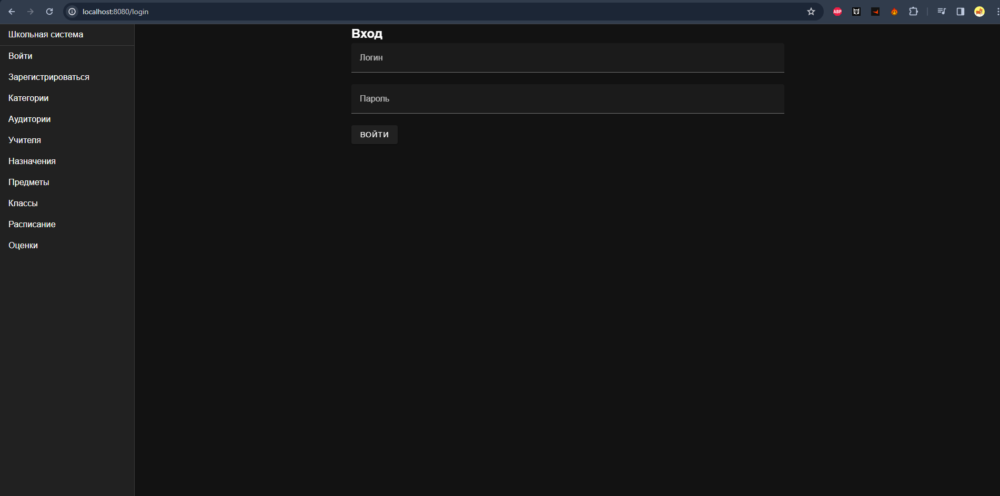
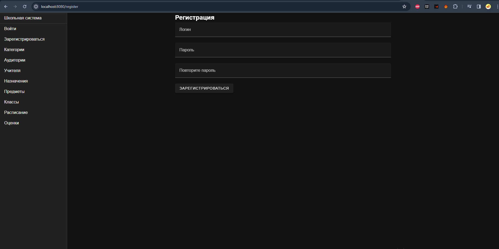
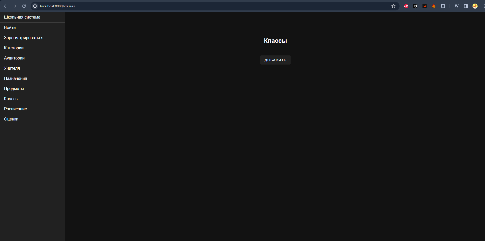
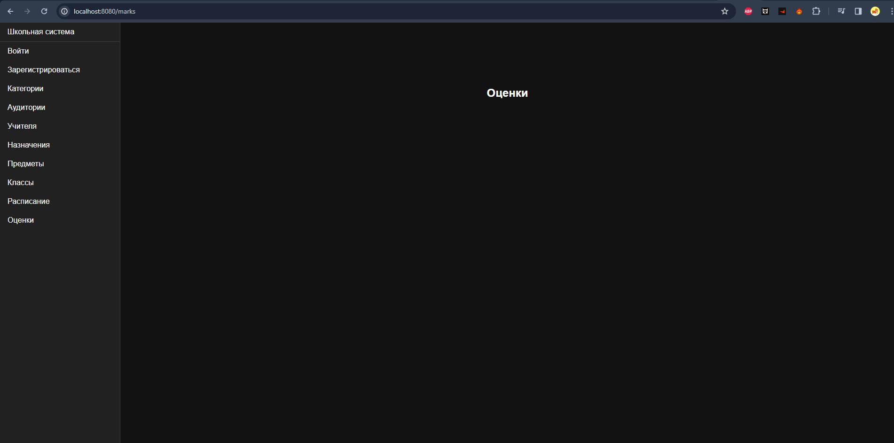
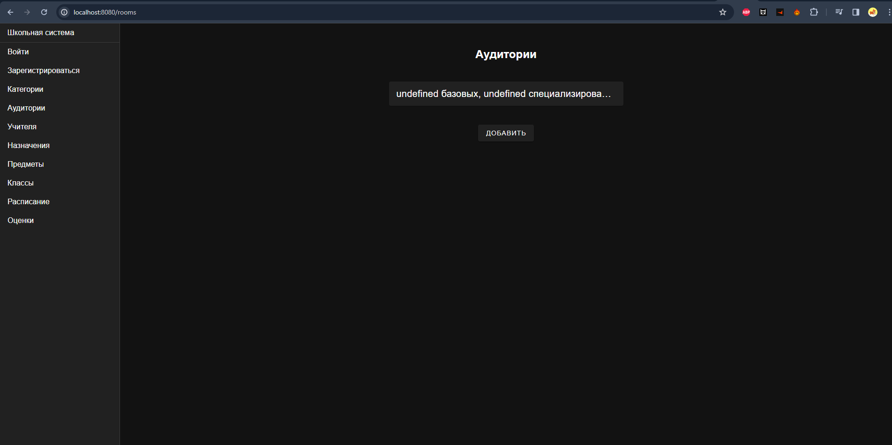
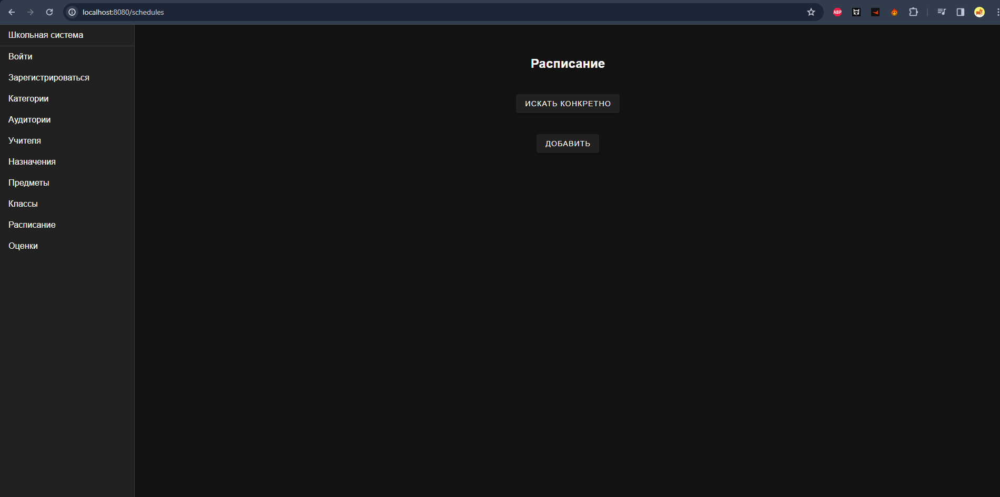

#Лабораторная 4
___
<br>

**Цель:** Реализация клиентской части приложения средствами vue.js
<br>

#Роутер
<br>
###Для реализации маршрутизации использован **VueRouter**
<br/>

###router.js
``` 
import { createRouter, createWebHistory } from 'vue-router'
import Login from "@/components/LoginPage.vue";
import RegisterPage from "@/components/RegisterPage.vue";
import AddRoom from "@/components/Room/AddRoom.vue";
import RoomList from "@/components/Room/RoomList.vue";
import RoomPage from "@/components/Room/RoomPage.vue";
import AddTeacher from "@/components/Teacher/AddTeacher.vue";
import TeacherList from "@/components/Teacher/TeacherList.vue";
import TeacherPage from "@/components/Teacher/TeacherPage.vue";
import AddTeacherLesson from "@/components/TeacherLesson/AddTeacherLesson.vue";
import TeacherLessonList from "@/components/TeacherLesson/TeacherLessonList.vue";
import TeacherLessonPage from "@/components/TeacherLesson/TeacherLessonPage.vue";
import AddLesson from "@/components/Lesson/AddLesson.vue";
import LessonList from "@/components/Lesson/LessonList.vue";
import LessonPage from "@/components/Lesson/LessonPage.vue";
import AddClass from "@/components/Class/AddClass.vue";
import ClassList from "@/components/Class/ClassList.vue";
import ClassPage from "@/components/Class/ClassPage.vue";
import ClassStudentsPage from "@/components/Class/ClassStudentsPage.vue";
import StudentPage from "@/components/Students/StudentPage.vue";
import AddStudent from "@/components/Students/AddStudent.vue";
import ScheduleList from "@/components/Schedule/ScheduleList.vue";
import AddSchedule from "@/components/Schedule/AddSchedule.vue";
import SchedulePage from "@/components/Schedule/SchedulePage.vue";
import CountTeachersPage from "@/components/Lesson/CountTeachersPage.vue";
import FindConcrete from "@/components/Schedule/FindConcrete.vue";
import AddMark from "@/components/Mark/AddMark.vue";
import ShowStatistics from "@/components/Class/ShowStatistics.vue";
import MarkList from "@/components/Mark/MarkList.vue";
import MarkPage from "@/components/Mark/MarkPage.vue";

const routes =[
    {path: '/login', component: Login},
    {path: '/register', component: RegisterPage},
    {path: '/add-room', component: AddRoom},
    {path: '/rooms', component: RoomList},
    {path: '/rooms/:id', component: RoomPage},
    {path: '/add-teacher', component: AddTeacher},
    {path: '/teachers', component: TeacherList},
    {path: '/teachers/:id', component: TeacherPage},
    {path: '/add-teacher-lesson', component: AddTeacherLesson},
    {path: '/teachers-lessons', component: TeacherLessonList},
    {path: '/teachers-lessons/:id', component: TeacherLessonPage},
    {path: '/add-lesson', component: AddLesson},
    {path: '/lessons', component: LessonList},
    {path: '/count-teachers', component: CountTeachersPage},
    {path: '/lessons/:id', component: LessonPage},
    {path: '/add-class', component: AddClass},
    {path: '/classes', component: ClassList},
    {path: '/classes/:id', component: ClassPage},
    {path: '/classes/:id/students', component: ClassStudentsPage},
    {path: '/add-student', component: AddStudent},
    {path: '/students/:id', component: StudentPage},
    {path: '/add-schedule', component: AddSchedule},
    {path: '/schedules/:id', component: SchedulePage},
    {path: '/schedules/:id/add-mark', component: AddMark},
    {path: '/schedules/', component: ScheduleList},
    {path: '/find-concrete', component: FindConcrete},
    {path: '/classes/:id/statistics', component: ShowStatistics},
    {path: '/marks/:id', component: MarkPage},
    {path: '/marks', component: MarkList},
]

const router = createRouter({
    history: createWebHistory(),
    routes
})

export default router

```
<br/>

#Интерфейс
___
<br/>

###**Интерфейс** - предстваляет из себя страницу, контент которой меняется роутером
<br/>


<br/>

##App.vue

```
<template>
    <v-layout class="rounded rounded-md">
      <v-navigation-drawer permanent>
        <v-list-item title="Школьная система"></v-list-item>
        <v-divider></v-divider>
        <template v-if="!Token.token">
        <router-link to="/login" style="text-decoration: none; color: inherit;"><v-list-item link title="Войти"></v-list-item></router-link>
        <router-link to="/register" style="text-decoration: none; color: inherit;"><v-list-item link title="Зарегистрироваться"></v-list-item></router-link>
        </template>
        <v-list-item v-else class="text-red" @click="Token.deleteToken">Выйти</v-list-item>

        <router-link to="/categories" style="text-decoration: none; color: inherit;"><v-list-item link title="Категории"></v-list-item></router-link>
        <router-link to="/rooms" style="text-decoration: none; color: inherit;"><v-list-item link title="Аудитории"></v-list-item></router-link>
        <router-link to="/teachers" style="text-decoration: none; color: inherit;"><v-list-item link title="Учителя"></v-list-item></router-link>
        <router-link to="/teachers-lessons" style="text-decoration: none; color: inherit;"><v-list-item link title="Назначения"></v-list-item></router-link>
        <router-link to="/lessons" style="text-decoration: none; color: inherit;"><v-list-item link title="Предметы"></v-list-item></router-link>
        <router-link to="/classes" style="text-decoration: none; color: inherit;"><v-list-item link title="Классы"></v-list-item></router-link>
        <router-link to="/schedules" style="text-decoration: none; color: inherit;"><v-list-item link title="Расписание"></v-list-item></router-link>
        <router-link to="/marks" style="text-decoration: none; color: inherit;"><v-list-item link title="Оценки"></v-list-item></router-link>

      </v-navigation-drawer>
      <v-main class="d-flex align-center justify-center" style="min-height: 300px;">
       <router-view/>
      </v-main>
    </v-layout>
</template>

<script setup>

import {TokenStore} from "@/stores/TokenStore";

const Token = TokenStore()
</script>

<style>
</style>

```
<br/>

#Axios
<br/>
###Стоит уточнить, что **axios** в данной работе используется через composable - переменную **instance**
<br/>

##AxiosInstance.js

```
import axios from "axios";

const instance = axios.create({
    baseURL: 'http://127.0.0.1:8000/',
    timeout: 1000,
});

export default instance
```

#Компоненты
___
<br/>


##Login Page

```
<script setup>
import {ref} from "vue";
import instance from "@/AxiosInstance";
import router from "@/router/router";
import {TokenStore} from "@/stores/TokenStore";

const Token = TokenStore()

const form = ref({
  username: '',
  password: ''
})

function login(){
  instance.post('/main/login/', form.value).then(response => {
    if (response.status === 200){
      Token.setToken(response.data.access)
      router.push('/rooms')
    }
  }
  ).catch(error => console.log(error))
}

</script>

<template>
  <v-app>
    <div class="w-50 mx-auto">
      <h2>Вход</h2>
    <v-text-field label="Логин" v-model="form.username"></v-text-field>
    <v-text-field label="Пароль" v-model="form.password"></v-text-field>
    <v-btn @click="login">Войти</v-btn>
    </div>
  </v-app>
</template>

<style scoped>

</style>

```

<br/>

##Register Page

```
<script setup>
import {ref} from "vue";
import instance from "@/AxiosInstance";
import router from "@/router/router";

const form = ref({
  username: '',
  password: '',
  password2: ''
})

function register(){
  instance.post('/auth/users/', form.value).then(response => {
        if (response.status === 201){
          router.push('/login')
        }
      }
  ).catch(error => console.log(error))
}

</script>

<template>
  <v-app>
    <div class="w-50 mx-auto">
      <h2>Регистрация</h2>
      <v-text-field label="Логин" v-model="form.username"></v-text-field>
      <v-text-field label="Пароль" v-model="form.password"></v-text-field>
      <v-text-field label="Повторите пароль" v-model="form.password2"></v-text-field>
      <v-btn @click="register">Зарегистрироваться</v-btn>
    </div>
  </v-app>
</template>

<style scoped>

</style>

```

<br/>

##Class
<br/>
<h4> Страница классов представлена 5 компонентами, в которых в скрипте используются axios-запросы: </h4>
<br/>



###ClassPage
```html
<script setup>
import {onMounted, ref} from "vue";
import instance from "@/AxiosInstance";
import router from "@/router/router";
import {TokenStore} from "@/stores/TokenStore";

const Token = TokenStore()

const form = ref({
  letter: "",
  year: "",
})

function getPaper(){
  instance.get(`/main/classes/${router.currentRoute.value.params.id}/`, {
    headers: {
      'Authorization': `Bearer ${Token.token}`
    }
  }).then(response => {
        if (response.status === 200){
          form.value = response.data
        }
      }
  ).catch(error => console.log(error))
}

function savePaper(){
  const {id, ...rest} = form.value
  instance.patch(`/main/classes/${router.currentRoute.value.params.id}/`, rest, {
    headers: {
      'Authorization': `Bearer ${Token.token}`
    }
  }).then(response => {
        if (response.status === 200){
          router.push('/classes')
        }
      }
  ).catch(error => console.log(error))
}

onMounted(() => {
  getPaper()
})

</script>

<template>
  <v-app>
    <div class="w-50 mx-auto">
      <h2>Класс</h2>
      <v-text-field label="Год" v-model="form.year"></v-text-field>
      <v-text-field label="Буква" v-model="form.letter"></v-text-field>
      <v-btn @click="savePaper">Сохранить</v-btn>
    </div>
  </v-app>
</template>

<style scoped>

</style>

```
<br/>


###ClassList
```html
<script setup>
import {onMounted, ref} from "vue";
import instance from "@/AxiosInstance";
import router from "@/router/router";
import {TokenStore} from "@/stores/TokenStore";

const Token = TokenStore()
const classs = ref([])

function getClasses(){
  instance.get('/main/classes/', {
    headers: {
      'Authorization': `Bearer ${Token.token}`
    }
  }).then(response => {
        if (response.status === 200){
          classs.value = response.data
        }
      }
  ).catch(error => console.log(error))
}

function deleteClass(id){
  instance.delete(`/main/classes/${id}/`, {
    headers: {
      'Authorization': `Bearer ${Token.token}`
    }
  }).then(response => {
        if (response.status === 204){
          getClasses()
        }
      }
  ).catch(error => console.log(error))
}

onMounted(() => {getClasses()})

</script>

<template>
  <div class="d-flex align-center flex-column ga-10">
    <h2>Классы</h2>
    <template v-for="student_class in classs" :key="student_class.id">
      <v-card
          width="700"
          :title="`${student_class.year}${student_class.letter}`"
      ><v-card-actions>
        <v-btn @click="router.push('/classes/' + student_class.id + '/students/')">
          Смотреть подробнее
        </v-btn>
        <v-btn @click="router.push('/classes/' + student_class.id)">
          Изменить
        </v-btn>
        <v-btn @click="deleteClass(student_class.id)">
          Удалить
        </v-btn>
      </v-card-actions></v-card>
    </template>
    <v-btn @click="router.push('/add-class')">Добавить</v-btn>
  </div>
</template>

<style scoped>
</style>

```
<br/>


###AddClass
```html
<script setup>
import {ref} from "vue";
import instance from "@/AxiosInstance";
import router from "@/router/router";
import {TokenStore} from "@/stores/TokenStore";

const Token = TokenStore()

const form = ref({
  letter: "",
  year: "",
})

function create(){
  instance.post('/main/classes/', form.value, {
    headers: {
      'Authorization': `Bearer ${Token.token}`
    }
  }).then(response => {
        if (response.status === 201){
          router.push('/classes')
        }
      }
  ).catch(error => console.log(error))
}

</script>

<template>
  <v-app>
    <div class="w-50 mx-auto">
      <h2>Класс</h2>
      <v-text-field label="Год" v-model="form.year"></v-text-field>
      <v-text-field label="Буква" v-model="form.letter"></v-text-field>
      <v-btn @click="create">Создать</v-btn>
    </div>
  </v-app>
</template>

<style scoped>

</style>

```
<br/>


###ClassStudentPage
```html
<script setup>
import {onMounted, ref} from "vue";
import instance from "@/AxiosInstance";
import router from "@/router/router";
import {TokenStore} from "@/stores/TokenStore";

const Token = TokenStore()
const students = ref([])
const sexes = ref([])

function getStudents(){
  instance.get(`/main/classes/${router.currentRoute.value.params.id}/show_students/`, {
    headers: {
      'Authorization': `Bearer ${Token.token}`
    }
  }).then(response => {
        if (response.status === 200){
          students.value = response.data
        }
      }
  ).catch(error => console.log(error))

  instance.get(`/main/classes/${router.currentRoute.value.params.id}/count_boys_and_girls/`, {
    headers: {
      'Authorization': `Bearer ${Token.token}`
    }
  }).then(response => {
        if (response.status === 200){
          sexes.value = response.data
        }
      }
  ).catch(error => console.log(error))

}

function deleteStudent(id){
  instance.delete(`/main/students/${id}/`, {
    headers: {
      'Authorization': `Bearer ${Token.token}`
    }
  }).then(response => {
        if (response.status === 204){
          getStudents()
        }
      }
  ).catch(error => console.log(error))
}

onMounted(() => {getStudents()})

</script>

<template>
  <div class="d-flex align-center flex-column ga-10">
    <h2>Учащиеся</h2>
    <v-card
        width="500"
        :title="`${sexes.boys} мальчиков, ${sexes.girls} девочек`"
    >
    </v-card>
    <v-btn @click="router.push('/classes/' + router.currentRoute.value.params.id + '/statistics' )">Оценки</v-btn>
    <template v-for="student in students" :key="student.id">
      <v-card
          width="400"
          :title="student.name"
          :subtitle="`${student.age}, ${student.sex}`"
      ><v-card-actions>
        <v-btn @click="router.push('/students/' + student.id)">
          Изменить
        </v-btn>
        <v-btn @click="deleteStudent(student.id)">
          Удалить
        </v-btn>
      </v-card-actions></v-card>
    </template>
    <v-btn @click="router.push('/add-student')">Добавить</v-btn>
  </div>
</template>

<style scoped>
</style>

```
<br/>

###ShowStatistics
```html
<script setup>
import {onMounted, ref} from "vue";
import instance from "@/AxiosInstance";
import router from "@/router/router";
import {TokenStore} from "@/stores/TokenStore";

const Token = TokenStore()
const lessons = ref([])
const headrs = [{
  title: 'Студент',
  value: 'name'
},
  {
    title: 'Оценки',
    value: 'marks'
  },
  {
    title: 'Среднее',
    value: 'mean'
  },
]

function getClasses(){
  instance.get( `/main/classes/${router.currentRoute.value.params.id}/statistics/`, {
    headers: {
      'Authorization': `Bearer ${Token.token}`
    }
  }).then(response => {
        if (response.status === 200){
          lessons.value = response.data
        }
      }
  ).catch(error => console.log(error))
}

onMounted(() => {getClasses()})

</script>

<template>
  <div class="d-flex align-center flex-column ga-10">
    <h2>Оценки по предметам</h2>
    <template v-for="lesson in lessons" :key="lesson.id">
      <v-card
        width="700"
        :title="lesson.name"
      ></v-card>

      <v-data-table :items="lesson.students" :headers="headrs"> </v-data-table>
    </template>
  </div>
</template>

<style scoped>
</style>

```
<br/>


##Lesson
<br/>
<h4> Страница уроков представлена 4 компонентами, в которых в скрипте используются axios-запросы: </h4>
<br/>


###LessonPage
```html
<script setup>
import {onMounted, ref} from "vue";
import instance from "@/AxiosInstance";
import router from "@/router/router";
import {TokenStore} from "@/stores/TokenStore";

const Token = TokenStore()

const form = ref({
  name: "",
})

function getPaper(){
  instance.get(`/main/lessons/${router.currentRoute.value.params.id}/`, {
    headers: {
      'Authorization': `Bearer ${Token.token}`
    }
  }).then(response => {
        if (response.status === 200){
          form.value = response.data
        }
      }
  ).catch(error => console.log(error))
}

function savePaper(){
  const {id, ...rest} = form.value
  instance.patch(`/main/lessons/${router.currentRoute.value.params.id}/`, rest, {
    headers: {
      'Authorization': `Bearer ${Token.token}`
    }
  }).then(response => {
        if (response.status === 200){
          router.push('/lessons')
        }
      }
  ).catch(error => console.log(error))
}

onMounted(() => {
  getPaper()
})

</script>

<template>
  <v-app>
    <div class="w-50 mx-auto">
      <h2>Предмет</h2>
      <v-text-field label="Имя" v-model="form.name"></v-text-field>
      <v-btn @click="savePaper">Сохранить</v-btn>
    </div>
  </v-app>
</template>

<style scoped>

</style>

```

<br/>
 
###LessonList
```html
<script setup>
import {onMounted, ref} from "vue";
import instance from "@/AxiosInstance";
import router from "@/router/router";
import {TokenStore} from "@/stores/TokenStore";

const Token = TokenStore()
const lessons = ref([])

function getLessons(){
  instance.get('/main/lessons/', {
    headers: {
      'Authorization': `Bearer ${Token.token}`
    }
  }).then(response => {
        if (response.status === 200){
          lessons.value = response.data
        }
      }
  ).catch(error => console.log(error))
}

function deleteLesson(id){
  instance.delete(`/main/lessons/${id}/`, {
    headers: {
      'Authorization': `Bearer ${Token.token}`
    }
  }).then(response => {
        if (response.status === 204){
          getLessons()
        }
      }
  ).catch(error => console.log(error))
}

onMounted(() => {getLessons()})

</script>

<template>
  <div class="d-flex align-center flex-column ga-10">
    <h2>Предметы</h2>
    <v-btn @click="router.push('/count-teachers')">Статистика по числу учителей</v-btn>
    <template v-for="lesson in lessons" :key="lesson.id">
      <v-card
          width="400"
          :title="lesson.name"
      ><v-card-actions>
        <v-btn @click="router.push('/lessons/' + lesson.id)">
          Изменить
        </v-btn>
        <v-btn @click="deleteLesson(lesson.id)">
          Удалить
        </v-btn>
      </v-card-actions></v-card>
    </template>
    <v-btn @click="router.push('/add-lesson')">Добавить</v-btn>
  </div>
</template>

<style scoped>
</style>

```
<br/>
 
###AddLesson
```html
<script setup>
import {ref} from "vue";
import instance from "@/AxiosInstance";
import router from "@/router/router";
import {TokenStore} from "@/stores/TokenStore";

const Token = TokenStore()

const form = ref({
  name: "",
})

function create(){
  instance.post('/main/lessons/', form.value, {
    headers: {
      'Authorization': `Bearer ${Token.token}`
    }
  }).then(response => {
        if (response.status === 201){
          router.push('/lessons')
        }
      }
  ).catch(error => console.log(error))
}

</script>

<template>
  <v-app>
    <div class="w-50 mx-auto">
      <h2>Предмет</h2>
      <v-text-field label="Название" v-model="form.name"></v-text-field>
      <v-btn @click="create">Создать</v-btn>
    </div>
  </v-app>
</template>

<style scoped>

</style>

```
<br/>
 
###CountTeachersPage
```html
<script setup>
import {onMounted, ref} from "vue";
import instance from "@/AxiosInstance";
import router from "@/router/router";
import {TokenStore} from "@/stores/TokenStore";

const Token = TokenStore()
const lessons = ref([])

function getLessons(){
  instance.get('/main/lessons/how_many_teachers', {
    headers: {
      'Authorization': `Bearer ${Token.token}`
    }
  }).then(response => {
        if (response.status === 200){
          lessons.value = response.data
        }
      }
  ).catch(error => console.log(error))
}

onMounted(() => {getLessons()})

</script>

<template>
  <div class="d-flex align-center flex-column ga-10">
    <h2>Число учителей на предмет</h2>
    <v-btn @click="router.push('/count-teachers')">Статистика по числу учителей</v-btn>
    <template v-for="lesson in lessons" :key="lesson.id">
      <v-card
          width="400"
          :title="`${lesson.name}: ${lesson.count}`"
      ></v-card>
    </template>
  </div>
</template>

<style scoped>
</style>

```
<br/>
 

##Mark
<br/>
<h4> Страница оценок представлена 3 компонентами, в которых в скрипте используются axios-запросы: </h4>
<br/>


###MarkPage
```html
<script setup>
import {onMounted, ref} from "vue";
import instance from "@/AxiosInstance";
import router from "@/router/router";
import {TokenStore} from "@/stores/TokenStore";

const Token = TokenStore()

const form = ref({
  student : "",
  schedule : "",
  mark : "",
})

function getPaper(){
  instance.get(`/main/marks/${router.currentRoute.value.params.id}/`, {
    headers: {
      'Authorization': `Bearer ${Token.token}`
    }
  }).then(response => {
        if (response.status === 200){
          form.value = response.data
        }
      }
  ).catch(error => console.log(error))
}

function savePaper(){
  const {id, ...rest} = form.value
  instance.patch(`/main/marks/${router.currentRoute.value.params.id}/`, rest, {
    headers: {
      'Authorization': `Bearer ${Token.token}`
    }
  }).then(response => {
        if (response.status === 200){
          router.push('/marks')
        }
      }
  ).catch(error => console.log(error))
}

onMounted(() => {
  getPaper()
})

</script>

<template>
  <v-app>
    <div class="w-50 mx-auto">
      <h2>Оценка</h2>
      <v-text-field label="Студент" v-model="form.student"></v-text-field>
      <v-text-field label="Оценка" v-model="form.mark"></v-text-field>
      <v-text-field label="Занятие" v-model="form.schedule"></v-text-field>

      <v-btn @click="savePaper">Сохранить</v-btn>
    </div>
  </v-app>
</template>

<style scoped>

</style>

```
<br/>
 
###MarkList
```html
<script setup>
import {onMounted, ref} from "vue";
import instance from "@/AxiosInstance";
import router from "@/router/router";
import {TokenStore} from "@/stores/TokenStore";

const Token = TokenStore()
const marks = ref([])

function getmarks(){
  instance.get('/main/marks/', {
    headers: {
      'Authorization': `Bearer ${Token.token}`
    }
  }).then(response => {
        if (response.status === 200){
          marks.value = response.data
        }
      }
  ).catch(error => console.log(error))
}

function deleteMark(id){
  instance.delete(`/main/marks/${id}/`, {
    headers: {
      'Authorization': `Bearer ${Token.token}`
    }
  }).then(response => {
        if (response.status === 204){
          getmarks()
        }
      }
  ).catch(error => console.log(error))
}

onMounted(() => {getmarks()})

</script>

<template>
  <div class="d-flex align-center flex-column ga-10">
    <h2>Оценки</h2>
    <template v-for="mark in marks" :key="mark.id">
      <v-card
          width="400"
          :title="mark.mark"
          :subtitle="`${mark.student} (ID занятия: ${mark.schedule})`"
      ><v-card-actions>
        <v-btn @click="router.push('/marks/' + mark.id)">
          Изменить
        </v-btn>
        <v-btn @click="deleteMark(mark.id)">
          Удалить
        </v-btn>
      </v-card-actions></v-card>
    </template>
  </div>
</template>

<style scoped>
</style>

```
<br/>
 
###AddMark
```html
<script setup>
import {onMounted, ref} from "vue";
import instance from "@/AxiosInstance";
import router from "@/router/router";
import {TokenStore} from "@/stores/TokenStore";

const Token = TokenStore()

const form = ref({
  student : "",
  schedule : "",
  mark : "",
})

const students = ref([])

function create(){
  form.value.schedule = router.currentRoute.value.params.id

  instance.post('/main/marks/', form.value, {
    headers: {
      'Authorization': `Bearer ${Token.token}`
    }
  }).then(response => {
        if (response.status === 201){
          router.push('/classes')
        }
      }
  ).catch(error => console.log(error))
}

function getRooms(){
  instance.get('/main/students/', {
    headers: {
      'Authorization': `Bearer ${Token.token}`
    }
  }).then(response => {
        if (response.status === 200) {
          students.value = response.data
        }
      }
  ).catch(error => console.log(error))

}

onMounted(() => {
  getRooms()
})


</script>

<template>
  <v-app>
    <div class="w-50 mx-auto">
      <h2>Добавить оценку</h2>
      <v-select
          label="Студент"
          v-model="form.student"
          :items="students"
          item-title="name"
          item-value="id"
      ></v-select>
      <v-text-field label="Оценка" v-model="form.mark"></v-text-field>
      <v-btn @click="create">Создать</v-btn>
    </div>
  </v-app>
</template>

<style scoped>

</style>

```
<br/>
 


##Room
<br/>
<h4> Страница аудиторий представлена 3 компонентами, в которых в скрипте используются axios-запросы: </h4>
<br/>


###RoomPage
```html
<script setup>
import {onMounted, ref} from "vue";
import instance from "@/AxiosInstance";
import router from "@/router/router";
import {TokenStore} from "@/stores/TokenStore";

const Token = TokenStore()

const form = ref({
  num: "",
  base: "",
})

function getPaper(){
  instance.get(`/main/rooms/${router.currentRoute.value.params.id}/`, {
    headers: {
      'Authorization': `Bearer ${Token.token}`
    }
  }).then(response => {
        if (response.status === 200){
          form.value = response.data
        }
      }
  ).catch(error => console.log(error))
}

function savePaper(){
  const {id, ...rest} = form.value
  instance.patch(`/main/rooms/${router.currentRoute.value.params.id}/`, rest, {
    headers: {
      'Authorization': `Bearer ${Token.token}`
    }
  }).then(response => {
        if (response.status === 200){
          router.push('/rooms')
        }
      }
  ).catch(error => console.log(error))
}

onMounted(() => {
  getPaper()
})

</script>

<template>
  <v-app>
    <div class="w-50 mx-auto">
      <h2>Аудитория</h2>
      <v-text-field label="Номер" v-model="form.num"></v-text-field>
      <v-text-field label="Без специализации" v-model="form.base"></v-text-field>
      <v-btn @click="savePaper">Сохранить</v-btn>
    </div>
  </v-app>
</template>

<style scoped>

</style>

```
<br/>
 
###RoomList
```html
<script setup>
import {onMounted, ref} from "vue";
import instance from "@/AxiosInstance";
import router from "@/router/router";
import {TokenStore} from "@/stores/TokenStore";

const Token = TokenStore()
const rooms = ref([])
const base = ref([])
const spec = ref([])

function getRooms(){
  instance.get('/main/rooms/', {
    headers: {
      'Authorization': `Token ${Token.token}`
    }
  }).then(response => {
        if (response.status === 200){
          rooms.value = response.data
        }
      }
  ).catch(error => console.log(error))
}

function getBase(){
  instance.get('/main/rooms/count_base', {
    headers: {
      'Authorization': `Bearer ${Token.token}`
    }
  }).then(response => {
        if (response.status === 200){
          base.value = response.data
        }
      }
  ).catch(error => console.log(error))

  instance.get('/main/rooms/count_specific', {
    headers: {
      'Authorization': `Bearer ${Token.token}`
    }
  }).then(response => {
        if (response.status === 200){
          spec.value = response.data
        }
      }
  ).catch(error => console.log(error))
}

function deleteRoom(id){
  instance.delete(`/main/rooms/${id}/`, {
    headers: {
      'Authorization': `Bearer ${Token.token}`
    }
  }).then(response => {
        if (response.status === 204){
          getRooms()
        }
      }
  ).catch(error => console.log(error))
}

function start(){
  getRooms()
  getBase()
}
onMounted(() => {start()})

</script>

<template>
  <div class="d-flex align-center flex-column ga-10">
    <h2>Аудитории</h2>
    <v-card
        width="500"
        :title="`${base.base} базовых, ${spec.specific} специализированных`"
    ></v-card>
    <template v-for="room in rooms" :key="room.id">
      <v-card
          width="400"
          :title="room.num"
          :subtitle="`Наличие специализации: ${!room.base}`"
      ><v-card-actions>
        <v-btn @click="router.push('/rooms/' + room.id)">
          Изменить
        </v-btn>
        <v-btn @click="deleteRoom(room.id)">
          Удалить
        </v-btn>
      </v-card-actions></v-card>
    </template>
    <v-btn @click="router.push('/add-room')">Добавить</v-btn>
  </div>
</template>

<style scoped>
</style>

```
<br/>
 
###AddRoom
```html
<script setup>
import {ref} from "vue";
import instance from "@/AxiosInstance";
import router from "@/router/router";
import {TokenStore} from "@/stores/TokenStore";

const Token = TokenStore()

const form = ref({
  full_name : "",
})

function create(){
  instance.post('/main/rooms/', form.value, {
    headers: {
      'Authorization': `Bearer ${Token.token}`
    }
  }).then(response => {
        if (response.status === 201){
          router.push('/rooms')
        }
      }
  ).catch(error => console.log(error))
}

</script>

<template>
  <v-app>
    <div class="w-50 mx-auto">
      <h2>Добавить аудиторию</h2>
      <v-text-field label="Номер" v-model="form.num"></v-text-field>
      <v-text-field label="Без специализации" v-model="form.base"></v-text-field>
      <v-btn @click="create">Создать</v-btn>
    </div>
  </v-app>
</template>

<style scoped>

</style>

```
<br/>
 


##Schedule
<br/>
<h4> Страница расписания представлена 4 компонентами, в которых в скрипте используются axios-запросы: </h4>
<br/>


###SchedulePage
```html
<script setup>
import {onMounted, ref} from "vue";
import instance from "@/AxiosInstance";
import router from "@/router/router";
import {TokenStore} from "@/stores/TokenStore";

const Token = TokenStore()

const form = ref({
  day : "",
  num_lesson : "",
  student_class : "",
  room: "",
  lesson_teacher: ""
})

function getPaper(){
  instance.get(`/main/schedules/${router.currentRoute.value.params.id}/`, {
    headers: {
      'Authorization': `Bearer ${Token.token}`
    }
  }).then(response => {
        if (response.status === 200){
          form.value = response.data
        }
      }
  ).catch(error => console.log(error))
}

function savePaper(){
  const {id, ...rest} = form.value
  instance.patch(`/main/schedules/${router.currentRoute.value.params.id}/`, rest, {
    headers: {
      'Authorization': `Bearer ${Token.token}`
    }
  }).then(response => {
        if (response.status === 200){
          router.push('/schedules')
        }
      }
  ).catch(error => console.log(error))
}

onMounted(() => {
  getPaper()
})

</script>

<template>
  <v-app>
    <div class="w-50 mx-auto">
      <h2>Расписание</h2>
      <v-select
          label="День недели"
          v-model="form.day"
          :items="['пн', 'вт', 'ср', 'чт', 'пт', 'сб', 'вс']"
      ></v-select>
      <v-text-field label="Порядковый номер урока" v-model="form.num_lesson"></v-text-field>
      <v-text-field label="Класс" v-model="form.student_class"></v-text-field>
      <v-text-field label="Аудитория" v-model="form.room"></v-text-field>
      <v-text-field label="Учитель" v-model="form.lesson_teacher"></v-text-field>
      <v-btn @click="savePaper">Сохранить</v-btn>
    </div>
  </v-app>
</template>

<style scoped>

</style>

```
<br/>
 
###ScheduleList
```html
<script setup>
import {onMounted, ref} from "vue";
import instance from "@/AxiosInstance";
import router from "@/router/router";
import {TokenStore} from "@/stores/TokenStore";

const Token = TokenStore()
const schedules = ref([])

function getSchedules(){
  instance.get('/main/schedules/', {
    headers: {
      'Authorization': `Bearer ${Token.token}`
    }
  }).then(response => {
        if (response.status === 200){
          schedules.value = response.data
        }
      }
  ).catch(error => console.log(error))
}

function deleteSchedule(id){
  instance.delete(`/main/schedules/${id}/`, {
    headers: {
      'Authorization': `Bearer ${Token.token}`
    }
  }).then(response => {
        if (response.status === 204){
          getSchedules()
        }
      }
  ).catch(error => console.log(error))
}

onMounted(() => {getSchedules()})

</script>

<template>
  <div class="d-flex align-center flex-column ga-10">
    <h2>Расписание</h2>
    <v-btn @click="router.push('/find-concrete')">Искать конкретно</v-btn>
    <template v-for="schedule in schedules" :key="schedule.id">
      <v-card
          width="400"
          :title="`${schedule.day}, ${schedule.num_lesson}`"
          :subtitle="`${schedule.student_class}, ${schedule.teacher}, ${schedule.lesson}`"
      ><v-card-actions>
        <v-btn @click="router.push('/schedules/' + schedule.id + '/add-mark/')">
          Добавить оценку
        </v-btn>
        <v-btn @click="router.push('/schedules/' + schedule.id)">
          Изменить
        </v-btn>
        <v-btn @click="deleteSchedule(schedule.id)">
          Удалить
        </v-btn>
      </v-card-actions></v-card>
    </template>
    <v-btn @click="router.push('/add-schedule')">Добавить</v-btn>
  </div>
</template>

<style scoped>
</style>

```
<br/>
 
###AddSchedule
```html
<script setup>
import {onMounted, ref} from "vue";
import instance from "@/AxiosInstance";
import router from "@/router/router";
import {TokenStore} from "@/stores/TokenStore";

const Token = TokenStore()

const form = ref({
  day: "",
  num_lesson: "",
  student_class: "",
  room: "",
  lesson_teacher: ""
})

const rooms = ref([])
const classes = ref([])
const l_t = ref([])

function create() {
  instance.post('/main/schedules/', form.value, {
    headers: {
      'Authorization': `Bearer ${Token.token}`
    }
  }).then(response => {
        if (response.status === 201) {
          router.push('/schedules')
        }
      }
  ).catch(error => console.log(error))
}

function getRooms() {
  instance.get('/main/rooms/', {
    headers: {
      'Authorization': `Bearer ${Token.token}`
    }
  }).then(response => {
        if (response.status === 200) {
          rooms.value = response.data
        }
      }
  ).catch(error => console.log(error))

  instance.get('/main/classes/', {
    headers: {
      'Authorization': `Bearer ${Token.token}`
    }
  }).then(response => {
        if (response.status === 200) {
          classes.value = response.data
        }
      }
  ).catch(error => console.log(error))

  instance.get('/main/teachers-lessons/list_filter/', {
    headers: {
      'Authorization': `Bearer ${Token.token}`
    }
  }).then(response => {
        if (response.status === 200) {
          l_t.value = response.data
        }
      }
  ).catch(error => console.log(error))

}

onMounted(() => {
  getRooms()
})


</script>

<template>
  <v-app>
    <div class="w-50 mx-auto">
      <h2>Добавить расписание</h2>
      <v-select
          label="День недели"
          v-model="form.day"
          :items="['пн', 'вт', 'ср', 'чт', 'пт', 'сб', 'вс']"
      ></v-select>
      <v-text-field label="Порядковый номер урока" v-model="form.num_lesson"></v-text-field>
      <v-select
        label="Аудитория"
        v-model="form.room"
        :items="rooms"
        item-title="num"
        item-value="id"
        ></v-select>
      <v-select
          label="Класс"
          v-model="form.student_class"
          :items="classes"
          :item-title="item => item.year + item.letter"
          item-value="id"
      ></v-select>
      <v-select
          label="Учитель и предмет"
          v-model="form.lesson_teacher"
          :items="l_t"
          :item-title="item => item.teacher + ' '+ item.lesson"
          item-value="id"
      ></v-select>
      <v-btn @click="create">Создать</v-btn>
    </div>
  </v-app>
</template>
<style scoped>
</style>

```
<br/>
 
###FindConcrete
```html
<script setup>
import {ref} from "vue";
import instance from "@/AxiosInstance";
import router from "@/router/router";
import {TokenStore} from "@/stores/TokenStore";

const Token = TokenStore()

const error = ref(false)

const form = ref({
  day : "",
  num_lesson : "",
  room: "",
})

const schedules = ref()

function find(){
  instance.post('/main/schedules/find/', form.value, {
    headers: {
      'Authorization': `Bearer ${Token.token}`
    }
  }).then(response => {
        if (response.status === 200){
          schedules.value = response.data
        }
      }
  ).catch(e => error.value = true )
}

</script>

<template>
  <v-app>
    <div class="w-50 mx-auto">
      <h2>Найти расписание:</h2>
      <v-text-field label="День недели" v-model="form.day"></v-text-field>
      <v-text-field label="Номер урока" v-model="form.num_lesson"></v-text-field>
      <v-text-field label="Номер удитории" v-model="form.room"></v-text-field>
      <v-btn @click="find">Найти</v-btn>
    </div>
    <div v-if="error" class="text-red">
      Не найдено
    </div>
    <div v-else-if="schedules">
      <template v-for="schedule in schedules" :key="schedule">
        <v-card
            width="400"
            :title="`${schedule.day}, ${schedule.num_lesson}`"
            :subtitle="`${schedule.student_class}, ${schedule.teacher}, ${schedule.lesson}`"
        ></v-card>
      </template>

    </div>
  </v-app>
</template>

<style scoped>

</style>
```
<br/>
 

##Students
<br/>
<h4> Страница обучающихся представлена 2 компонентами, в которых в скрипте используются axios-запросы: </h4>
<br/>

###StudentPage
```html
<script setup>
import {onMounted, ref} from "vue";
import instance from "@/AxiosInstance";
import router from "@/router/router";
import {TokenStore} from "@/stores/TokenStore";

const Token = TokenStore()

const form = ref({
  name: "",
  age : "",
  sex: "",
  student_class: "",
})

function getPaper(){
  instance.get(`/main/students/${router.currentRoute.value.params.id}/`, {
    headers: {
      'Authorization': `Bearer ${Token.token}`
    }
  }).then(response => {
        if (response.status === 200){
          form.value = response.data
        }
      }
  ).catch(error => console.log(error))
}

function savePaper(){
  const {id, ...rest} = form.value
  instance.patch(`/main/students/${router.currentRoute.value.params.id}/`, rest, {
    headers: {
      'Authorization': `Bearer ${Token.token}`
    }
  }).then(response => {
        if (response.status === 200){
          router.push(`/classes/${router.currentRoute.value.params.id}/students`)
        }
      }
  ).catch(error => console.log(error))
}

onMounted(() => {
  getPaper()
})

</script>

<template>
  <v-app>
    <div class="w-50 mx-auto">
      <h2>Учащийся</h2>
      <v-text-field label="Имя" v-model="form.name"></v-text-field>
      <v-text-field label="Возраст" v-model="form.age"></v-text-field>
      <v-select
          label="Пол"
          v-model="form.sex"
          :items="['f', 'm']"
      ></v-select>
      <v-text-field label="Класс" v-model="form.student_class"></v-text-field>
      <v-btn @click="savePaper">Сохранить</v-btn>
    </div>
  </v-app>
</template>

<style scoped>

</style>

```
<br/>
 
###AddStudent
```html
<script setup>
import {onMounted, ref} from "vue";
import instance from "@/AxiosInstance";
import router from "@/router/router";
import {TokenStore} from "@/stores/TokenStore";

const Token = TokenStore()

const form = ref({
  name: "",
  age : "",
  sex: "",
  student_class: "",
})
const classes = ref([])

function create(){
  instance.post('/main/students/', form.value, {
    headers: {
      'Authorization': `Bearer ${Token.token}`
    }
  }).then(response => {
        if (response.status === 201){
          router.push('/classes')
        }
      }
  ).catch(error => console.log(error))
}

function getRooms(){
  instance.get('/main/classes/', {
    headers: {
      'Authorization': `Bearer ${Token.token}`
    }
  }).then(response => {
        if (response.status === 200) {
          classes.value = response.data
        }
      }
  ).catch(error => console.log(error))

}

onMounted(() => {
  getRooms()
})


</script>

<template>
  <v-app>
    <div class="w-50 mx-auto">
      <h2>Учащийся</h2>
      <v-text-field label="Имя" v-model="form.name"></v-text-field>
      <v-text-field label="Возраст" v-model="form.age"></v-text-field>
      <v-select
          label="Пол"
          v-model="form.sex"
          :items="['f', 'm']"
      ></v-select>
      <v-select
          label="Класс"
          v-model="form.student_class"
          :items="classes"
          :item-title="item => item.teacher + ' '+ item.lesson"
          item-value="id"
      ></v-select>
      <v-btn @click="create">Создать</v-btn>
    </div>
  </v-app>
</template>
<style scoped>

</style>

```
<br/>
 

##Teacher
<br/>
<h4> Страница учителей представлена 3 компонентами, в которых в скрипте используются axios-запросы: </h4>
<br/>


###TeacherPage
```html
<script setup>
import {onMounted, ref} from "vue";
import instance from "@/AxiosInstance";
import router from "@/router/router";
import {TokenStore} from "@/stores/TokenStore";

const Token = TokenStore()

const form = ref({
  name: "",
})

function getPaper(){
  instance.get(`/main/teachers/${router.currentRoute.value.params.id}/`, {
    headers: {
      'Authorization': `Bearer ${Token.token}`
    }
  }).then(response => {
        if (response.status === 200){
          form.value = response.data
        }
      }
  ).catch(error => console.log(error))
}

function savePaper(){
  const {id, ...rest} = form.value
  instance.patch(`/main/teachers/${router.currentRoute.value.params.id}/`, rest, {
    headers: {
      'Authorization': `Bearer ${Token.token}`
    }
  }).then(response => {
        if (response.status === 200){
          router.push('/teachers')
        }
      }
  ).catch(error => console.log(error))
}

onMounted(() => {
  getPaper()
})

</script>

<template>
  <v-app>
    <div class="w-50 mx-auto">
      <h2>Учитель</h2>
      <v-text-field label="Имя" v-model="form.name"></v-text-field>
      <v-btn @click="savePaper">Сохранить</v-btn>
    </div>
  </v-app>
</template>

<style scoped>

</style>

```
<br/>
 
###TeacherList
```html
<script setup>
import {onMounted, ref} from "vue";
import instance from "@/AxiosInstance";
import router from "@/router/router";
import {TokenStore} from "@/stores/TokenStore";

const Token = TokenStore()
const teachers = ref([])

function getTeachers(){
  instance.get('/main/teachers/', {
    headers: {
      'Authorization': `Bearer ${Token.token}`
    }
  }).then(response => {
        if (response.status === 200){
          teachers.value = response.data
        }
      }
  ).catch(error => console.log(error))
}

function deleteTeacher(id){
  instance.delete(`/main/teachers/${id}/`, {
    headers: {
      'Authorization': `Bearer ${Token.token}`
    }
  }).then(response => {
        if (response.status === 204){
          getTeachers()
        }
      }
  ).catch(error => console.log(error))
}

onMounted(() => {getTeachers()})

</script>

<template>
  <div class="d-flex align-center flex-column ga-10">
    <h2>Учителя</h2>
    <template v-for="teacher in teachers" :key="teacher.id">
      <v-card
          width="400"
          :title="teacher.name"
      ><v-card-actions>
        <v-btn @click="router.push('/teachers/' + teacher.id)">
          Изменить
        </v-btn>
        <v-btn @click="deleteTeacher(teacher.id)">
          Удалить
        </v-btn>
      </v-card-actions></v-card>
    </template>
    <v-btn @click="router.push('/add-teacher')">Добавить</v-btn>
  </div>
</template>

<style scoped>
</style>

```
<br/>
 
###AddTeacher
```html
<script setup>
import {ref} from "vue";
import instance from "@/AxiosInstance";
import router from "@/router/router";
import {TokenStore} from "@/stores/TokenStore";

const Token = TokenStore()

const form = ref({
  name: "",
})

function create(){
  instance.post('/main/teachers/', form.value, {
    headers: {
      'Authorization': `Bearer ${Token.token}`
    }
  }).then(response => {
        if (response.status === 201){
          router.push('/teachers')
        }
      }
  ).catch(error => console.log(error))
}

</script>

<template>
  <v-app>
    <div class="w-50 mx-auto">
      <h2>Учитель</h2>
      <v-text-field label="Имя" v-model="form.name"></v-text-field>
      <v-btn @click="create">Создать</v-btn>
    </div>
  </v-app>
</template>

<style scoped>

</style>

```
<br/>
 

##LessonTeacher
<br/>
<h4> Страница учителей уроков представлена 3 компонентами, в которых в скрипте используются axios-запросы: </h4>
<br/>


###LessonTeacherPage
```html
<script setup>
import {onMounted, ref} from "vue";
import instance from "@/AxiosInstance";
import router from "@/router/router";
import {TokenStore} from "@/stores/TokenStore";

const Token = TokenStore()

const form = ref({
  lesson: "",
  teacher: "",
})

function getPaper(){
  instance.get(`/main/teachers-lessons/${router.currentRoute.value.params.id}/`, {
    headers: {
      'Authorization': `Bearer ${Token.token}`
    }
  }).then(response => {
        if (response.status === 200){
          form.value = response.data
        }
      }
  ).catch(error => console.log(error))
}

function savePaper(){
  const {id, ...rest} = form.value
  instance.patch(`/main/teachers-lessons/${router.currentRoute.value.params.id}/`, rest, {
    headers: {
      'Authorization': `Bearer ${Token.token}`
    }
  }).then(response => {
        if (response.status === 200){
          router.push('/teachers-lessons')
        }
      }
  ).catch(error => console.log(error))
}

onMounted(() => {
  getPaper()
})

</script>

<template>
  <v-app>
    <div class="w-50 mx-auto">
      <h2>Назначить учителя на предмет</h2>
      <v-text-field label="Предмет" v-model="form.lesson"></v-text-field>
      <v-text-field label="Учитель" v-model="form.teacher"></v-text-field>
      <v-btn @click="savePaper">Сохранить</v-btn>
    </div>
  </v-app>
</template>

<style scoped>

</style>

```
<br/>
 
###LessonTeacherList
```html
<script setup>
import {onMounted, ref} from "vue";
import instance from "@/AxiosInstance";
import router from "@/router/router";
import {TokenStore} from "@/stores/TokenStore";

const Token = TokenStore()
const teachers_lessons = ref([])

function getTeachers(){
  instance.get('/main/teachers-lessons/', {
    headers: {
      'Authorization': `Bearer ${Token.token}`
    }
  }).then(response => {
        if (response.status === 200){
          teachers_lessons.value = response.data
        }
      }
  ).catch(error => console.log(error))
}

function deleteTeacher(id){
  instance.delete(`/main/teachers-lessons/${id}/`, {
    headers: {
      'Authorization': `Bearer ${Token.token}`
    }
  }).then(response => {
        if (response.status === 204){
          getTeachers()
        }
      }
  ).catch(error => console.log(error))
}

onMounted(() => {getTeachers()})

</script>

<template>
  <div class="d-flex align-center flex-column ga-10">
    <h2>Назначения</h2>
    <template v-for="teacher_lesson in teachers_lessons" :key="teacher_lesson.id">
      <v-card
          width="400"
          :title="`${teacher_lesson.teacher.name} ведет ${teacher_lesson.lesson.name}`"
      ><v-card-actions>
        <v-btn @click="router.push('/teachers-lessons/' + teacher_lesson.id)">
          Изменить
        </v-btn>
        <v-btn @click="deleteTeacher(teacher_lesson.id)">
          Удалить
        </v-btn>
      </v-card-actions></v-card>
    </template>
    <v-btn @click="router.push('/add-teacher-lesson')">Добавить</v-btn>
  </div>
</template>

<style scoped>
</style>

```
<br/>
 
###AddLessonTeacher
```html
<script setup>
import {onMounted, ref} from "vue";
import instance from "@/AxiosInstance";
import router from "@/router/router";
import {TokenStore} from "@/stores/TokenStore";

const Token = TokenStore()

const form = ref({
  lesson: "",
  teacher: "",
})

const lessons = ref([])
const teachers = ref([])

function create(){
  instance.post('/main/teachers-lessons/', form.value, {
    headers: {
      'Authorization': `Bearer ${Token.token}`
    }
  }).then(response => {
        if (response.status === 201){
          router.push('/teachers-lessons')
        }
      }
  ).catch(error => console.log(error))
}

function getRooms() {
  instance.get('/main/teachers/', {
    headers: {
      'Authorization': `Bearer ${Token.token}`
    }
  }).then(response => {
        if (response.status === 200) {
          teachers.value = response.data
        }
      }
  ).catch(error => console.log(error))

  instance.get('/main/lessons/', {
    headers: {
      'Authorization': `Bearer ${Token.token}`
    }
  }).then(response => {
        if (response.status === 200) {
          lessons.value = response.data
        }
      }
  ).catch(error => console.log(error))

}

onMounted(() => {
  getRooms()
})

</script>

<template>
  <v-app>
    <div class="w-50 mx-auto">
      <h2>Назначить учителя на предмет</h2>
      <v-select
          label="Предмет"
          v-model="form.lesson"
          :items="lessons"
          item-title="name"
          item-value="id"
      ></v-select>
      <v-select
          label="Учитель"
          v-model="form.teacher"
          :items="teachers"
          item-title="name"
          item-value="id"
      ></v-select>
      <v-btn @click="create">Создать</v-btn>
    </div>
  </v-app>
</template>

<style scoped>

</style>

```
<br/>
 
