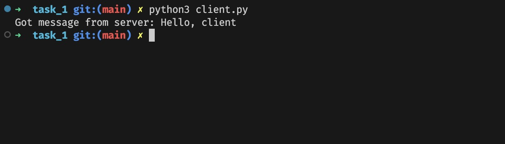
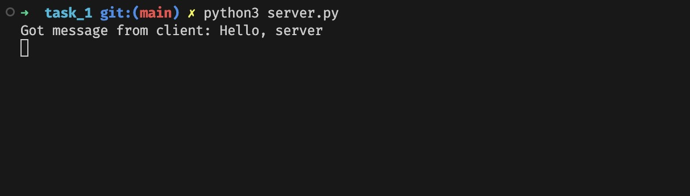

# Задача 1

Реализовать клиентскую и серверную часть приложения. Клиент отсылает серверу
сообщение «Hello, server». Сообщение должно отразиться на стороне сервера.
Сервер в ответ отсылает клиенту сообщение «Hello, client». Сообщение должно
отобразиться у клиента.

## Реализация

Клиент:

```python
import socket

# Using UDP connection (SOCK_DGRAM)
client = socket.socket(socket.AF_INET, socket.SOCK_DGRAM)
server_address = ("localhost", 9090)

try:
    client.sendto(b"Hello, server", server_address)
    data, server = client.recvfrom(1024)
    print(f"Got message from server: {data.decode()}")
finally:
    client.close()
```

Сервер:

```python
import socket

server = socket.socket(socket.AF_INET, socket.SOCK_DGRAM)
server_address = ("localhost", 9090)
server.bind(server_address)

while True:
    data, client_address = server.recvfrom(1024)
    print(f"Got message from client: {data.decode()}")
    server.sendto(b"Hello, client", client_address)
```

Пример выполнения:



