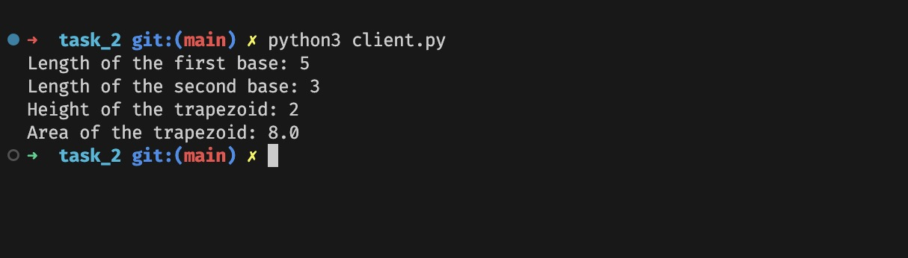

# Задача 2

Реализовать клиентскую и серверную часть приложения. Клиент запрашивает у
сервера выполнение математической операции, параметры, которые вводятся с
клавиатуры. Сервер обрабатывает полученные данные и возвращает результат
клиенту.

Вариант: c. Поиск площади трапеции

## Реализация

Клиент:

```python
import socket

# Using TCP connection (SOCK_STREAM)
client = socket.socket(socket.AF_INET, socket.SOCK_STREAM)
server_address = ('localhost', 9090)
client.connect(server_address)

baseA = float(input('Length of the first base: '))
baseB = float(input('Length of the second base: '))
height = float(input('Height of the trapezoid: '))

SEP = ';'
data = SEP.join(map(str, [baseA, baseB, height]))
client.send(data.encode())
res = client.recv(1024).decode()
print(f'Area of the trapezoid: {res}')
client.close()
```

Сервер:

```python
import socket

SEP = ';'

def calculate_trapezoid_area(baseA: float, baseB: float, height: float):
    return 0.5 * (baseA + baseB) * height


server = socket.socket(socket.AF_INET, socket.SOCK_STREAM)
server_address = ('localhost', 9090)
server.bind(server_address)
server.listen(10)
client_socket, client_address = server.accept()

while True:
    try:
        data = client_socket.recv(1024).decode()
        params = data.split(SEP)
        if len(params) == 3:
            baseA, baseB, height = map(float, params)
            result = calculate_trapezoid_area(baseA, baseB, height)
            client_socket.send(str(result).encode())
        else:
            client_socket.send(f'Params invalid, got {data}'.encode())
    except ConnectionResetError as e:
        break

client_socket.close()
server.close()
```

Пример выполнения:


