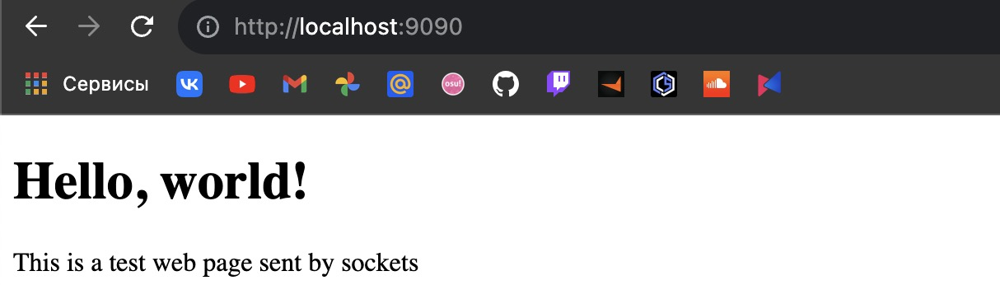

# Задача 3

Реализовать серверную часть приложения. Клиент подключается к серверу. В ответ клиент получает http-сообщение, содержащее html-страницу, которую сервер подгружает из файла index.html.

## Реализация

Сервер:

```python
import socket


def make_response():
    with open('index.html', 'r', encoding='utf-8') as file:
        html_content = file.read()

    res = 'HTTP/1.1 200 OK\r\n'
    res += 'Content-Type: text/html; charset=UTF-8\r\n'
    res += f'Content-Length: {len(html_content.encode())}\r\n\r\n'
    res += html_content

    return res


server = socket.socket(socket.AF_INET, socket.SOCK_STREAM)
server_address = ('localhost', 9090)
server.bind(server_address)
server.listen(10)
client_socket, client_address = server.accept()

while True:
    try:
        request = client_socket.recv(1024).decode()
        http_response = make_response()
        client_socket.send(http_response.encode())
        client_socket.close()
        break
    except Exception as e:
        print(str(e))
        break

server.close()
```

Страница:

```html
<!DOCTYPE html>
<html lang="en">
<head>
    <meta charset="UTF-8">
    <meta name="viewport" content="width=device-width, initial-scale=1.0">
    <title>Title</title>
</head>
<body>
    <h1>Hello, world!</h1>
    <p>This is a test web page sent by sockets</p>
</body>
</html>
```

Пример выполнения:


