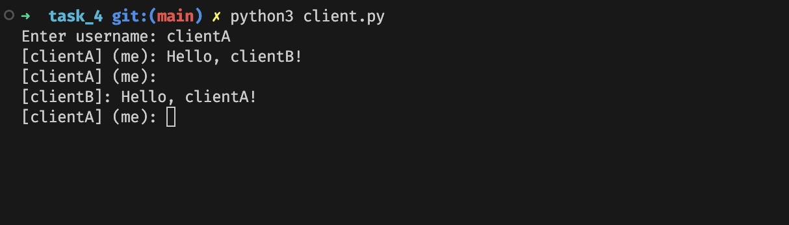

# Задача 4

Реализовать многопользовательский чат.

## Реализация

Клиент:

```python
import socket, sys, threading

SEP = '__SEP__'

def send():
    while True:
        try:
            sys.stdout.write(f'[{username}] (me): ')
            sys.stdout.flush()
            message = input()
            server.send(message.encode())
        except Exception as e:
            print(str(e))

def receive():
    while True:
        try:
            msg = server.recv(1024)
            USER, MESSAGE = msg.decode().split(SEP)

            if (USER == username):
                continue
            else:
                sys.stdout.write(f'\n[{USER}]: {MESSAGE}\n[{username}] (me): ')
                sys.stdout.flush()
        except:
            break


username = input('Enter username: ')
server_address = ('localhost', 9090)
server = socket.socket(socket.AF_INET, socket.SOCK_STREAM)
server.connect(server_address)
server.send(username.encode())

send_thread = threading.Thread(target=send)
receive_thread = threading.Thread(target=receive)
send_thread.start()
receive_thread.start()
```

Сервер:

```python
import socket, threading

SEP = '__SEP__'

server = socket.socket(socket.AF_INET, socket.SOCK_STREAM)
server_address = ('localhost', 9090)
server.bind(server_address)

users: dict[str, socket.socket] = {}

def client(client_socket: socket.socket, username: str):
    try:
        while True:
            message = client_socket.recv(1024).decode()
            if not message:
                break

            for _, client in users.items():
                if client != client_socket:
                    client.send(SEP.join([username, message]).encode())

    except Exception as e:
        print(f"Error: {e}")

    finally:
        del users[username]
        client_socket.close()
        print(f"{username} disconnected")


def threads():
    server.listen(10)

    while True:
        client_socket, client_address = server.accept()
        username = client_socket.recv(1024).decode().strip()
        print(f'Connected {client_address}: {username}')
        users[username] = client_socket
        client_thread = threading.Thread(target=client, args=(client_socket, username))
        client_thread.start()

print(f'Listening on {server_address[0]}:{server_address[1]}')
threads()
```

Пример выполнения:




