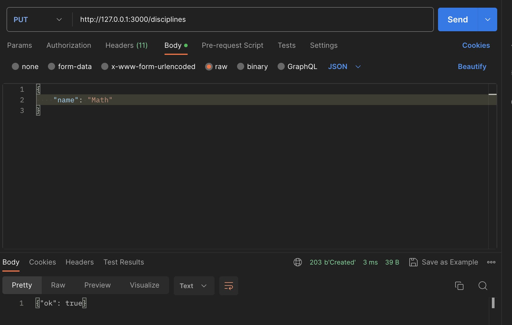
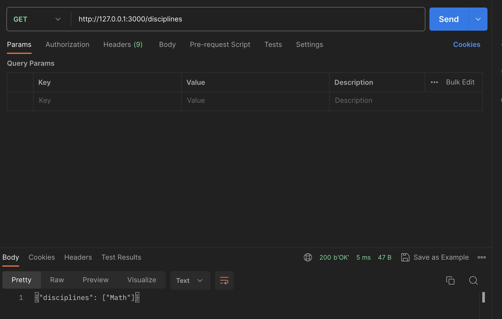

# Задача 4

Необходимо написать простой web-сервер для обработки GET и POST http запросов средствами Python и библиотеки socket.

Задание: сделать сервер, который может:
- Принять и записать информацию о дисциплине и оценке по дисциплине.
- Отдать информацию обо всех оценах по дсициплине в виде html-страницы.

## Реализация

```python
from functools import lru_cache
from email.parser import Parser
from io import BufferedReader
import json
import socket
from urllib.parse import parse_qs, urlparse
import traceback


MAX_LINE = 64*1024
MAX_HEADERS = 100


class Request:
  def __init__(self, method: str, target: str, version: str, headers, rfile: BufferedReader):
    self.method = method
    self.target = target
    self.version = version
    self.headers = headers
    self.rfile = rfile

  @property
  def path(self):
    return self.url.path

  @property
  @lru_cache(maxsize=None)
  def query(self):
    return parse_qs(self.url.query)

  @property
  @lru_cache(maxsize=None)
  def url(self):
    return urlparse(self.target)

  def body(self):
    size = self.headers.get('Content-Length')
    if not size:
      return None
    return self.rfile.read(int(size))

class Response:
  def __init__(self, status: int, reason: bytes, body: bytes=None, headers=None):
    self.status = status
    self.reason = reason
    self.headers = headers
    self.body = body

class HTTPError(Exception):
  def __init__(self, status: int, reason: bytes, body: bytes=None):
    super()
    self.status = status
    self.reason = reason
    self.body = body


class MyHTTPServer:
    def __init__(self, host: str, port: int, name: str = 'example.local'):
        self._host = host
        self._port = port
        self._name = name
        self.grades = {}
        self.disciplines = set()

    def serve_forever(self):
        serv_sock = socket.socket(
            socket.AF_INET,
            socket.SOCK_STREAM,
            proto=0)
        serv_sock.setsockopt(socket.SOL_SOCKET, socket.SO_REUSEADDR, 1)

        try:
            serv_sock.bind((self._host, self._port))
            serv_sock.listen(1)

            while True:
                conn, _ = serv_sock.accept()
                try:
                    self.serve_client(conn)
                except Exception as e:
                    print('Client serving failed:', e)
                    traceback.print_tb(e.__traceback__)
        finally:
            serv_sock.close()

    def serve_client(self, conn: socket.socket):
        req = None
        try:
            req = self.parse_request(conn)
            res = self.handle_request(req)
            self.send_response(conn, res)
        except ConnectionResetError:
            conn = None
        except HTTPError as e:
            self.send_error(conn, e)

        if conn and req:
            req.rfile.close()
            conn.close()

    def parse_request(self, conn: socket.socket):
        rfile = conn.makefile('rb')
        method, target, ver = self.parse_request_line(rfile)
        headers = self.parse_headers(rfile)
        host = headers.get('Host')
        if not host:
            raise HTTPError(400, 'Bad request',
                'Host header is missing')
        if host not in (self._name,
                        f'{self._name}:{self._port}'):
            raise HTTPError(404, 'Not found')
        return Request(method, target, ver, headers, rfile)

    def parse_request_line(self, rfile: BufferedReader):
        raw = rfile.readline(MAX_LINE + 1)
        if len(raw) > MAX_LINE:
            raise HTTPError(400, 'Bad request',
                'Request line is too long')

        req_line = str(raw, 'iso-8859-1')
        words = req_line.split()
        if len(words) != 3:
            raise HTTPError(400, 'Bad request',
                'Malformed request line')

        method, target, ver = words
        if ver != 'HTTP/1.1':
            raise HTTPError(505, 'HTTP Version Not Supported')
        return method, target, ver

    def parse_headers(self, rfile: BufferedReader):
        headers = []
        while True:
            line = rfile.readline(MAX_LINE + 1)
            if len(line) > MAX_LINE:
                raise HTTPError(494, 'Request header too large')

            if line in (b'\r\n', b'\n', b''):
                break

            headers.append(line)
            if len(headers) > MAX_HEADERS:
                raise HTTPError(494, 'Too many headers')

        sheaders = b''.join(headers).decode('iso-8859-1')
        return Parser().parsestr(sheaders)

    def send_response(self, conn: socket.socket, res: Response):
        wfile = conn.makefile('wb')
        status_line = f'HTTP/1.1 {res.status} {res.reason}\r\n'
        wfile.write(status_line.encode('iso-8859-1'))

        if res.headers:
            for (key, value) in res.headers:
                header_line = f'{key}: {value}\r\n'
                wfile.write(header_line.encode('iso-8859-1'))

        wfile.write(b'\r\n')

        if res.body:
            wfile.write(res.body)

        wfile.flush()
        wfile.close()
    
    def send_error(self, conn: socket.socket, e: HTTPError):
        try:
            status = e.status
            reason = e.reason
            body = (e.body or e.reason).encode('utf-8')
        except:
            status = 500
            reason = b'Internal Server Error'
            body = b'Internal Server Error'
        res = Response(status,
                    reason,
                    body,
                    [('Content-Length', len(body))])
        self.send_response(conn, res)

    def handle_request(self, req: Request):
        print(req.method, req.path)

        if req.path == '/grades' and req.method == 'GET':
            return self.handle_get_grades(req)

        if req.path == '/grades' and req.method == 'PUT':
            return self.handle_add_grade(req)

        if req.path == '/disciplines' and req.method == 'GET':
            return self.handle_get_disciplines(req)

        if req.path == '/disciplines' and req.method == 'PUT':
            return self.handle_add_discipline(req)

        raise HTTPError(404, 'Not found')

    def handle_add_grade(self, req: Request):
        parsed_body = json.loads(req.body().decode())
        grade = parsed_body.get('grade')
        discipline = parsed_body.get('discipline')
        
        if grade == None or discipline == None:
            raise HTTPError(403, 'Bad Request', json.dumps({ 'message': 'missing params', 'error': True }))
        
        if not discipline in self.disciplines:
            raise HTTPError(403, 'Bad Request', json.dumps({ 'message': 'unknown discipline', 'error': True }))

        self.grades[discipline].append(grade)
            
        return Response(203, b'Created', json.dumps({ 'ok': True }).encode())
    
    def handle_add_discipline(self, req: Request):
        parsed_body = json.loads(req.body().decode())
        name = parsed_body.get('name')
        
        if name == None:
            raise HTTPError(403, 'Bad Request', json.dumps({ 'message': 'missing params "name"', 'error': True }))
        
        if name in self.disciplines:
            raise HTTPError(403, 'Bad Request', json.dumps({ 'message': 'discipline already exists "name"', 'error': True }))
        
        self.disciplines.add(name)
        self.grades[name] = []

        return Response(203, b'Created', json.dumps({ 'ok': True }).encode())

    def handle_get_grades(self, req: Request):
        accept = req.headers.get('Accept')
        
        if 'text/html' in accept:
            lines = [f'<li>{discipline}: {", ".join(map(str, grades))}' for discipline, grades in self.grades.items()]
            page = (
                f"<html><body><ul>"
                f"{''.join(lines)}"
                f"</ul></body></html>"
            )
            return Response(200, b'OK', page.encode())
        elif 'application/json' in accept:
            return Response(200, b'OK', json.dumps({ 'grades': self.grades }).encode())
        else:
            return Response(406, 'Not Acceptable')

    def handle_get_disciplines(self, req: Request):
        disciplines = []
        for d in self.disciplines:
            disciplines.append(d)
        return Response(200, b'OK', json.dumps({ 'disciplines': disciplines }).encode())


if __name__ == "__main__":
    host = "127.0.0.1"
    port = 3000
    server = MyHTTPServer(host, port)
    try:
        server.serve_forever()
    except KeyboardInterrupt:
        pass
```

Пример выполнения:





