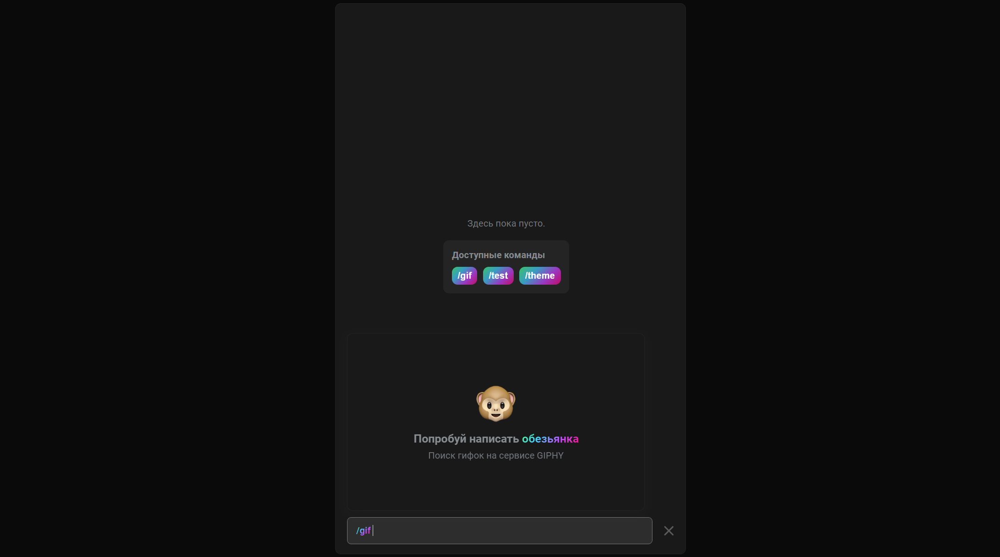
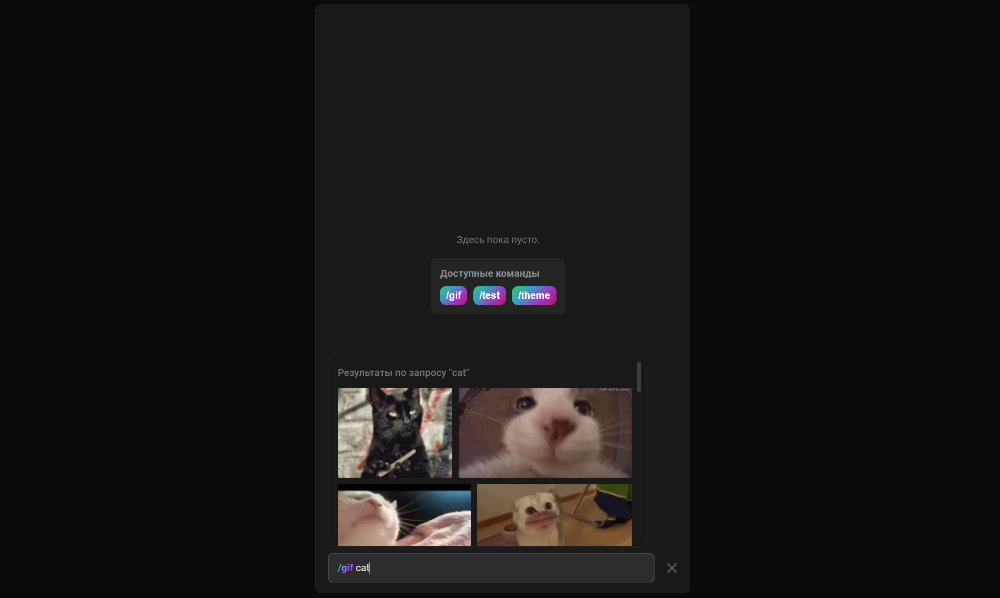
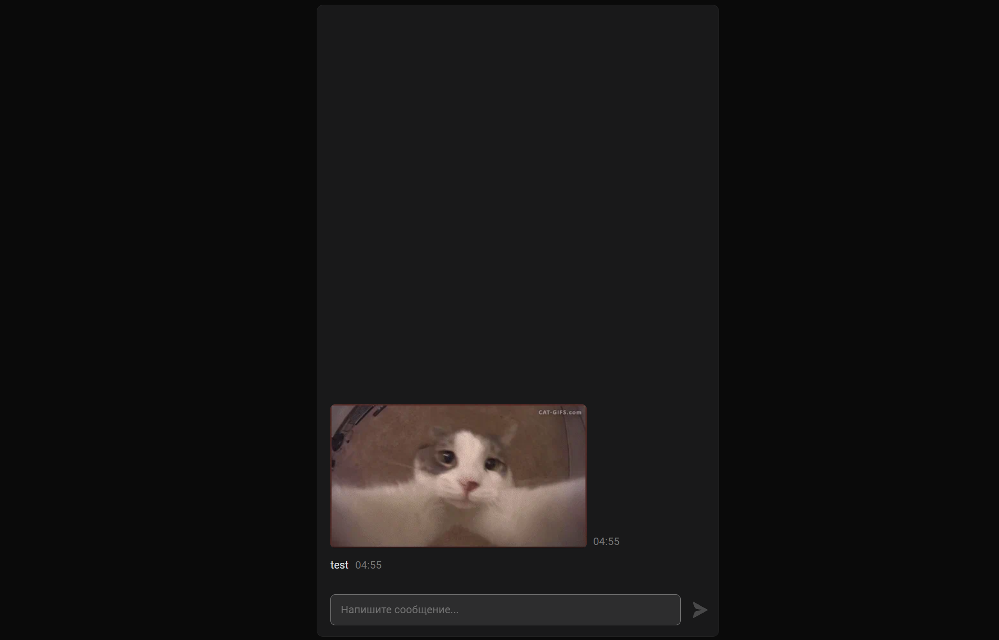
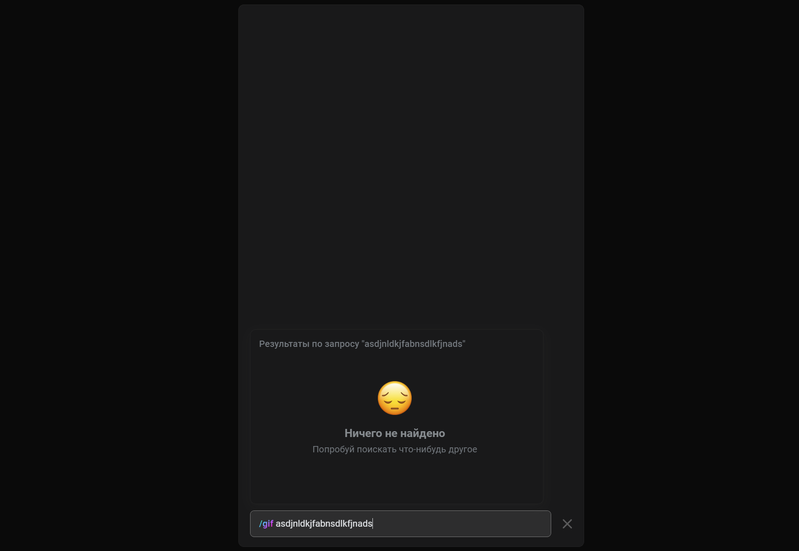

# Отчёт

Лабораторная работа представлена в виде проекта **vk-giphy**, который представляет собой успешное тестовое на позицию разработчика ВКонтакте в команде веб-мессенджера.

GitHub: [link](https://github.com/jarvis394/vk-giphy)

### Задача

Реализовать приложение, которое будет имитировать интерфейс мессенджера (лента сообщений, поле ввода, кнопка отправки). При вводе сочетания `/gif` в поле ввода сообщения, сочетание должно подсветиться градиентом и должно открыться меню выбора гифки. Модальное меню над полем ввода должно выглядеть как сетка с динамической шириной элементов. Плюсом будет поддержка выбора гифки с клавиатуры.

### Стек проекта

- TypeScript
- React 18, Redux, immer
- Emotion
- Axios

### Реализация проекта

Для стартовой архитектуры был выбран инструмент CRA (create-react-app). Выбор пал на него, так как у него изначально была поддержка service-worker'ов, через которые можно кешировать запросы к API гифок. Также, для поля ввода было принято решение использовать простой тег `<textarea>` и наложить поверх него блок с текстом, который можно редактировать и красить кодом.

От себя было добавлено в условие задачи изменение дизайна по своему вкусу, а также возможность автоматически менять тему вместе с темой устройства.

В плане разбиения на компоненты был использован новый подход с использованием "доменов":

```typescript
// src/components/Messages/index.tsx

import React, { useState } from 'react'
import Stack from './Stack'
import TextArea from './TextArea'
import TextAreaInput from './TextAreaInput'
import Popups from './Popups'

export interface MessagesState {
  command: string
  message: string
  lastSelection: [number, number]
}

export const MessagesContext = React.createContext<{
  context: MessagesState
  setContext: React.Dispatch<React.SetStateAction<MessagesState>>
}>(undefined)

const Messages = ({ children }) => {
  const [context, setContext] = useState<MessagesState>({
    command: null,
    message: '',
    lastSelection: [0, 0],
  })

  return (
    <MessagesContext.Provider
      value={{
        context,
        setContext,
      }}
    >
      {children}
    </MessagesContext.Provider>
  )
}

Messages.TextArea = TextArea
Messages.TextAreaInput = TextAreaInput
Messages.Popups = Popups
Messages.Stack = Stack
export default Messages
```

Здесь `Messages` -- это домен, а компоненты `Messages.TextArea`, `Messages.TextAreaInput` и другие находятся внутри этого домена. Такой подход позволяет явно указать, к какой части приложения относится компонент и, что важнее, в каком реактовском контексте должен находиться компонент.

Реализован стор на основе чистого Redux и immer, пример одного из сторов (хранение и получение гифок):

```typescript
// src/store/reducers/gifs/index.ts

import produce from 'immer'
import { GIPHY_FETCH_GIFS_COUNT } from 'src/config/constants'
import { FetchingState, ShowState } from 'src/types'
import {
  GIFS_IDLE,
  GIFS_FETCH,
  GIFS_FETCH_FULFILLED,
  GIFS_FETCH_REJECTED,
  State,
} from './types'

const initialState: State = {
  query: '',
  state: FetchingState.Idle,
  showState: ShowState.Hide,
  fetchError: null,
  data: {},
  source: null,
  pagination: {
    count: GIPHY_FETCH_GIFS_COUNT,
    offset: 0,
    total_count: null,
  },
}

export default produce((draft, { type, payload }) => {
  switch (type) {
    case GIFS_IDLE:
      draft.state = FetchingState.Idle
      draft.showState = ShowState.Hide
      draft.query = null
      draft.pagination = {
        count: GIPHY_FETCH_GIFS_COUNT,
        offset: 0,
        total_count: null,
      }
      break
    case GIFS_FETCH:
      draft.state = FetchingState.Fetching
      draft.showState = ShowState[payload.offset === 0 ? 'Hide' : 'Show']
      draft.source = payload.source
      draft.fetchError = null
      // Empty data if user is has made a different search
      // We don't need to empty data if we are fetching same query with offset
      if (payload.offset === 0) draft.data = {}
      draft.pagination.offset = payload.offset
      draft.query = payload.query
      break
    case GIFS_FETCH_FULFILLED:
      // Reject fetched data for another query (condition race)
      // Could happen when data is almost loaded and user changes the query
      // Fetch cancelling is implemented so this should™ never happen
      if (payload.query !== draft.query) return

      draft.state = FetchingState.Fetched
      draft.showState = ShowState.Show
      draft.source = null

      // In some cases, high `offset` will lead to Giphy API misfunction
      // and it will return { data: [], pagination: undefined }.
      // We should ignore the result in this case and set pagination
      // to the last successful result
      if (!payload.pagination) {
        draft.pagination.total_count =
          draft.pagination.offset + draft.pagination.count
        return
      }

      draft.data[payload.pagination.offset] = payload.data
      draft.pagination = payload.pagination
      break
    case GIFS_FETCH_REJECTED:
      draft.state = FetchingState.Error
      draft.showState = ShowState.Hide
      draft.data = {}
      draft.fetchError = payload.data
      // Pagination object should be the same to let to
      // retry fetch at faulty `offset`
      break
    default:
      break
  }
}, initialState)
```

Код для actions для стора с гифками

```typescript
// src/store/actions/gifs.ts

import { RootState } from '..'
import {
  GIFS_FETCH,
  GIFS_FETCH_FULFILLED,
  GIFS_FETCH_REJECTED,
  GIFS_IDLE,
} from '../reducers/gifs/types'
import { GIPHY_FETCH_GIFS_COUNT } from 'src/config/constants'
import * as api from 'src/api'
import axios from 'axios'
import { FetchingState } from 'src/types'

interface SearchGIFsParams {
  query: string
  offset?: number
}

export const flushGIFs = () => async (dispatch, getState: () => RootState) => {
  const shouldDispatch = getState().gifs.state !== FetchingState.Idle
  shouldDispatch && dispatch({ type: GIFS_IDLE })
}

export const searchGIFs =
  (params: SearchGIFsParams) => async (dispatch, getState: () => RootState) => {
    const { query, offset = 0 } = params
    const storeState = getState()
    const storeData = storeState.gifs

    // Cancel previous request if found
    if (storeData.source) {
      storeData.source.cancel()
    }

    const source = axios.CancelToken.source()
    dispatch({ type: GIFS_FETCH, payload: { offset, query, source } })

    try {
      const language = window && window.navigator.language.split('-')[0]
      const response = await api.search({
        query,
        limit: GIPHY_FETCH_GIFS_COUNT,
        offset,
        lang: language,
        requestOptions: {
          cancelToken: source.token,
        },
      })

      if (response) {
        dispatch({
          type: GIFS_FETCH_FULFILLED,
          payload: {
            data: response.data,
            pagination: response.pagination,
            query,
          },
        })
      }
    } catch (error) {
      if (axios.isCancel(error)) {
        return
      }

      dispatch({
        type: GIFS_FETCH_REJECTED,
        payload: { data: error, query },
      })
    }
  }
```

### Вывод и результаты










В ходе работы был написан чистый код с заданными архитектурными паттернами. Кроме выполнения условия, были реализованы дополнительные фичи, как темизация, поддержка других команд, кроме `/gif`; адаптивность, поддержка выбора гифки через клавиатуру (WAI-ARIA practicies).
