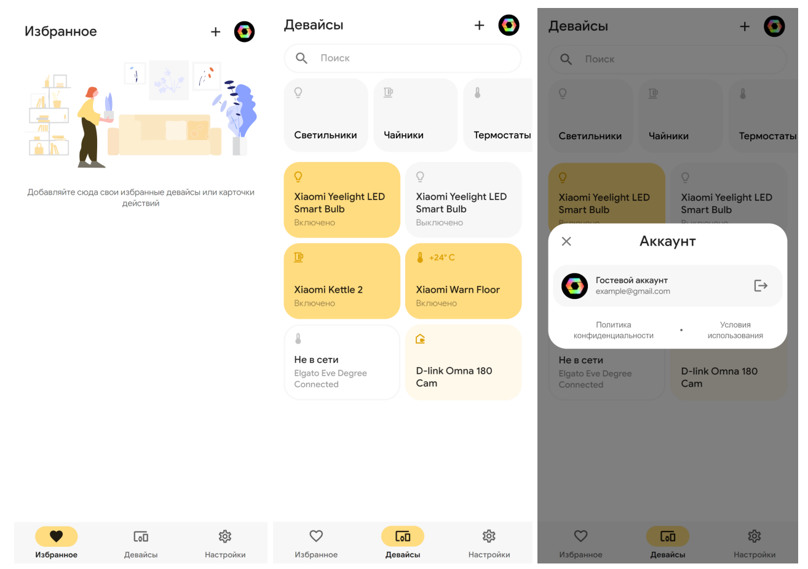
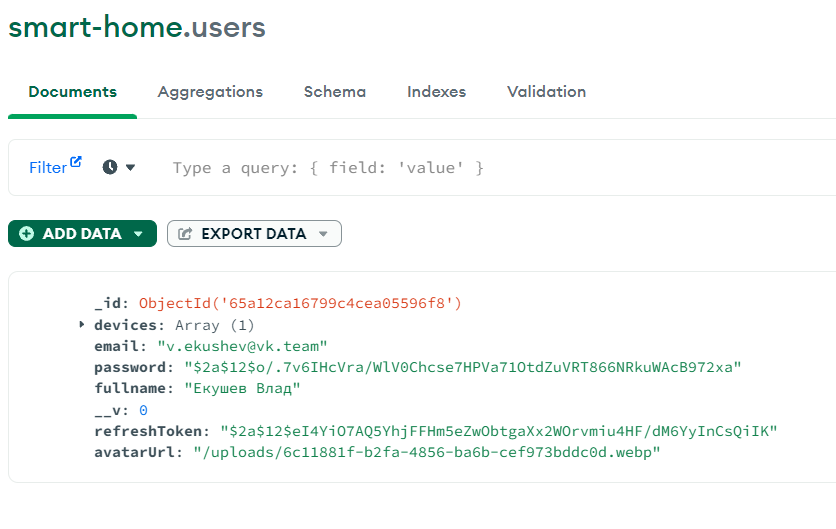
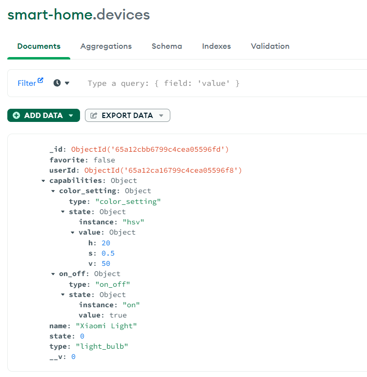

# Вывод и результаты

В ходе лабораторной работы был реализован веб-сервис для управления умным домом. Реализована backend часть приложения на фреймворке NestJS, с разными стратегиями авторизации (Basic, JWT). Была реализована привязка фронтенда к API через RTK Query стор.

  
  
  

