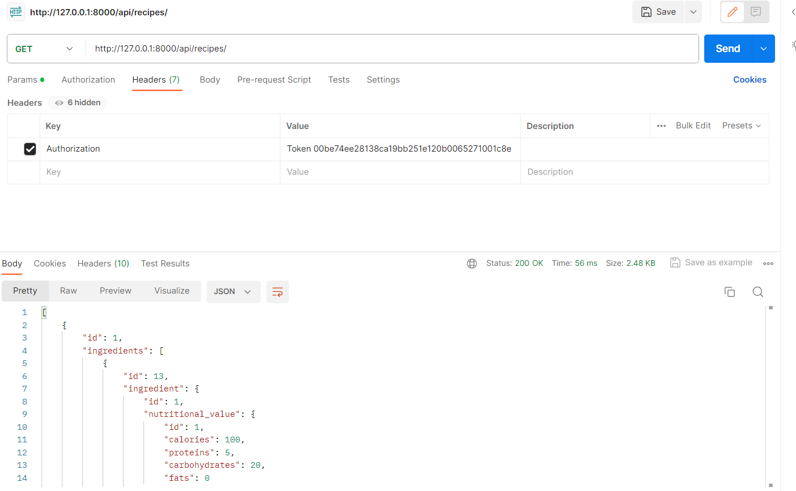

# Отчет по лабораторной работе №3

Выполнил: Акулов Алексей, K33391

#### Цель работы:

Овладеть практическими навыками и умениями реализации web-сервисов
средствами Django.

## Модель

Я делал свой собственный вариант, согласовав его предварительно с преподаватеями.
Идея сайта: модульные рецепты, которые пользователь может составить самостоятельно + возможность добавлять 
ингредиенты и инструменты для рецептов и собирать планы питания. Также нужно не забыть добавить профиль для пользователя.

```
from django.db import models
from django.contrib.auth.models import AbstractUser


class Ingredient(models.Model):
    name = models.CharField(max_length=255)
    allergens = models.CharField(max_length=255, blank=True)
    is_vegetarian = models.BooleanField(default=False)
    nutritional_value = models.ForeignKey('NutritionalValue',
                                          on_delete=models.SET_NULL, null=True,
                                          blank=True)


class NutritionalValue(models.Model):
    calories = models.IntegerField()
    proteins = models.IntegerField()
    carbohydrates = models.IntegerField()
    fats = models.IntegerField()


class Tool(models.Model):
    name = models.CharField(max_length=255)
    cleaning_time = models.IntegerField()


class Recipe(models.Model):
    difficulty_types = (
        ("E", "Easy"),
        ("M", "Medium"),
        ("H", "Hard"),
    )

    title = models.CharField(max_length=255)
    preparation_time = models.IntegerField()
    cooking_time = models.IntegerField()
    difficulty_level = models.CharField(max_length=2, choices=difficulty_types)
    region = models.CharField(max_length=255, blank=True)
    is_vegetarian = models.BooleanField(default=False)
    image_url = models.URLField(blank=True)
    ingredients = models.ManyToManyField(Ingredient,
                                         through='RecipeIngredient')
    tools = models.ManyToManyField(Tool, through='RecipeTool')


class MealPlan(models.Model):
    date = models.DateField()
    breakfast = models.ForeignKey(Recipe, related_name='meal_plan_breakfast',
                                  on_delete=models.SET_NULL, null=True,
                                  blank=True)
    lunch = models.ForeignKey(Recipe, related_name='meal_plan_lunch',
                              on_delete=models.SET_NULL, null=True, blank=True)
    dinner = models.ForeignKey(Recipe, related_name='meal_plan_dinner',
                               on_delete=models.SET_NULL, null=True,
                               blank=True)


class RecipeIngredient(models.Model):
    recipe = models.ForeignKey(Recipe, on_delete=models.CASCADE)
    ingredient = models.ForeignKey(Ingredient, on_delete=models.CASCADE)
    quantity = models.CharField(max_length=100)


class RecipeTool(models.Model):
    recipe = models.ForeignKey(Recipe, on_delete=models.CASCADE)
    tool = models.ForeignKey(Tool, on_delete=models.CASCADE)


class UserProfile(AbstractUser):
    favorite_recipe = models.ForeignKey(Recipe, on_delete=models.CASCADE, null=True, blank=True)


```

Нужно не забыть провести миграции модели

## Serializers

Сериализаторы пишем обычно, выводя все поля и ставя вложенные сериализаторы для более логичной работы с апи

```
from django.contrib.auth.hashers import make_password
from rest_framework import serializers
from .models import Ingredient, NutritionalValue, Tool, Recipe, MealPlan, \
    RecipeIngredient, RecipeTool, UserProfile


class NutritionalValueSerializer(serializers.ModelSerializer):
    class Meta:
        model = NutritionalValue
        fields = '__all__'


class IngredientSerializer(serializers.ModelSerializer):
    nutritional_value = NutritionalValueSerializer(read_only=True)

    class Meta:
        model = Ingredient
        fields = '__all__'


class ToolSerializer(serializers.ModelSerializer):
    class Meta:
        model = Tool
        fields = '__all__'


class RecipeIngredientSerializer(serializers.ModelSerializer):
    ingredient = IngredientSerializer()

    class Meta:
        model = RecipeIngredient
        fields = '__all__'


class RecipeToolSerializer(serializers.ModelSerializer):
    tool = ToolSerializer()

    class Meta:
        model = RecipeTool
        fields = '__all__'


class RecipeSerializer(serializers.ModelSerializer):
    ingredients = RecipeIngredientSerializer(source='recipeingredient_set',
                                             many=True, read_only=True)
    tools = RecipeToolSerializer(source='recipetool_set', many=True, read_only=True)

    class Meta:
        model = Recipe
        fields = '__all__'


class MealPlanSerializer(serializers.ModelSerializer):
    breakfast = RecipeSerializer()
    lunch = RecipeSerializer()
    dinner = RecipeSerializer()

    class Meta:
        model = MealPlan
        fields = '__all__'


class UserProfileSerializer(serializers.ModelSerializer):
    favorite_recipe = serializers.PrimaryKeyRelatedField(
        queryset=Recipe.objects.all(), allow_null=True)

    class Meta:
        model = UserProfile
        fields = (
            "id",
            "password",
            "username",
            "email",
            "first_name",
            "last_name",
            "favorite_recipe"
        )

    def create(self, validated_data):
        return super().create({**validated_data, "password": make_password(
            validated_data["password"])})
```

## Views

Дальше делаем вьюхи для апи. Нужно настроить самостоятельно update и create для рецепта и ингредиента,
т.к. они используют встроенные сериализаторы, также пишем несколько дополнительных апи методов:
нахождение самого калорийного плана, нахождение блюда по ингредиенту

```
from django.db.models import Sum
from django.shortcuts import get_object_or_404
from rest_framework import viewsets, status
from rest_framework.decorators import action, api_view, permission_classes
from rest_framework.permissions import IsAdminUser, AllowAny
from rest_framework.response import Response

from .models import Ingredient, NutritionalValue, Tool, Recipe, MealPlan, \
    RecipeIngredient, UserProfile, RecipeTool

from .serializers import IngredientSerializer, NutritionalValueSerializer, \
    ToolSerializer, RecipeSerializer, MealPlanSerializer, UserProfileSerializer


class IngredientViewSet(viewsets.ModelViewSet):
    queryset = Ingredient.objects.all()
    serializer_class = IngredientSerializer

    def create(self, request, *args, **kwargs):
        serializer = self.get_serializer(data=request.data)
        serializer.is_valid(raise_exception=True)

        nutritional_data = request.data.get('nutritional_value')
        nutritional_value = None

        if nutritional_data:
            nutritional_serializer = NutritionalValueSerializer(
                data=nutritional_data)
            if nutritional_serializer.is_valid():
                if 'id' in nutritional_data:
                    nutritional_value = NutritionalValue.objects.get(
                        id=nutritional_data['id'])
                else:
                    nutritional_value = NutritionalValue.objects.create(
                        **nutritional_serializer.validated_data)

        ingredient_data = serializer.validated_data
        ingredient_data['nutritional_value'] = nutritional_value
        ingredient = Ingredient.objects.create(**ingredient_data)

        output_serializer = IngredientSerializer(ingredient)
        return Response(output_serializer.data, status=status.HTTP_201_CREATED)

    def destroy(self, request, *args, **kwargs):
        instance = self.get_object()
        self.perform_destroy(instance)
        return Response(status=status.HTTP_204_NO_CONTENT)


class NutritionalValueViewSet(viewsets.ModelViewSet):
    queryset = NutritionalValue.objects.all()
    serializer_class = NutritionalValueSerializer


class ToolViewSet(viewsets.ModelViewSet):
    queryset = Tool.objects.all()
    serializer_class = ToolSerializer


class RecipeViewSet(viewsets.ModelViewSet):
    queryset = Recipe.objects.all()
    serializer_class = RecipeSerializer

    def create(self, request, *args, **kwargs):
        serializer = self.get_serializer(data=request.data)
        serializer.is_valid(raise_exception=True)

        recipe_data = serializer.validated_data
        recipe = Recipe.objects.create(
            title=recipe_data['title'],
            preparation_time=recipe_data['preparation_time'],
            cooking_time=recipe_data['cooking_time'],
            difficulty_level=recipe_data['difficulty_level'],
            region=recipe_data.get('region', ''),
            is_vegetarian=recipe_data['is_vegetarian'],
            image_url=recipe_data.get('image_url', '')
        )

        for ingredient_data in request.data.get('ingredients', []):
            ingredient_id = ingredient_data['id']
            quantity = ingredient_data['quantity']
            ingredient = get_object_or_404(Ingredient, id=ingredient_id)
            RecipeIngredient.objects.create(recipe=recipe, ingredient=ingredient, quantity=quantity)

        for tool_data in request.data.get('tools', []):
            tool_id = tool_data['id']
            tool = get_object_or_404(Ingredient, id=tool_id)
            RecipeTool.objects.create(recipe=recipe, tool=tool)

        output_serializer = RecipeSerializer(recipe)
        headers = self.get_success_headers(output_serializer.data)
        return Response(output_serializer.data, status=status.HTTP_201_CREATED, headers=headers)

    def update(self, request, *args, **kwargs):
        partial = kwargs.pop('partial', False)
        instance = self.get_object()
        serializer = self.get_serializer(instance, data=request.data,
                                         partial=partial)
        serializer.is_valid(raise_exception=True)

        self.perform_update(serializer)

        if 'ingredients' in request.data:
            RecipeIngredient.objects.filter(recipe=instance).delete()

            for ingredient_data in request.data['ingredients']:
                ingredient_id = ingredient_data['ingredient']['id']
                quantity = ingredient_data['quantity']
                ingredient = get_object_or_404(Ingredient, id=ingredient_id)
                RecipeIngredient.objects.create(recipe=instance,
                                                ingredient=ingredient,
                                                quantity=quantity)

        if 'tools' in request.data:
            RecipeTool.objects.filter(recipe=instance).delete()

            for tool_data in request.data['tools']:
                tool_id = tool_data['tool']['id']
                tool = get_object_or_404(Tool, id=tool_id)
                RecipeTool.objects.create(recipe=instance, tool=tool)

        return Response(serializer.data)


def find_highest_calorie_plan():
    max_calorie_plan = None
    max_calories = 0
    for plan in MealPlan.objects.all():
        total_calories = 0
        for recipe in [plan.breakfast, plan.lunch, plan.dinner]:
            if recipe:
                for recipe_ingredient in RecipeIngredient.objects.filter(
                        recipe=recipe):
                    if recipe_ingredient.ingredient.nutritional_value.calories:
                        calories_per_unit = recipe_ingredient.ingredient.\
                            nutritional_value.calories

                        #quantity = float(recipe_ingredient.quantity)
                        total_calories += calories_per_unit
        if total_calories > max_calories:
            max_calories = total_calories
            max_calorie_plan = plan
    return max_calorie_plan


class MealPlanViewSet(viewsets.ModelViewSet):
    queryset = MealPlan.objects.all()
    serializer_class = MealPlanSerializer

    @action(detail=False)
    def highest_calorie_plan(self, request):
        max_calorie_plan = find_highest_calorie_plan()
        if max_calorie_plan:
            serializer = self.get_serializer(max_calorie_plan)
            return Response(serializer.data)
        else:
            return Response({'status': 'no meal plans found'},
                            status=status.HTTP_404_NOT_FOUND)


@api_view(["POST"])
def find_recipes_by_ingredient(request):
    ingredient_name = request.data["name"]
    queryset = Recipe.objects.filter(ingredients__name=ingredient_name)
    serializer = RecipeSerializer(queryset, many=True)
    return Response(serializer.data, status=status.HTTP_200_OK)


@api_view(["POST"])
def find_recipes_by_nutrition(request):
    min_calories = request.data.get("min_calories", 0)
    min_proteins = request.data.get("min_proteins", 0)
    min_carbs = request.data.get("min_carbs", 0)
    min_fats = request.data.get("min_fats", 0)

    queryset = Recipe.objects.annotate(
        total_calories=Sum('ingredients__nutritional_value__calories'),
        total_proteins=Sum('ingredients__nutritional_value__proteins'),
        total_carbohydrates=Sum('ingredients__nutritional_value__carbohydrates'),
        total_fats=Sum('ingredients__nutritional_value__fats')
    ).filter(
        total_calories__gte=min_calories,
        total_proteins__gte=min_proteins,
        total_carbohydrates__gte=min_carbs,
        total_fats__gte=min_fats
    )

    serializer = RecipeSerializer(queryset, many=True)
    return Response(serializer.data, status=status.HTTP_200_OK)


class UserProfileViewSet(viewsets.ModelViewSet):
    permission_classes = [IsAdminUser]
    queryset = UserProfile.objects.all()
    serializer_class = UserProfileSerializer

    def create(self, request, *args, **kwargs):
        serializer = self.get_serializer(data=request.data)
        serializer.is_valid(raise_exception=True)
        self.perform_create(serializer)
        headers = self.get_success_headers(serializer.data)
        return Response(serializer.data, status=status.HTTP_201_CREATED,
                        headers=headers)

    @action(detail=True, methods=['patch'])
    def partial_update_profile(self, request, pk=None):
        instance = self.get_object()
        partial_data = request.data
        serializer = self.get_serializer(instance, data=partial_data,
                                         partial=True)
        serializer.is_valid(raise_exception=True)

        for key, value in serializer.validated_data.items():
            setattr(instance, key, value)

        instance.save()

        return Response(self.get_serializer(instance).data)

    def destroy(self, request, *args, **kwargs):
        instance = self.get_object()
        self.perform_destroy(instance)
        return Response(status=status.HTTP_204_NO_CONTENT)


```

## Ссылки

Остаются ссылки. Здесь воспользуемся роутером. 

```
from django.urls import path, include
from rest_framework.routers import DefaultRouter
from .views import IngredientViewSet, NutritionalValueViewSet, \
    ToolViewSet, RecipeViewSet, MealPlanViewSet, find_recipes_by_nutrition, \
    find_recipes_by_ingredient, UserProfileViewSet

router = DefaultRouter()
router.register(r'ingredients', IngredientViewSet)
router.register(r'nutritionalvalues', NutritionalValueViewSet)
router.register(r'tools', ToolViewSet)
router.register(r'recipes', RecipeViewSet)
router.register(r'mealplans', MealPlanViewSet)
router.register(r'users', UserProfileViewSet)

urlpatterns = [
    path('', include(router.urls)),
    path('mealplans/highest_calorie_plan/',
         MealPlanViewSet.as_view({'get': 'highest_calorie_plan'})),
    path('find_recipe/', find_recipes_by_nutrition),
    path('find_recipe_ing/', find_recipes_by_ingredient)
]

```


## Работа

Также стоит не забыть изменить файл настроек в главном проекте. После этого нужно через /auth/users/
полчуить токен и использовав его в заголовке отправить нужные запросы. Примеры:

Получение ингредиентов:


Добавление ингредиента:


## Вывод

При выполнении данной лабораторной работы я изучил работу с DjangoREST