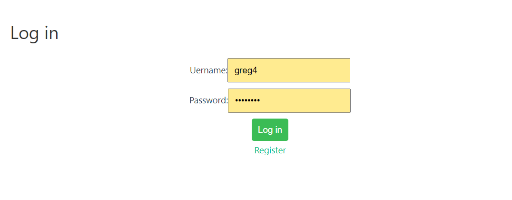
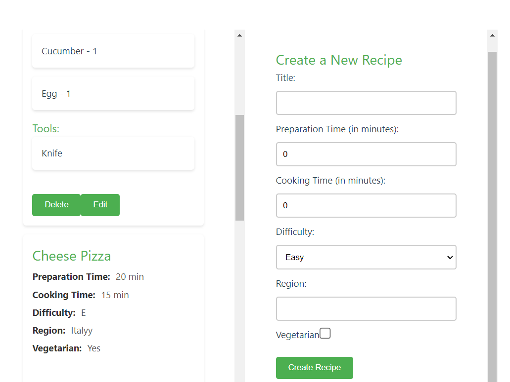
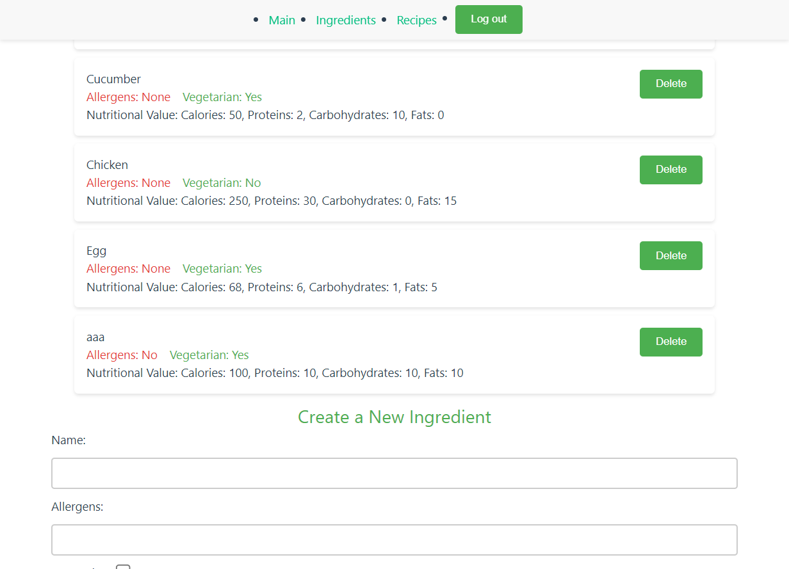

# Отчет по лабораторной работе №4

Выполнил: Акулов Алексей, K33391

#### Цель работы:

Овладеть практическими навыками и умениями 
реализации клиентской части приложения средствами vue.js

### Серверная часть

Я делал свой собственный вариант, согласовав его предварительно с преподаватеями.
Идея сайта: модульные рецепты, которые пользователь может составить самостоятельно + возможность добавлять 
ингредиенты и инструменты для рецептов и собирать планы питания. Также нужно не забыть добавить профиль для пользователя.
Подробнее можно узнать в 3 Лабораторной

## Регистрация и вход

Регистрация и вход представляют собой классические страницы, где пользователь вводит
свои данные и потом на сервере ему выдается токен. Не забываем добавить стили 
для более приятного внешнего вида.

```
<template>
  <div>
    <h2>Registration</h2>
    <form @submit.prevent="register">
      <div>
        <label for="username">Username:</label>
        <input id="username" v-model="user.username" type="text" required>
      </div>
      <div>
        <label for="email">Email:</label>
        <input id="email" v-model="user.email" type="email" required>
      </div>
      <div>
        <label for="password">Password:</label>
        <input id="password" v-model="user.password" type="password" required>
      </div>
      <button type="submit">Register</button>
      <router-link to="/login">Log in</router-link>
    </form>
  </div>
</template>

<script>
import axios from 'axios';

export default {
  name: 'RegisterPage',
  data() {
    return {
      user: {
        username: '',
        email: '',
        password: ''
      }
    }
  },
  methods: {
    async register() {
      try {
        const response = await axios.post('http://127.0.0.1:8000/auth/users/', this.user);
        console.log('Registration successful', response.data);

        const response_login = await axios.post('http://127.0.0.1:8000/auth/token/login/', {
          username: this.user.username,
          password: this.user.password,
        });

        const accessToken = response_login.data.auth_token;
        localStorage.setItem('access_token', accessToken);
        console.log('Login successful. Token:', accessToken);

        this.$router.push('/');
      } catch (error) {
        console.error('Ошибка при регистрации:', error.response.data);
      }
    }
  }
}
</script>


<style scoped>
.container {
  max-width: 400px;
  margin: 0 auto;
  padding: 20px;
  text-align: center;
}

h2 {
  color: #333;
  font-size: 2em;
  margin-bottom: 20px;
}

form {
  display: flex;
  flex-direction: column;
  align-items: center;
}

label {
  margin-bottom: 5px;
}

input {
  margin-bottom: 10px;
  padding: 10px;
  font-size: 1em;
}

button {
  background-color: #3bbc55;
  color: #ffffff;
  padding: 10px;
  border: none;
  cursor: pointer;
  font-size: 1em;
  border-radius: 4px;
}
</style>
```

```
<template>
  <div>
    <h2>Log in</h2>
    <form @submit.prevent="login">
      <div>
        <label for="username">Uername:</label>
        <input id="username" v-model="username" type="text" required>
      </div>
      <div>
        <label for="password">Password:</label>
        <input id="password" v-model="password" type="password" required>
      </div>
      <button type="submit">Log in</button>
      <router-link to="/register">Register</router-link>

    </form>
  </div>
</template>

<script>
import axios from 'axios';

export default {
  name: 'LoginPage',
  data() {
    return {
        username: '',
        password: ''
    }
  },
  methods: {
    async login() {
      try {
        const response = await axios.post('http://127.0.0.1:8000/auth/token/login/', {
          username: this.username,
          password: this.password,
        });

        const accessToken = response.data.auth_token;
        localStorage.setItem('access_token', accessToken);
        console.log('Login successful. Token:', accessToken);

        this.$router.push('/');

      } catch (error) {
        console.error('Login failed:', error.response.data);
      }
    }

  }
}
</script>

<style scoped>
.container {
  max-width: 400px;
  margin: 0 auto;
  padding: 20px;
  text-align: center;
}

h2 {
  color: #333;
  font-size: 2em;
  margin-bottom: 20px;
}

form {
  display: flex;
  flex-direction: column;
  align-items: center;
}

label {
  margin-bottom: 5px;
}

input {
  margin-bottom: 10px;
  padding: 10px;
  font-size: 1em;
}

button {
  background-color: #3bbc55;
  color: #ffffff;
  padding: 10px;
  border: none;
  cursor: pointer;
  font-size: 1em;
  border-radius: 4px;
}
</style>


```

страница входа:


## Рецепты

Страница с рецептами выходит самой большой, т.к. нужно сделать две формы на добавление и редактирование
рецептов, из-за чего код занимает под 500 строчек

```
<template>
  <div class = "main-container">
    <div class = "recipe-list-container">

      <h1>Recipes</h1>
        <ul class="recipe-list">
          <li v-for="recipe in recipes" :key="recipe.id">
            <h2>{{ recipe.title }}</h2>

            <p><span class="label">Preparation Time:</span> <span class="value">{{ recipe.preparation_time }} min</span></p>
            <p><span class="label">Cooking Time:</span> <span class="value">{{ recipe.cooking_time }} min</span></p>
            <p><span class="label">Difficulty:</span> <span class="value">{{ recipe.difficulty_level }}</span></p>
            <p><span class="label">Region:</span> <span class="value">{{ recipe.region }}</span></p>
            <p><span class="label">Vegetarian:</span> <span class="value">{{ recipe.is_vegetarian ? 'Yes' : 'No' }}</span></p>
            <br><br>
            <div v-if="recipe.ingredients.length">
              <h3>Ingredients:</h3>
              <ul>
                <li v-for="ingredient in recipe.ingredients" :key="ingredient.id">
                  <span class="value">{{ ingredient.ingredient.name }}</span> - <span class="value">{{ ingredient.quantity }}</span>
                </li>
              </ul>
            </div>

            <div v-if="recipe.tools.length">
              <h3>Tools:</h3>
              <ul>
                <li v-for="tool in recipe.tools" :key="tool.id">
                  <span class="value">{{ tool.tool.name }}</span>
                </li>
              </ul>
            </div>

            <br>
            <button @click="deleteRecipe(recipe.id)">Delete</button>
            <button @click="startEdit(recipe)">Edit</button>
          </li>
        </ul>


        <div  v-if="editRecipe">
          <h2>Recipe Edition: {{ editRecipe.title }}</h2>
          <form @submit.prevent="updateRecipe">
            <div>
              <label for="editTitle">Title:</label>
              <input id="editTitle" type="text" v-model="editRecipe.title" required>
            </div>

            <div>
              <label for="editPreparationTime">Preparation Time (in minutes):</label>
              <input id="editPreparationTime" type="number" v-model="editRecipe.preparation_time" required>
            </div>

            <div>
              <label for="editCookingTime">Cooking Time (in minutes):</label>
              <input id="editCookingTime" type="number" v-model="editRecipe.cooking_time" required>
            </div>

            <div>
              <label for="editDifficulty">Difficulty:</label>
              <select id="editDifficulty" v-model="editRecipe.difficulty_level" required>
                <option value="E">Easy</option>
                <option value="M">Medium</option>
                <option value="H">Hard</option>
              </select>
            </div>

            <div>
              <label for="editRegion">Region:</label>
              <input id="editRegion" type="text" v-model="editRecipe.region">
            </div>

            <div>
              <label for="editVegetarian">Vegetarian:</label>
              <input id="editVegetarian" type="checkbox" v-model="editRecipe.is_vegetarian">
            </div>


            <h3>Ingredients:</h3>
            <ul>
              <li v-for="(ingredient, index) in editRecipe.ingredients" :key="ingredient.id">
                {{ ingredient.ingredient.name }} -
                <input type="text" v-model="ingredient.quantity">
                <button @click="removeIngredient(index)">Remove</button>
              </li>
            </ul>
            <div>
              <select v-model="newIngredientId">
                <option v-for="ingredient in ingredients" :value="ingredient.id">{{ ingredient.name }}</option>
              </select>
              <input type="text" v-model="newIngredientQuantity" placeholder="Quantity">
              <button @click="addIngredient">Add Ingredient</button>
            </div>


            <button type="submit">Update Recipe</button>
            <button @click="cancelEdit">Cancel</button>
          </form>
        </div>
    </div>

    <div class="form-container">
      <h2>Create a New Recipe</h2>
      <form @submit.prevent="createRecipe">
        <div>
          <label for="newTitle">Title:</label>
          <input id="newTitle" type="text" v-model="newRecipe.title" required>
        </div>

        <div>
          <label for="newPreparationTime">Preparation Time (in minutes):</label>
          <input id="newPreparationTime" type="number" v-model="newRecipe.preparation_time" required>
        </div>

        <div>
          <label for="newCookingTime">Cooking Time (in minutes):</label>
          <input id="newCookingTime" type="number" v-model="newRecipe.cooking_time" required>
        </div>

        <div>
          <label for="newDifficulty">Difficulty:</label>
          <select id="newDifficulty" v-model="newRecipe.difficulty_level" required>
            <option value="E">Easy</option>
            <option value="M">Medium</option>
            <option value="H">Hard</option>
          </select>
        </div>

        <div>
          <label for="newRegion">Region:</label>
          <input id="newRegion" type="text" v-model="newRecipe.region">
        </div>

        <div>
          <label for="newVegetarian">Vegetarian:</label>
          <input id="newVegetarian" type="checkbox" v-model="newRecipe.is_vegetarian">
        </div>

        <br>

        <button type="submit">Create Recipe</button>
      </form>
    </div>
  </div>
</template>

<script>
import axios from 'axios';
export default {
  name: "RecipeList",
  data() {
    return {
      recipes: [],
      editRecipe: null,
      newRecipe: {
        title: '',
        preparation_time: 0,
        cooking_time: 0,
        difficulty_level: 'E',
        region: '',
        is_vegetarian: false,
        ingredients: []
      },
      newIngredientId: null,
      newIngredientQuantity: '',
      ingredients: []
    }
  },
  created() {
    this.fetchRecipes();
    this.fetchIngredients();
  },
  methods: {
    addIngredient(event) {
      event.preventDefault();

      const ingredientToAdd = this.ingredients.find(ing => ing.id === this.newIngredientId);
      if (ingredientToAdd) {
        this.editRecipe.ingredients.push({
          ingredient: ingredientToAdd,
          quantity: this.newIngredientQuantity
        });

        this.newIngredientId = null;
        this.newIngredientQuantity = '';
      }
    },

    removeIngredient(index) {
      this.editRecipe.ingredients.splice(index, 1);
    },


    fetchIngredients() {
      const token = localStorage.getItem('access_token');

      axios.get('http://127.0.0.1:8000/api/ingredients/', {
        headers: {
          'Authorization': `Token ${token}`
        }
      })
      .then(response => {
        this.ingredients = response.data;
      })
      .catch(error => {
        console.error('Ошибка при получении списка ингредиентов:', error);
      });
    },


    fetchRecipes() {
      const token = localStorage.getItem('access_token');

      axios.get('http://127.0.0.1:8000/api/recipes/', {
        headers: {
          'Authorization': `Token ${token}`
        }
      })
        .then(response => {
          this.recipes = response.data;
        })
        .catch(error => {
          console.error('Ошибка при получении рецептов:', error);
        })
    },


    startEdit(recipe) {
      this.editRecipe = {...recipe};
    },
    cancelEdit() {
      this.editRecipe = null;
    },
    updateRecipe() {
      const token = localStorage.getItem('access_token');
      axios.patch(`http://127.0.0.1:8000/api/recipes/${this.editRecipe.id}/`, this.editRecipe, {
        headers: {
          'Authorization': `Token ${token}`
        }
      })
      .then(() => {
        this.fetchRecipes();
        this.editRecipe = null;
      })
      .catch(error => {
        console.error('Ошибка при обновлении рецепта:', error);
      });
    },


    deleteRecipe(id) {
      const token = localStorage.getItem('access_token');
      axios.delete(`http://127.0.0.1:8000/api/recipes/${id}`, {
        headers: {
          'Authorization': `Token ${token}`
        }
      })
      .then(() => {
        this.fetchRecipes();
      })
      .catch(error => {
        console.error('Ошибка при удалении рецепта:', error);
      });
    },


    createRecipe() {
      const token = localStorage.getItem('access_token');
      axios.post(`http://127.0.0.1:8000/api/recipes/`, this.newRecipe, {
        headers: {
          'Authorization': `Token ${token}`
        }
      })
      .then(() => {
        this.fetchRecipes();
        this.newRecipe = { title: '', preparation_time: 0, cooking_time: 0, difficulty_level: 'E', region: '', is_vegetarian: false };
      })
      .catch(error => {
        console.error('Ошибка при создании рецепта:', error);
      });
    }
  }
}
</script>


<style scoped>
body {
  font-family: 'Arial', sans-serif;
  color: #333;
  background-color: #f8f8f8;
  line-height: 1.6;
}

h1, h2, h3 {
  color: #4CAF50;
}

ul {
  list-style-type: none;
  padding: 0;
}

.recipe-list li {
  background-color: #fff;
  margin-bottom: 1em;
  padding: 1em;
  box-shadow: 0 2px 4px rgba(0, 0, 0, 0.1);
  border-radius: 5px;
}

.recipe-list p, .recipe-list li {
  font-size: 1em;
}

.recipe-list p {
  margin: 5px 0;
}

.recipe-list p span.label {
  font-weight: bold;
  color: #333;
  margin-right: 5px;
}

.recipe-list p span.value {
  color: #555;
}

button {
  background-color: #4CAF50;
  color: white;
  border: none;
  padding: 10px 20px;
  border-radius: 4px;
  cursor: pointer;
  transition: background-color 0.3s;
}

button:hover {
  background-color: #45a049;
}

input[type="text"], input[type="number"], select {
  width: 100%;
  padding: 10px;
  margin: 10px 0;
  display: inline-block;
  border: 2px solid #ccc;
  border-radius: 4px;
  box-sizing: border-box;
}

.main-container {
  display: flex;
  justify-content: space-between;
  align-items: stretch;
  height: calc(100vh - 60px);
  margin-top: 60px;
}

.recipe-list-container,
.form-container {
  flex: 1;
  padding: 50px;
  overflow: auto;
}

.recipe-list-container {
  max-width: 50%;
}

.form-container {
  max-width: 50%;
}

input[type="checkbox"] {
  transform: scale(1.5);
  margin-left: 10px;
  border-color: #4CAF50;
}
</style>
```

Также не забываем добавить стили. Смотрим как выглядит внешний вид сайта. Форма редактирования
похожа на создание нового



## Ингредиенты

Похожим образом делаем страницу с ингредиентами

```
<template>
  <div>
    <div class="ingredient-list-container">
      <h1>Ingredients List</h1>
      <ul>
        <li v-for="ingredient in ingredients" :key="ingredient.id" class="ingredient-item">
          <div class="ingredient-details">
            {{ ingredient.name }}
            <br>
            <span class="allergens">Allergens: {{ ingredient.allergens || 'None' }}</span>
            <span class="vegetarian-status">Vegetarian: {{ ingredient.is_vegetarian ? 'Yes' : 'No' }}</span>
            <br>
            <div class="nutritional-value">
              Nutritional Value: Calories: {{ ingredient.nutritional_value.calories }},
              Proteins: {{ ingredient.nutritional_value.proteins }},
              Carbohydrates: {{ ingredient.nutritional_value.carbohydrates }},
              Fats: {{ ingredient.nutritional_value.fats }}
            </div>
          </div>
          <div class="ingredient-actions">
            <button @click="deleteIngredient(ingredient.id)">Delete</button>
          </div>
        </li>
      </ul>
    </div>


    <div class="form-container">
      <h2>Create a New Ingredient</h2>
      <form @submit.prevent="createIngredient">
        <div>
          <label for="newName">Name:</label>
          <input id="newName" type="text" v-model="newIngredient.name" required>
        </div>

        <div>
          <label for="newAllergens">Allergens:</label>
          <input id="newAllergens" type="text" v-model="newIngredient.allergens" required>
        </div>

        <div>
          <label for="newIsVegetarian">Vegetarian:</label>
          <input id="newIsVegetarian" type="checkbox" v-model="newIngredient.is_vegetarian">
          <br>
        </div>

        <div>
          <label for="newCalories">Calories:</label>
          <input id="newCalories" type="number" v-model.number="newIngredient.nutritional_value.calories" required>
        </div>

        <div>
          <label for="newProteins">Proteins:</label>
          <input id="newProteins" type="number" v-model.number="newIngredient.nutritional_value.proteins" required>
        </div>

        <div>
          <label for="newCarbohydrates">Carbohydrates:</label>
          <input id="newCarbohydrates" type="number" v-model.number="newIngredient.nutritional_value.carbohydrates" required>
        </div>

        <div>
          <label for="newFats">Fats:</label>
          <input id="newFats" type="number" v-model.number="newIngredient.nutritional_value.fats" required>
        </div>

        <div>
          <button type="submit">Add Ingredient</button>
        </div>
      </form>

    </div>

  </div>
</template>


<script>
import axios from 'axios';

export default {
  name: 'IngredientsList',
  data() {
      return {
        ingredients: [],
        newIngredient: { name: '', allergens: '', is_vegetarian: false, nutritional_value:
              {calories: 0, proteins: 0, carbohydrates: 0, fats: 0} }
      }
  },
  created() {
      this.fetchIngredients();
  },
  methods: {
  fetchIngredients() {
      const token = localStorage.getItem('access_token');

      axios.get('http://127.0.0.1:8000/api/ingredients/', {
        headers: {
          'Authorization': `Token ${token}`
        }
      })
      .then(response => {
        this.ingredients = response.data;
      })
      .catch(error => {
        console.error('Ошибка при получении списка ингредиентов:', error);
      });
  },
  createIngredient() {
    const token = localStorage.getItem('access_token');
    axios.post('http://127.0.0.1:8000/api/ingredients/', this.newIngredient, {
      headers: {
        'Authorization': `Token ${token}`
      }
    })
    .then(() => {
      this.fetchIngredients();
      this.newIngredient = { name: '', allergens: '', is_vegetarian: false, nutritional_value:
                           {calories: 0, proteins: 0, carbohydrates: 0, fats: 0} };
    })
    .catch(error => {
      console.error('Ошибка при создании ингредиента:', error);
    });
  },
  deleteIngredient(ingredientId) {
    const token = localStorage.getItem('access_token');
    axios.delete(`http://127.0.0.1:8000/api/ingredients/${ingredientId}`, {
      headers: {
        'Authorization': `Token ${token}`
      }
    })
    .then(() => {
      this.fetchIngredients(); // Refresh the list after deletion
    })
    .catch(error => {
      console.error('Ошибка при удалении ингредиента:', error);
    });
  }
}

}
</script>

<style scoped>

body {
  font-family: 'Arial', sans-serif;
  color: #333;
  background-color: #f8f8f8;
  line-height: 1.6;
}


h1, h2, h3 {
  color: #4CAF50;
  text-align: center;
}

.ingredient-list-container ul {
  list-style: none;
  padding: 0;
  margin: 0 auto;
  max-width: 800px;
}

.ingredient-item {
  display: flex;
  justify-content: space-between;
  align-items: start;
  margin-bottom: 10px;
}

li {
  background-color: #fff;
  margin-bottom: 1em;
  padding: 1em;
  box-shadow: 0 2px 4px rgba(0, 0, 0, 0.1);
  border-radius: 5px;
  line-height: 1.5;
}

.allergens, .vegetarian-status, .nutritional-value {
  display: inline-block;
  margin-right: 15px;
}

.vegetarian-status {
  color: #4CAF50;
}

.allergens {
  color: #E53935;
}

button {
  background-color: #4CAF50;
  color: white;
  border: none;
  padding: 10px 20px;
  border-radius: 4px;
  cursor: pointer;
  transition: background-color 0.3s;
}

button:hover {
  background-color: #45a049;
}

input[type="text"], input[type="number"], select {
  width: 100%;
  padding: 10px;
  margin: 10px 0;
  display: inline-block;
  border: 2px solid #ccc;
  border-radius: 4px;
  box-sizing: border-box;
}

label[for="newIsVegetarian"] {
  margin-right: 10px;
}

input[type="checkbox"] {
  transform: scale(1.5);
  margin-right: 5px;
  border-color: #4CAF50;
}

</style>


```

Внешний вид:



## Общее

Нужно добавить шапку сайта, которую видно на внешнем виде ингредиентов и настроить App.vue и
main.js

### App.vue
```
<template>
  <div id="app">
    <header v-if="showHeader">
      <NavigationMenu />
    </header>

    <RouterView />
  </div>
</template>

<script setup>
import { computed } from 'vue';
import { useRoute } from 'vue-router';
import NavigationMenu from "@/components/NavigationMenu.vue";

const route = useRoute();

const showHeader = computed(() => {
  return route.path !== '/login' && route.path !== '/register';
});
</script>

<style scoped>
.main-container {
  display: flex;
  justify-content: space-between; /* Adjust as needed */
  padding: 20px;
}

.recipe-container, .form-container {
  flex: 1;
  padding: 10px;
}
</style>
```

### NavigationMenu

```
<template>
  <nav>
    <ul>
      <li><router-link to="/">Main</router-link></li>
      <li><router-link to="/ingredients">Ingredients</router-link></li>
      <li><router-link to="/recipes">Recipes</router-link></li>
      <li><button @click="logout">Log out</button></li>
    </ul>
  </nav>
</template>

<script>
export default {
  name: 'NavigationMenu',
  methods: {
    logout() {
      console.log('Token before logout:', localStorage.getItem('access_token'));
      localStorage.removeItem('access_token');
      console.log('Token after logout:', localStorage.getItem('access_token'));
      this.$router.push('/login');
    }
  }
}
</script>

<style scoped>

button {
  background-color: #4CAF50;
  color: white;
  border: none;
  padding: 10px 20px;
  border-radius: 4px;
  cursor: pointer;
  transition: background-color 0.3s;
}

nav {
  width: 100%;
  background-color: #f8f8f8; /* Choose a color that fits your design */
  box-shadow: 0 2px 5px rgba(0, 0, 0, 0.1);
  position: fixed;
  top: 0;
  left: 0;
  z-index: 1000;
}

nav ul {
  margin: 0;
  padding: 0;
  display: flex;
  justify-content: center;
  align-items: center;
  height: 50px; /* Adjust height as needed */
}

nav ul li {
  margin: 0 10px;
}
</style>

```

### main.js

```
import './assets/main.css'

import { createApp } from 'vue'
import App from './App.vue'
//import router from './router'
import LoginPage from "./components/LoginPage.vue";
import {createRouter, createWebHistory} from "vue-router";
import axios from 'axios';
import RegisterPage from "@/components/RegisterPage.vue";
import IngredientsList from "@/components/IngredientsList.vue";
import HomePage from "@/components/HomePage.vue";
import RecipeList from "@/components/RecipeList.vue";

const app = createApp(App)

const router = createRouter({
  history: createWebHistory(),
  routes: [
    { path: '/', component: HomePage },
    { path: '/login', component: LoginPage },
    { path: '/register', component: RegisterPage },
    { path: '/ingredients', component: IngredientsList },
    { path: '/recipes', component: RecipeList },
  ]
});

app.use(router)

app.mount('#app')
```


## Вывод

При выполнении данной лабораторной работы я изучил как создавать клиентскую часть приложения