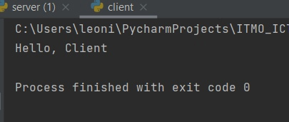
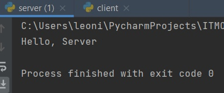

# Задание 1

Реализовать клиентскую и серверную часть приложения. Клиент отсылает серверу
сообщение «Hello, server». Сообщение должно отразиться на стороне сервера.
Сервер в ответ отсылает клиенту сообщение «Hello, client». Сообщение должно
отобразиться у клиента.

Обязательно использовать библиотеку socket

Реализовать с помощью протокола UDP

## Ход выполнения работы

### Код server.py

    import socket

    server = socket.socket(socket.AF_INET,socket.SOCK_DGRAM)
    server.bind(('', 2000))

    data, clientAdress = server.recvfrom(4096)
    print(data.decode("UTF-8"))

    server.sendto(bytes("Hello, Client", "UTF-8"),clientAdress)
    server.close()

### Код client.py

    import socket

    client = socket.socket(socket.AF_INET,socket.SOCK_DGRAM)

    client.sendto(bytes("Hello, Server", "UTF-8"),('localhost', 2000))

    data = client.recv(4096)
    print(data.decode("UTF-8"))

    client.close()

## Результат

