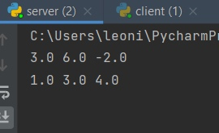
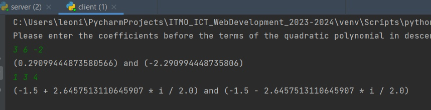

# Задание 2

Реализовать клиентскую и серверную часть приложения. Клиент запрашивает у
сервера выполнение математической операции, параметры, которые вводятся с
клавиатуры. Сервер обрабатывает полученные данные и возвращает результат
клиенту. Вариант: Решение квадратного уравнения

Обязательно использовать библиотеку socket

Реализовать с помощью протокола TCP

## Ход выполнения работы

### Код server.py
    import socket
    import threading
    
    
    class ClientThread(threading.Thread):
        def __init__(self, clientAdress, clientSocket):
            threading.Thread.__init__(self)
            self.clientSocket = clientSocket
            self.clientAdress = clientAdress
        def Counting(self, msg):
            msg = map(float,msg.split())
            a, b, c = msg
            discriminant = b**2 - 4*a*c
            if a == 0:
                if b == 0:
                    return "impossible!"
                else:
                    return str(-c/b)
            if discriminant<0:
                first_answer = f"{-b/2/a} + {(-discriminant)**(1/2)} * i / {2*a}"
                second_answer = f"{-b/2/a} - {(-discriminant)**(1/2)} * i / {2*a}"
            else:
                first_answer = str((-b+discriminant**(1/2))/2/a)
                second_answer = str((-b - discriminant ** (1 / 2)) / 2 / a)
            return '(' + first_answer + ')' + " and " + '(' + second_answer + ')'
    
        def run(self):
            try:
                while True:
                    msg = self.clientSocket.recv(16384)
                    msg = msg.decode("UTF-8")
                    print(msg)
                    if not msg:
                        break
                    else:
                        self.clientSocket.send(bytes(self.Counting(msg), "UTF-8"))
            except:
                print("Connection was broken")
                clientSocket.close()
    
    
    server = socket.socket(socket.AF_INET,socket.SOCK_STREAM)
    server.bind(('', 2002))
    server.listen(10)
    
    while True:
        clientSocket, clientAdress = server.accept()
        newThread = ClientThread(clientAdress, clientSocket)
        newThread.start()
    

### Код client.py
    import socket
    
    client = socket.socket(socket.AF_INET,socket.SOCK_STREAM)
    client.connect(('localhost', 2002))
    
    print("Please enter the coefficients before the terms of the quadratic polynomial in descending order of its degrees:")
    
    try:
        while True:
            a,b,c = map(float,input().split())
            arr = [a,b,c]
            arr = map(str,arr)
            message = ' '.join(arr)
            client.send(bytes(message, "UTF-8"))
            data = client.recv(4096)
            print(data.decode("UTF-8"))
    except:
        print("incorrect input")
    client.close()
## Результат

