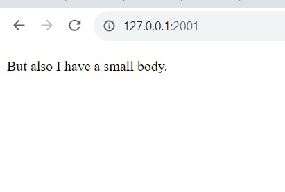

# Задание 3

Реализовать серверную часть приложения. Клиент подключается к серверу. В ответ
клиент получает http-сообщение, содержащее html-страницу, которую сервер
подгружает из файла index.html.

Обязательно использовать библиотеку socket

## Ход выполнения работы

### Код server.py
    import socket
    
    
    server = socket.socket(socket.AF_INET, socket.SOCK_STREAM)
    server.bind(('', 2001))
    server.listen(1)
    
    clientSocket, clientAdress = server.accept()
    response_type = "HTTP/1.0 200 OK\n"
    headers = "Content-Type: text/html\n\n"
    
    file1 = open("index.html", "r")
    body =''
    while True:
        line = file1.readline()
        body+=line
        if not line:
            break
    file1.close()
    
    response = response_type+headers+body
    clientSocket.send(response.encode("UTF-8"))
    clientSocket.close()
    print(response)

### Код client.py
    import socket
    
    client = socket.socket(socket.AF_INET,socket.SOCK_STREAM)
    
    client.connect(('localhost', 2001))
    data = client.recv(32768)
    print(data.decode('UTF-8'))
    client.close()

### Код index.html

    <!DOCTYPE html>
    <html>
        <head>
            <title>I have a big head.</title>
        </head>
        <body>
            
But also I have a small body.

        </body>
    </html>

## Результат

