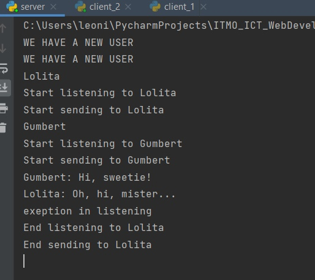

# Задание 4

Реализовать двухпользовательский или многопользовательский чат. Реализация
многопользовательского часа позволяет получить максимальное количество
баллов.

Обязательно использовать библиотеку threading

## Ход выполнения работы (Многопользовательский чат)

### Код server.py
    import socket
    import threading
    import time
    from datetime import datetime
    
    usersDict = {}
    oldMessages = []
    newMessages = []
    
    
    class Message():
        def __init__(self,userName, userSocket, text):
            self.userName = userName
            self.userSocket = userSocket
            self.text = text
            self.status  = 0
        def make_text(self):
            return self.userName+": "+self.text
    
    
    class ClientThread(threading.Thread):
        def __init__(self, clientAdress, clientSocket):
            threading.Thread.__init__(self)
            self.clientSocket = clientSocket
            self.clientAdress = clientAdress
            self.connection = True
            self.userName = "Default User"
            usersDict[self.clientSocket] = []
    
        def break_connection(self):
            usersDict.pop(self.clientSocket)
            self.clientSocket.close()
            self.connection = False
    
        def listen(self):
            print(f"Start listening to {self.userName}")
            counter = 0
            while self.connection:
                try:
                    msg = self.clientSocket.recv(16384)
                    msg = msg.decode("UTF-8")
                    if msg:
                        counter = 0
                        print(self.userName+': ' + msg)
                        msg = Message(self.userName,self.clientSocket,msg)
                        for key in usersDict:
                            if key!=self.clientSocket:
                                arr = usersDict.get(key,[])
                                arr.append(msg)
                                usersDict[key] = arr
    
                    else:
                        counter+=1
                    if counter>=10:
                        print(f"The {self.userName} was blocked")
                        self.break_connection()
                        break
                except:
                    print("exeption in listening")
                    self.break_connection()
            print(f"End listening to {self.userName}")
        def send(self):
             print(f"Start sending to {self.userName}")
             while self.connection:
                 try:
                    time.sleep(2)
                    arr = usersDict.get(self.clientSocket,[])
                    for msg in arr:
                        if self.connection:
                            self.clientSocket.send(bytes(msg.make_text(), "UTF-8"))
                    usersDict[self.clientSocket]=[]
                 except:
                     print("exeption in sending")
                     self.break_connection()
             print(f"End sending to {self.userName}")
    
        def run(self):
            try:
                self.clientSocket.send(bytes("Please, enter your name...", "UTF-8"))
                if self.connection:
                    msg = self.clientSocket.recv(16384)
                else:
                    self.break_connection()
                    return
                self.userName = msg.decode("UTF-8")
                print(msg.decode("UTF-8"))
                ear = threading.Thread(target=self.listen)
                ear.start()
                mouth = threading.Thread(target=self.send)
                mouth.start()
    
            except:
                print(f"Connection with {self.userName} was broken ")
                self.break_connection()
    
    
    server = socket.socket(socket.AF_INET,socket.SOCK_STREAM)
    server.bind(('', 2002))
    server.listen(10)
    
    while True:
        clientSocket, clientAdress = server.accept()
        print("WE HAVE A NEW USER")
        newThread = ClientThread(clientAdress, clientSocket)
        newThread.start()

## Код client1.py (у client2.py код аналогичный)
    import socket
    import threading
    import time
    
    client = socket.socket(socket.AF_INET,socket.SOCK_STREAM)
    client.connect(('localhost', 2002))
    
    def send():
        while True:
            try:
                data = input()
                if data == 'exit':
                    break
                client.send(data.encode('utf-8'))
            except:
                print('disconnection')
                break
        client.close()
    
    def listen():
        while True:
            try:
                indata = client.recv(1024)
                print(indata.decode('utf-8'))
            except:
                print('disconnection')
                break
    t1 = threading.Thread(target=listen)
    t2 = threading.Thread(target=send)
    
    t1.start()
    t2.start()

## Результат

