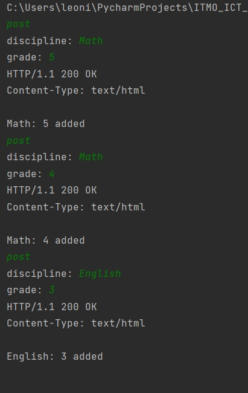
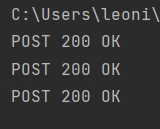
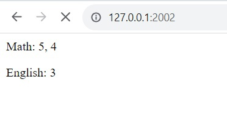

# Задание 5

Необходимо написать простой web-сервер для обработки GET и POST http
запросов средствами Python и библиотеки socket.

Задание: сделать сервер, который может:
● Принять и записать информацию о дисциплине и оценке по дисциплине.
● Отдать информацию обо всех оценах по дсициплине в виде html-страницы.

## Ход выполнения работы

### Код web_server.py
    import socket
    import threading
    
    
    class MyHTTPServer:
        def __init__(self, host, port, number_of_users):
            self.connection = socket.socket(socket.AF_INET, socket.SOCK_STREAM)
            self.connection.setsockopt(socket.SOL_SOCKET, socket.SO_REUSEADDR, 1)
            self.connection.bind((host, port))
            self.connection.listen(number_of_users)
            self.grades = {}
    
        def serve_forever(self):
            while True:
                try:
                    clientSocket, clientAdress = self.connection.accept()
                    servitor = threading.Thread(target=self.serve_client, args=[clientSocket])
                    servitor.start()
                except:
                    print("exeption")
    
        def serve_client(self, client):
            while True:
                try:
                    msg = client.recv(32768).decode("UTF-8")
                    #print(msg)
                    self.parse_request(client, msg)
                except:
                    print(f"client {client} was disconnected")
                    break
    
    
        def parse_request(self, client, msg):
            lines = msg.split("\n")
            method, url, version = lines[0].split()
            params = {}
    
            if method == "GET":
    
                if "?" in url:
                    for frame in url.split("?")[1].split("&"):
                        params[frame.split("=")[0]] = frame.split("=")[1]
                else:
                    params = None
    
            elif method == "POST":
                body = msg.split("\n")[-1]
                for frame in body.split("&"):
                    params[frame.split("=")[0]] = frame.split("=")[1]
    
            else:
                params = None
    
            self.handle_request(client, method, params)
    
        def handle_request(self, client, method, params):
            if method == "GET":
                self.send_response(client, 200, "OK", self.generate_html())
                print("GET 200 OK")
            elif method == "POST":
                discipline = params.get("discipline")
                grade = params.get("grade")
    
                arr = self.grades.get(discipline, [])
                arr.append(grade)
                self.grades[discipline] = arr
    
                self.send_response(client, 200, "OK", f'{discipline}: {grade} added')
                print("POST 200 OK")
            else:
                self.send_response(client, 404, "Not Found")
                print("ERROR  404")
    
        def send_response(self, client, code, reason, body):
            response = f"HTTP/1.1 {code} {reason}\nContent-Type: text/html\n\n{body}"
            client.send(response.encode("UTF-8"))
            #client.close()
    
        def generate_html(self):
            arr = []
            for discipline, grade in self.grades.items():
                grade = ', '.join(grade)
                arr.append(f'
{discipline}: {grade}
')
            answer = ''.join(arr)
            answer = "<html><body>
" + answer + "
</body></html>"
            return answer
    
    host = "localhost"
    port = 2002
    number_of_users = 10
    server = MyHTTPServer(host, port, number_of_users)
    try:
        server.serve_forever()
    except KeyboardInterrupt:
        server.connection.close()

### Код web_client.py
    import socket
    
    client = socket.socket(socket.AF_INET, socket.SOCK_STREAM)
    client.connect(("localhost", 2002))
    def post():
        discipline = input('discipline: ')
        grade = input('grade: ')
    
        request = "POST /discipline HTTP/1.1\nHost: localhost\nContent-Type: application/x-www-form-urlencoded\nContent-Length: 38\n\n"
        body = f"discipline={discipline}&grade={grade}"
    
        # print(request+body)
        client.send((request + body).encode("UTF-8"))
    
        answer = client.recv(2048).decode("UTF-8")
        print(answer)
    
    def get():
        request = "GET /scores?subject=test HTTP/1.1\nContent-Type: text"
        client.send(request.encode("UTF-8"))
    
        msg = client.recv(2048).decode("UTF-8")
        print(msg)
    
    
    while True:
        action = input()
        if action == "post":
            post()
        elif action == "get":
            get()
        else:
            break
    
    client.close()

## Результат

