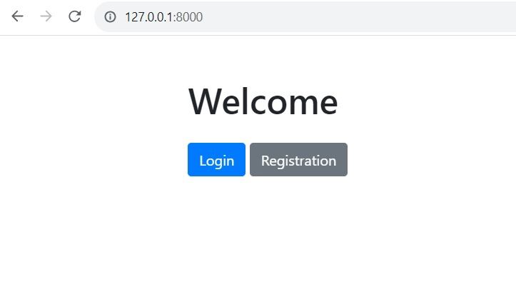
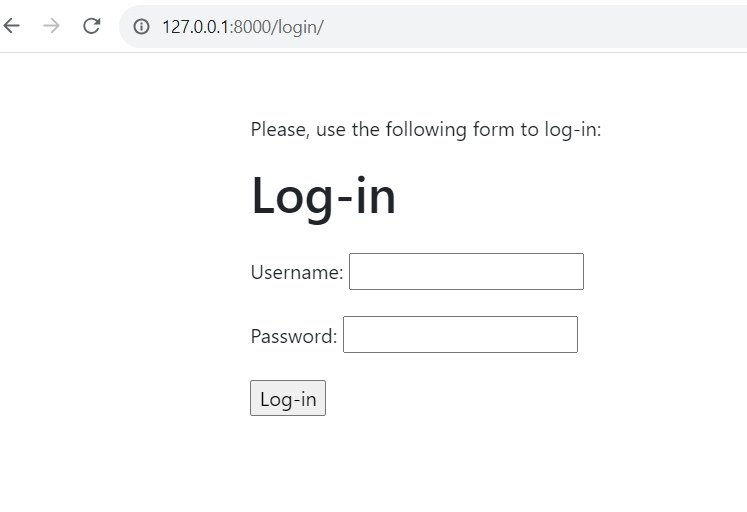
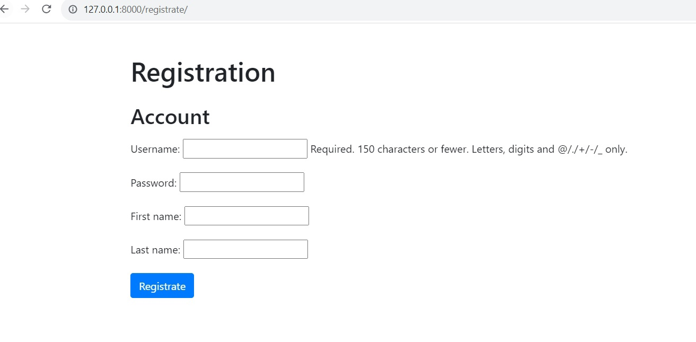
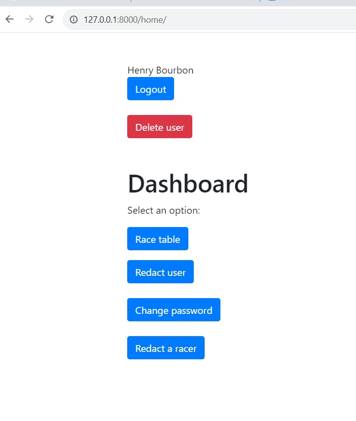
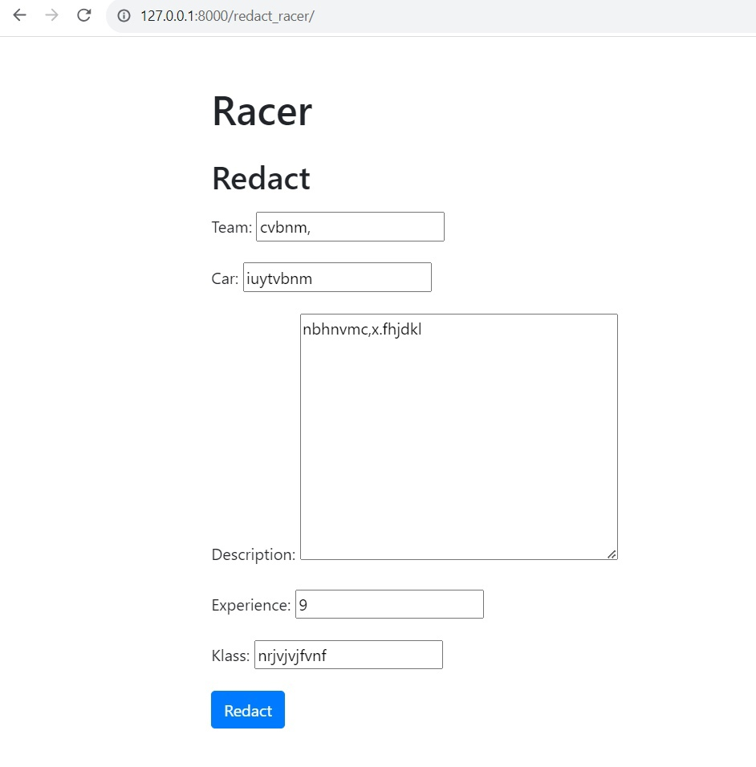
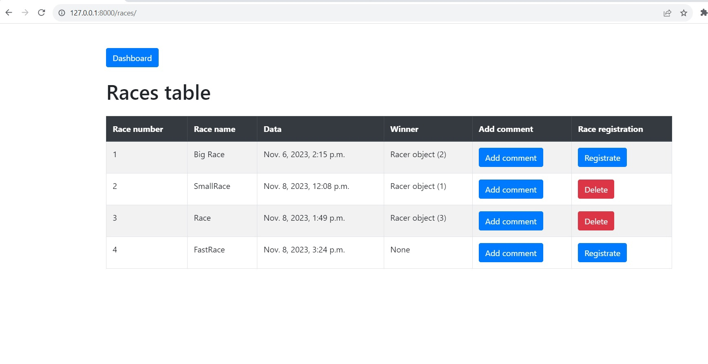
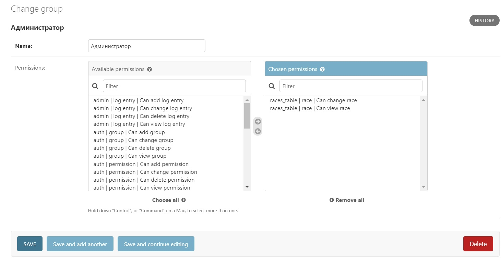
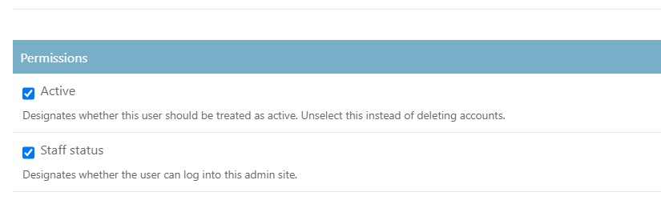
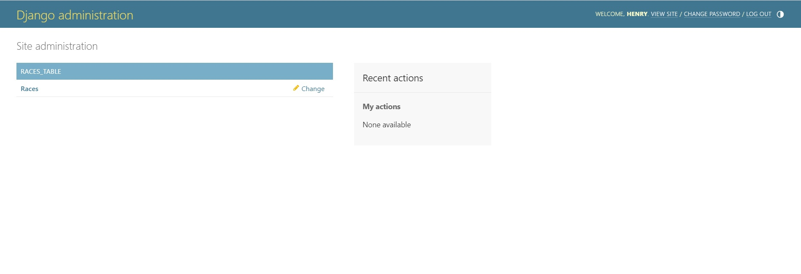

# Табло победителей автогонок

Табло должно отображать информацию об участниках автогонок: ФИО участника,
название команды, описание автомобиля, описание участника, опыт и класс участника.
Необходимо реализовать следующий функционал:

        1)Регистрация новых пользователей.

        2)Просмотр автогонок и регистрацию гонщиков. Пользователь должен
          иметь возможность редактирования и удаления своих регистраций.
        
        3)Написание отзывов и комментариев к автогонкам. Предварительно
          комментатор должен зарегистрироваться. При добавлении комментариев 
          должны сохраняться даты заезда, текст комментария, тип комментария
          (вопрос о сотрудничестве, вопрос о гонках, иное), рейтинг (1-10),
          информация о комментаторе.

        4)Администратор должен иметь возможность указания времени заезда и
          результата средствами Django-admin.

        5)В клиентской части должна формироваться таблица всех заездов и
          результатов конкретной гонки.

## Ход выполнения работы

### Код models.py
    from django.db import models
    from django.contrib.auth.models import AbstractUser
    from django.core.validators import MinValueValidator, MaxValueValidator
    from django.db import models
    
    
    class User(AbstractUser):
         #racer = models.OneToOneField('Racer', on_delete=models.CASCADE, null=True)
         first_name = models.CharField(max_length=30)
         last_name = models.CharField(max_length=30)
         has_racer = models.BooleanField(default=False)
    
         def __str__(self):
             return f"{self.first_name} {self.last_name}"
    
    
    class Racer(models.Model):
        user = models.OneToOneField(User, on_delete=models.CASCADE)
        team = models.CharField(max_length=100)
        car = models.CharField(max_length=100)
        description = models.TextField()
        experience = models.IntegerField()
        klass = models.CharField(max_length=100)
    
    
    class Race(models.Model):
        name = models.CharField(max_length=100)
        date = models.DateTimeField()
        winner = models.ForeignKey(Racer, on_delete=models.SET_NULL, blank=True, null=True)
    
        def __str__(self):
            return f"{self.name}"
    
    class RaceConnection(models.Model):
        racer = models.ForeignKey(Racer, on_delete=models.CASCADE)
        race = models.ForeignKey(Race, on_delete=models.CASCADE)
        class Meta:
            unique_together = ('racer', 'race')
    
    
    class Comment(models.Model):
        COMMENT_TYPES = (("cooperation", "вопрос о сотрудничестве"),
            ("race", "вопрос о гонках"),
            ("other", "иное"),)
        race = models.ForeignKey(Race, on_delete=models.CASCADE)
        author = models.ForeignKey(User, on_delete=models.CASCADE)
        text = models.TextField()
        comment_type = models.CharField(max_length=20, choices=COMMENT_TYPES)
        rating = models.IntegerField(
            validators=[MinValueValidator(0), MaxValueValidator(10)]
        )
        created_at = models.DateTimeField(auto_now_add=True)

### Код views.py
    from django.contrib.auth.decorators import login_required
    from django.contrib.auth.forms import PasswordChangeForm
    from django.http import HttpResponse
    from django.shortcuts import render, redirect, get_object_or_404
    from django.contrib.auth import authenticate, login, logout, update_session_auth_hash
    from races_table.forms import LoginForm, RegistrationForm, RacerForm, UserUpdateForm, CommentForm, RaceConnectionForm
    
    # Create your views here.
    from races_table.models import Race, Comment, RaceConnection
    
    
    def logout_view(request):
        logout(request)
        return render(request, 'logged_out.html')
    
    def user_login(request):
        if request.method == 'POST':
            form = LoginForm(request.POST)
            if form.is_valid():
                cd = form.cleaned_data
                user = authenticate(username=cd['username'], password=cd['password'])
                if user is not None:
                    if user.is_active:
                        login(request, user)
                        return redirect('dashboard')
                    else:
                        return HttpResponse('Disabled account')
                else:
                    return HttpResponse('Invalid login or password')
        else:
            form = LoginForm()
        return render(request, 'login.html', {'form': form})
    
    def register(request):
        if request.method == "POST":
            form = RegistrationForm(request.POST)
            if form.is_valid():
                user = form.save()
                user.set_password(user.password)
                user.save()
                return redirect("login")
        else:
            form = RegistrationForm()
    
        return render(request, "register.html", {"user_form": form})
    
    def home(request):
        return render(request, "home.html")
    
    @login_required
    def dashboard(request):
        return render(request, 'dashboard.html', {'section': 'dashboard', 'has_racer': hasattr(request.user,'racer')})
    
    @login_required
    def register_racer(request):
        user = request.user
        print(user.has_racer)
        if hasattr(request.user, "racer"):
            return HttpResponse("You have already got a racer")
        else:
            if request.method == "POST":
    
                racer_form = RacerForm(request.POST)
                if  racer_form.is_valid():
                    print(user)
                    racer = racer_form.save(commit=False)
                    racer.user = user
                    racer.save()
                    user.has_racer = True
                    user.save()
                    return redirect("dashboard")
            else:
                racer_form = RacerForm()
    
        return render(request,"register_racer.html", {"racer_form": racer_form})
    
    @login_required
    def redact_user(request):
        if request.method == "POST":
            user_form = UserUpdateForm(request.POST, instance=request.user)
            if user_form.is_valid():
                user_form.save()
                return redirect('dashboard')
        else:
            user_form = UserUpdateForm(instance=request.user)
        return render(request, "redact_user.html", {"user_form": user_form},)
    
    @login_required
    def change_password(request):
        if request.method == "POST":
            password_form = PasswordChangeForm(request.user, request.POST)
    
            if password_form.is_valid():
                user = password_form.save()
                update_session_auth_hash(request, user)
                return redirect("dashboard")
        else:
            password_form = PasswordChangeForm(request.user)
        return render(request,"change_password.html",{"password_form": password_form,})
    @login_required()
    def redact_racer(request):
        if request.method == "POST":
            racer_form = RacerForm(request.POST, instance=request.user.racer)
            if racer_form.is_valid():
                racer_form.save()
                return redirect("dashboard")
        else:
            if hasattr(request.user, "racer"):
                racer_form = RacerForm(instance=getattr(request.user, "racer", None))
            else:
                racer_form = None
        return render(request,"redact_racer.html",{"racer_form": racer_form,})
    
    @login_required
    def race_comments(request, race_id):
        race = get_object_or_404(Race, id=race_id)
        comments = Comment.objects.filter(race=race)
        if request.method == "POST":
            form = CommentForm(request.POST)
            if form.is_valid():
                comment = form.save(commit=False)
                comment.race = race
                comment.author = request.user
                comment.save()
        else:
            form = CommentForm()
        return render(request,"race_comments.html",{"race": race, "comments": comments, "form": form})
    
    @login_required
    def races_list(request):
        races = Race.objects.all()
        race_connections = RaceConnection.objects.filter(racer=request.user.racer).values("race")
        #print(race_connections)
        racer_races = []
        for race_connection in race_connections:
            racer_races.append(race_connection['race'])
        #print(racer_races)
        return render(request, "races_list.html", {"races": races, "race_connections": racer_races})
    
    @login_required
    def delete_user(request):
        if request.method == "POST":
            request.user.delete()
            return redirect("home")
        return render(request, "delete_user.html")
    
    @login_required
    def create_race_connection(request,race_id):
        user = request.user
        if not(hasattr(user, "racer")):
            return HttpResponse("You have not got a racer")
        else:
                try:
                        race_connection = RaceConnection()
                        race = Race.objects.get(pk = race_id)
                        race_connection.race = race
                        race_connection.racer = user.racer
                        race_connection.save()
                except Exception as ex:
                        print(ex)
                        return HttpResponse('You have already registrated')
                return redirect("races_list")
        return redirect("races_list")
    
    def delete_race_connection(request, race_id):
        racer = request.user.racer
        race = Race.objects.get(pk=race_id)
        RaceConnection.objects.filter(racer= racer, race= race).delete()
        return redirect("races_list")

### Код forms.py

    from django.contrib.auth.forms import AuthenticationForm, UserCreationForm
    from . import models
    from django import forms
    from .models import User, Racer, Comment
    
    
    class LoginForm(forms.Form):
        username = forms.CharField()
        password = forms.CharField(widget=forms.PasswordInput)
    
    class RegistrationForm(forms.ModelForm):
        class Meta:
            model = User
            fields = ["username", "password", "first_name","last_name"]
    
    class RacerForm(forms.ModelForm):
        class Meta:
            model = Racer
            fields = ["team", "car", "description", "experience", "klass"]
    class UserUpdateForm(forms.ModelForm):
        class Meta:
            model = User
            fields = ["first_name", "last_name"]
    
    class CommentForm(forms.ModelForm):
        class Meta:
            model = Comment
            fields = ["comment_type", "rating", "text"]

    class RaceConnectionForm(forms.ModelForm):
    class Meta:
        model = RaceConnection
        fields = ["race"]
### Код urls.py
    from django.contrib.auth.views import LogoutView
    from django.urls import include, path
    from django.contrib import admin
    from races_table import views
    
    
    urlpatterns = [
         path('admin/', admin.site.urls),
         path("", views.home, name="home"),
         path('login/', views.user_login, name='login'),
         path('logout/', views.logout_view, name='logout'),
         path('home/', views.dashboard, name='dashboard'),
         path("registrate/", views.register, name="registrate"),
         path("registrate_racer/", views.register_racer, name="registrate_racer"),
         path("redact_user/",views.redact_user, name = "redact_user"),
         path("change_password/",views.change_password, name = "change_password"),
         path("redact_racer/",views.redact_racer, name = "redact_racer"),
         path("races/comments/<int:race_id>/", views.race_comments, name="race_comments"),
         path("races/", views.races_list, name="races_list"),
         path("profile/delete/", views.delete_user, name="delete_user"),
         path("create_race_connection/<int:race_id>/", views.create_race_connection, name="create_race_connection"),
         path("delete_race_connection/<int:race_id>", views.delete_race_connection, name="delete_race_connection"),
    ]

## Результат

## Администрирование в админ панели

###Создание группы администраторов

### Передача прав администратора пользователю

### Stuff status для авторизации в панели

###Вид админ панели глазами администратора

