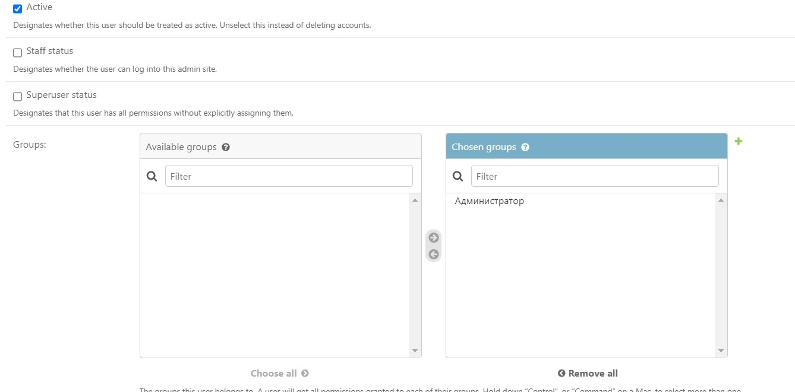

# Табло победителей автогонок

Табло должно отображать информацию об участниках автогонок: ФИО участника,
название команды, описание автомобиля, описание участника, опыт и класс участника.
Необходимо реализовать следующий функционал:

        1)Регистрация новых пользователей.

        2)Просмотр автогонок и регистрацию гонщиков. Пользователь должен
          иметь возможность редактирования и удаления своих регистраций.
        
        3)Написание отзывов и комментариев к автогонкам. Предварительно
          комментатор должен зарегистрироваться. При добавлении комментариев 
          должны сохраняться даты заезда, текст комментария, тип комментария
          (вопрос о сотрудничестве, вопрос о гонках, иное), рейтинг (1-10),
          информация о комментаторе.

        4)Администратор должен иметь возможность указания времени заезда и
          результата средствами Django-admin.

        5)В клиентской части должна формироваться таблица всех заездов и
          результатов конкретной гонки.

## Ход выполнения работы

### Код models.py
    from django.db import models
    from django.contrib.auth.models import AbstractUser
    from django.core.validators import MinValueValidator, MaxValueValidator
    from django.db import models
    
    
    class User(AbstractUser):
         #racer = models.OneToOneField('Racer', on_delete=models.CASCADE, null=True)
         first_name = models.CharField(max_length=30)
         last_name = models.CharField(max_length=30)
         has_racer = models.BooleanField(default=False)
    
         def __str__(self):
             return f"{self.first_name} {self.last_name}"
    
    
    class Racer(models.Model):
        user = models.OneToOneField(User, on_delete=models.CASCADE)
        team = models.CharField(max_length=100)
        car = models.CharField(max_length=100)
        description = models.TextField()
        experience = models.IntegerField()
        klass = models.CharField(max_length=100)
    
    
    class Race(models.Model):
        name = models.CharField(max_length=100)
        date = models.DateTimeField()
        winner = models.ForeignKey(Racer, on_delete=models.SET_NULL, blank=True, null=True)
    
        def __str__(self):
            return f"{self.name}"
    
    class RaceConnection(models.Model):
        racer = models.ForeignKey(Racer, on_delete=models.CASCADE)
        race = models.ForeignKey(Race, on_delete=models.CASCADE)
    
    
    class Comment(models.Model):
        COMMENT_TYPES = (("cooperation", "вопрос о сотрудничестве"),
            ("race", "вопрос о гонках"),
            ("other", "иное"),)
        race = models.ForeignKey(Race, on_delete=models.CASCADE)
        author = models.ForeignKey(User, on_delete=models.CASCADE)
        text = models.TextField()
        comment_type = models.CharField(max_length=20, choices=COMMENT_TYPES)
        rating = models.IntegerField(
            validators=[MinValueValidator(0), MaxValueValidator(10)]
        )
        created_at = models.DateTimeField(auto_now_add=True)

    

### Код forms.py

    from django.contrib.auth.forms import AuthenticationForm, UserCreationForm
    from . import models
    from django import forms
    from .models import User, Racer, Comment
    
    
    class LoginForm(forms.Form):
        username = forms.CharField()
        password = forms.CharField(widget=forms.PasswordInput)
    
    class RegistrationForm(forms.ModelForm):
        class Meta:
            model = User
            fields = ["username", "password", "first_name","last_name"]
    
    class RacerForm(forms.ModelForm):
        class Meta:
            model = Racer
            fields = ["team", "car", "description", "experience", "klass"]
    class UserUpdateForm(forms.ModelForm):
        class Meta:
            model = User
            fields = ["first_name", "last_name"]
    
    class CommentForm(forms.ModelForm):
        class Meta:
            model = Comment
            fields = ["comment_type", "rating", "text"]
### Код urls.py
    from django.contrib.auth.views import LogoutView
    from django.urls import include, path
    from django.contrib import admin
    from races_table import views
    
    
    urlpatterns = [
         path('admin/', admin.site.urls),
         path("", views.home, name="home"),
         path('login/', views.user_login, name='login'),
         path('logout/', views.logout_view, name='logout'),
         path('home/', views.dashboard, name='dashboard'),
         path("registrate/", views.register, name="registrate"),
         path("registrate_racer/", views.register_racer, name="registrate_racer"),
         path("redact_user/",views.redact_user, name = "redact_user"),
         path("change_password/",views.change_password, name = "change_password"),
         path("redact_racer/",views.redact_racer, name = "redact_racer"),
         path("races/comments/<int:race_id>/", views.race_comments, name="race_comments"),
         path("races/", views.races_list, name="races_list"),
         path("profile/delete/", views.delete_user, name="delete_user"),
    ]

## Результат

## Администрирование в админ панели

###Создание группы администраторов

### Передача прав администратора пользователю

### Stuff status для авторизации в панели

###Вид админ панели глазами администратора

