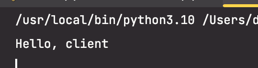
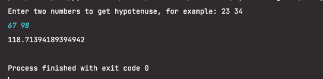
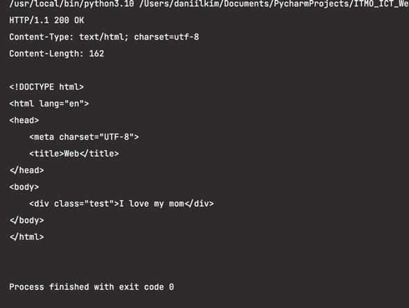
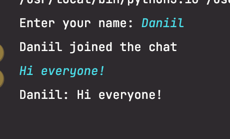
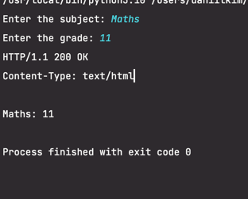
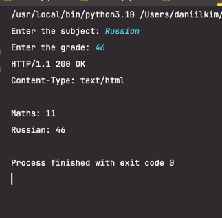
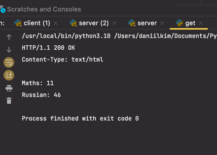

# Отчет по лабораторной работе №1

## Выполнил: Ким Даниил, K33391

#### Цель работы:

Овладеть практическими навыками и умениями реализации web-серверов и использования сокетов.

## Задание 1

#### Текст задания:

Реализовать клиентскую и серверную часть приложения. Клиент отсылает серверу сообщение «Hello, server». Сообщение должно отразиться на стороне сервера. Сервер в ответ отсылает клиенту сообщение «Hello, client». Сообщение должно отобразиться у клиента. Обязательно использовать библиотеку socket. Реализовать с помощью протокола UDP.

#### Решение:

Сервер:

```
import socket

# Create a new socket object
# AF_INET - IPv4 address
# SOCK_DGRAM - UDP socket type
conn = socket.socket(socket.AF_INET, socket.SOCK_DGRAM)

# bind server address and server port
conn.bind(("localhost", 9090))

# get data and IP address from the client
data, client_addr = conn.recvfrom(1024)

# decode and print client data
udata = data.decode()
print(udata)

# send response to the client
conn.sendto(b"Hello, client", client_addr)

# close connection
conn.close()
```

Создание сокета, прослушивание порта 9090, когда ответ получен отправляем на клиент сообщение "Hello, Сlient!".

Клиент:

```
import socket

# Create a new socket object
# AF_INET - IPv4 address
# SOCK_DGRAM - UDP socket type
conn = socket.socket(socket.AF_INET, socket.SOCK_DGRAM)

# define server address and server port
server_addr = ("localhost", 9090)

# send data to the server
conn.sendto(b"Hello, server", server_addr)

# get response from the server
data = conn.recv(1024)
print(data.decode())

# close connection
conn.close()

```

Создание сокета, отправка на сервер сообщение "Hello, Server!", вывод ответа.



## Задание 2

#### Текст задания:

Реализовать клиентскую и серверную часть приложения. Клиент запрашивает у
сервера выполнение математической операции, параметры, которые вводятся с
клавиатуры. Сервер обрабатывает полученные данные и возвращает результат
клиенту. Вариант с учетом номера в журнале:

__Теорема Пиффгора__

Обязательно использовать библиотеку socket
Реализовать с помощью протокола TCP

#### Решение:

Сервер:

```
import socket

conn = socket.socket(socket.AF_INET, socket.SOCK_STREAM)

conn.bind(("localhost", 9090))
conn.listen(1)

clientsocket, addr = conn.accept()
print("Received new connection from", addr)

clientsocket.send(b"Enter two numbers to get hypotenuse, for example: 23 34")

data = clientsocket.recv(1024)

a, b = list(map(int, data.decode().split()))

clientsocket.send(str((a**2 + b**2)**0.5).encode())

# close connection
conn.close()
```

Создание сокета TCP. Установка коннекта в цикле с клиентом и получение от него данных для решения задачи. Затем парсим данные с клиента где приходит два аргумента и находим гипотенузу. Отправляем ответ.

Клиент:

```
import socket

conn = socket.socket(socket.AF_INET, socket.SOCK_STREAM)

# define server address and server port
server_addr = ("localhost", 9090)

conn.connect(server_addr)

hello_data = conn.recv(1024)
print(hello_data.decode())

conn.send(input().encode())
data = conn.recv(1024)
print(data.decode())

# close connection
conn.close()

```

Также создаем сокет. Пользователь вводит данные такие как, 2 катета прямоугольного треугольника. Получаем с сервера ответ.



## Задание 3

#### Текст задания:

Реализовать серверную часть приложения. Клиент подключается к серверу. В ответ
клиент получает http-сообщение, содержащее html-страницу, которую сервер
подгружает из файла index.html.

#### Решение:

HTML документ:

```
<!DOCTYPE html>
<html lang="en">
<head>
    <meta charset="UTF-8">
    <title>Web</title>
</head>
<body>
    <div class="test">I love my mom</div>
</body>
</html>
```

Сервер:

```
import socket


def http_response(body: str) -> bytes:
    result = f"HTTP/1.1 200 OK\nContent-Type: text/html; charset=utf-8\nContent-Length: {len(body)}\n\n{body}"
    return result.encode()


conn = socket.socket(socket.AF_INET, socket.SOCK_STREAM)

conn.bind(("localhost", 9090))
conn.listen(1)

clientsocket, addr = conn.accept()
print("Received new connection from", addr)

clientsocket.sendall(http_response(open("index.html").read()))

# close connection
conn.close()

```

Создание сокета TCP, устанановка соединения, затем читаем html файл и отправляем на клиент ответ содержащий ответ с нашим index.html.

Клиент:

```
import socket


def socket_read_all(s: socket.socket, size=1024) -> bytes:
    result = b""
    while (chunk := s.recv(size)) != b"":
        result += chunk
    return result


def read_http_body(response: bytes) -> str:
    lines = response.decode().splitlines()
    body = ""
    for i in lines:
        body += i + "\n"

    return body


sock = socket.socket(socket.AF_INET, socket.SOCK_STREAM)
sock.connect(("localhost", 9090))

data = socket_read_all(sock)
body = read_http_body(data)

print(body)
```

Создание сокета и коннект с сервером, отправка запроса и получение ответ.

Скриншот:




## Задание 4

#### Текст задания:

Реализовать двухпользовательский или многопользовательский чат. Реализация многопользовательского часа позволяет получить максимальное количество
баллов. Обязательно использовать библиотеку threading.

Для применения с TCP необходимо запускать клиентские подключения. И прием, и отправку сообщений всем юзерам на сервере в потоках. Не забудьте сохранять юзеров,
чтобы потом отправлять им сообщения.

#### Ход решения:

Сервер:

```
import socket
import threading


class User:
    def __init__(self, conn):
        self.Conn = conn
        self.Name = ""


def send_everyone(message: str):
    for user in users:
        if user.Name != "":
            user.Conn.send(message.encode())


def chat(user: User):
    while True:
        try:
            data = user.Conn.recv(1024)
            print(data.decode('utf-8'))
            if not data:
                raise

            data = data.decode('utf-8')
            if user.Name == "":
                user.Name = data
                send_everyone(f"{user.Name} joined the chat")
                continue

            send_everyone(user.Name + ": " + data)

        except (Exception,):
            users.remove(user)
            user.Conn.close()
            send_everyone(f"{user.Name} left the chat")
            break


def start():
    while True:
        conn, address = server.accept()
        user = User(conn)
        users.append(user)
        chat_thread = threading.Thread(target=chat, args=[user])
        chat_thread.start()


users = []

server = socket.socket(socket.AF_INET, socket.SOCK_STREAM)
server.bind(("localhost", 9090))
server.listen()

start()

```

Создание сокета, списка клиентов и их экземпляров класса. Здесь реализованы функции для трансляции сообщений всем клиентам, для отлавливания клиентов и для самого общения. Запускаем потоки с помощью библиотеки _threading_.

Клиент:

```
import socket
import threading


def get_messages():
    while True:
        message = server.recv(1024)
        if message:
            print(message.decode('utf-8'))


def send_messages():
    while True:
        server.send(input().encode('utf-8'))


server = socket.socket(socket.AF_INET, socket.SOCK_STREAM)
server.connect(("localhost", 9090))

get_mess_thread = threading.Thread(target=get_messages)
get_mess_thread.start()

server.send(input("Enter your name: ").encode('utf-8'))

send_messages()
```

Пользователь вводит свое имя, далее установка соединения с сервером. Функции для получения и отправки сообщений. Запускаем потоки для каждой функции, а функцию отправки без потока.

Скриншот:




## Задание 5

#### Текст задания:

Необходимо написать простой web-сервер для обработки GET и POST http
запросов средствами Python и библиотеки socket.

Задание: сделать сервер, который может:
<br/>● Принять и записать информацию о дисциплине и оценке по дисциплине.
<br/>● Отдать информацию обо всех оценках по дисциплине в виде html-страницы.

#### Решение:

Сервер:

```
import socket
from http.client import HTTPResponse


class HTTPServer():
    def __init__(self, host: str, port: int) -> None:
        self.Host = host
        self.Port = port
        self.Scores = {}

    def serve_forever(self):
        server = socket.socket(socket.AF_INET, socket.SOCK_STREAM)
        try:
            server.bind((self.Host, self.Port))
            server.listen()

            while True:
                conn, client_addr = server.accept()
                self.serve_client(conn)

        finally:
            server.close()

    def serve_client(self, conn: socket.socket):
        method, params = self.parse_request(conn)
        code, body, reason = self.handle_request(method, params)
        self.send_response(conn, code, body, reason)

    def send_response(self, conn: socket.socket, code: int, body: str, reason: str) -> None:
        resp = f'HTTP/1.1 {code} {reason}\nContent-Type: text/html\n\n'
        resp += body
        conn.send(resp.encode("utf-8"))
        conn.close()

    def parse_request(self, conn: socket.socket):
        data = conn.recv(1024).decode('utf-8')
        lines = data.split('\n')
        method, url, vers = lines[0].split()
        params = {}

        if method == 'POST':
            body = data.split('\n')[-1]

            for param in body.split('&'):
                params[param.split('=')[0]] = param.split('=')[1]

        elif method == 'GET':
            if '?' in url:
                for param in url.split('?')[1].split('&'):
                    params[param.split('=')[0]] = param.split('=')[1]

        return method, params

    def handle_request(self, method: str, params: dict):
        if method == 'POST':
            subj = params.get("subj")
            grade = params.get("grade")
            self.Scores[subj] = grade

            return 200, self.generate_html(), "OK"

        elif method == 'GET':
            return 200, self.generate_html(), "OK"

        else:
            return 404, 'Not Found'

    def generate_html(self):
        scores = [f'{subj}: {grade}' for subj, grade in self.Scores.items()]
        return '\n'.join(scores)


if __name__ == '__main__':
    server = HTTPServer("localhost", 9090)
    server.serve_forever()

```

Использован предоставленный шаблон. Инициализация сервера и создание словаря, куда будем заносить оценки. Функция прослушивания клиента. Дальше парсим полученные с клиента запросыс и делим их на два типа запросов GET или POST. Запросы разделяем на метод и параметры, обрабатываем их. При POST запросе получаем параметры и записываем их в словарь, отправляем на клиент сообщение об успешном выполнении запроса + html страницу. При GET запросе отправляем на клиент сгенерированную страницу html.

POST запрос:

```
import socket

conn = socket.socket(socket.AF_INET, socket.SOCK_STREAM)
conn.connect(("localhost", 9090))

subj = input('Enter the subject: ')
grade = input('Enter the grade: ')

request = "POST /subj HTTP/1.1\nHost: localhost\nContent-Type: text\n"
body = f"subj={subj}&grade={grade}"

conn.send((request + body).encode('utf-8'))
response = conn.recv(1024).decode('utf-8')
print(response)
```

GET запрос:

```
import socket

conn = socket.socket(socket.AF_INET, socket.SOCK_STREAM)
conn.connect(("localhost", 9090))

request = "GET /scores?subj=test HTTP/1.1\nContent-Type: text"
conn.send(request.encode('utf-8'))

response = conn.recv(1024).decode('utf-8')
print(response)
```

Результат в скриншотах:

POST запрос:



POST запрос:



GET запрос:



## Вывод

При выполнении данной лабораторной работы я изучил работу с сокетами, TCP, UDP, HTTP сервера, научился работать с запросами.