# Практическое задание 1

Напишите запрос на создание 6-7 новых автовладельцев и 5-6 автомобилей, каждому автовладельцу назначьте удостоверение и от 1 до 3 автомобилей. Задание можете выполнить либо в интерактивном режиме интерпретатора, либо в отдельном python-файле. Результатом должны стать запросы и отображение созданных объектов.

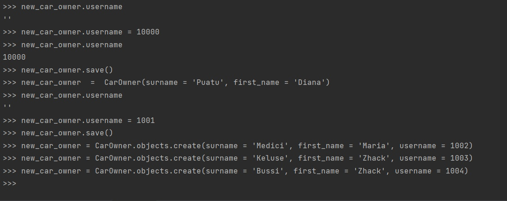
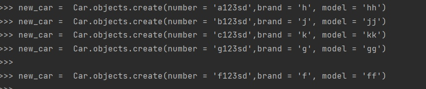

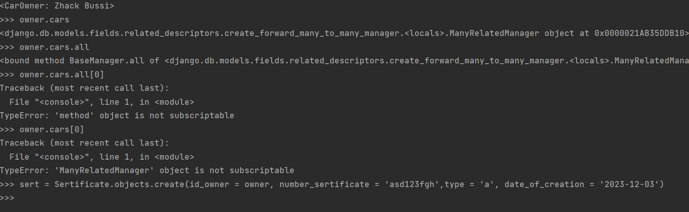

 Результат

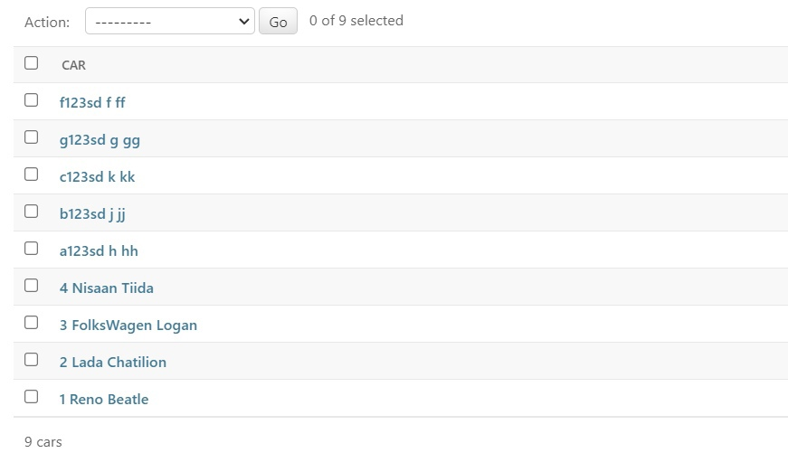

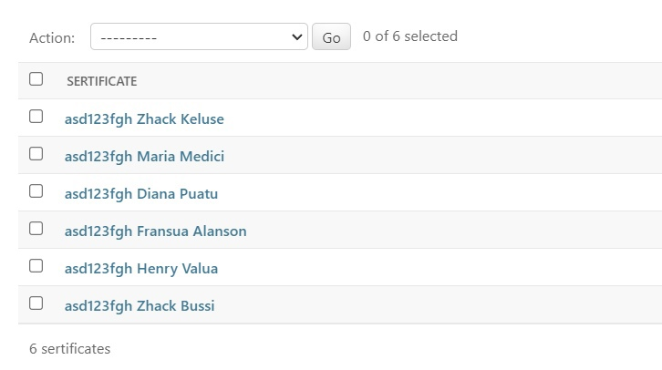

# Практическое задание 2

Выведете все машины марки “Reno” (или любой другой марки, которая у вас есть)

Найти всех водителей с именем “Henry” (или любым другим именем на ваше усмотрение)

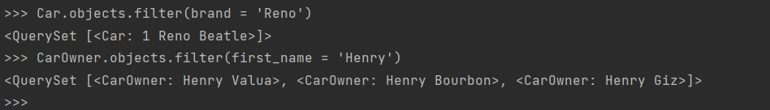

Взяв любого случайного владельца получить его id, и по этому id получить экземпляр удостоверения

Вывести всех владельцев зеленых машин (или любого другого цвета, который у вас присутствует)
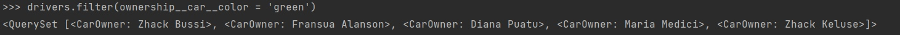

Найти всех владельцев, чей год владения машиной начинается с 2010 (или любой другой год, который присутствует у вас в базе)

# Практическое задание 3

Вывод даты выдачи самого старшего водительского удостоверения

Укажите самую позднюю дату владения машиной, имеющую какую-то из существующих моделей в вашей базе
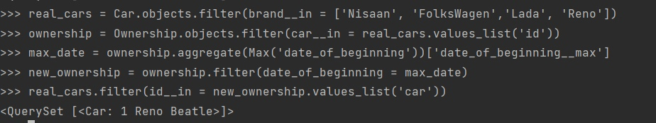
Одним запросом:
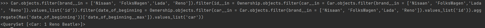

Выведите количество машин для каждого водителя
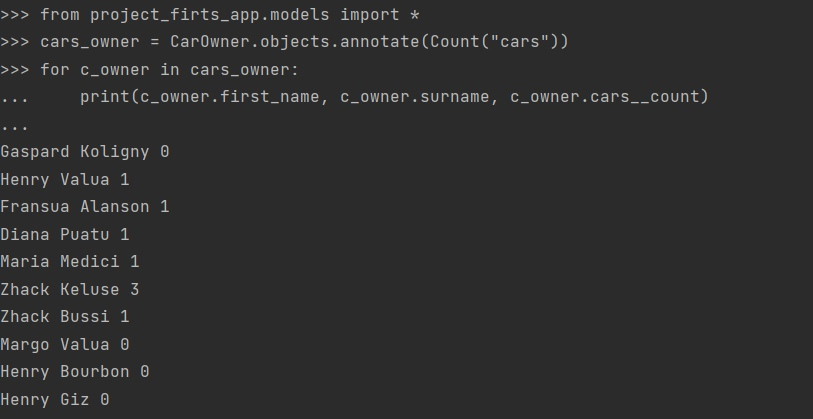

Подсчитайте количество машин каждой марки
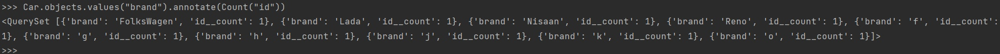

Отсортируйте всех автовладельцев по дате выдачи удостоверения
