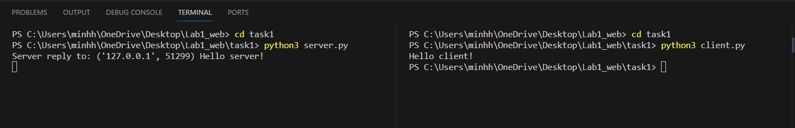

## Задача №1

Реализовать клиентскую и серверную часть приложения. Клиент отсылает 
серверу сообщение “Hello, server”. Сообщение должно отразиться на 
сервере.
Сервер в ответ отсылает клиенту сообщение «Hello, client». Сообщение 
должно отобразиться у клиента.
Обязательно использовать библиотеку socket.
Реализовать с использованием протокола UDP.

## Решение

1. Сервер

```python
import socket

port = 2002
data_recv = 2048
msg_to_client = b"Hello client!"
host = "127.0.0.1"

def main():
    #Create a UDP socket and associate it with the specified IP address and port.
    s = socket.socket(socket.AF_INET, socket.SOCK_DGRAM)
    s.bind((host, port))

    try:
        while True:
            #Receive the data and Client address.
            msg, address = s.recvfrom(data_recv)
            print("Server reply to:", address, msg.decode("utf-8"))

            #Reply to Client
            s.sendto(msg_to_client, address)
    except KeyboardInterrupt:
        s.close()

if __name__ == "__main__":
    main()
```
2. Клиент

```python
import socket

port = 2002
data_recv = 2048
msg_to_sv = b"Hello server!"
host = "127.0.0.1"

def main():
    s = socket.socket(socket.AF_INET, socket.SOCK_DGRAM)
    
    #associate with the specified IP address and port.
    s.connect((host, port))
    
    try:
        #Send message to the server
        s.send(msg_to_sv)

        #Receive n bytes of data from the server
        msg, address = s.recvfrom(data_recv)
        print(msg.decode("utf-8"))
    except KeyboardInterrupt:
        s.close()

if __name__ == "__main__":
    main()
```

## Демонстрация работы


