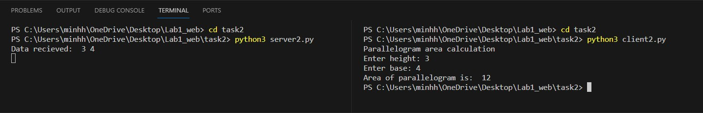

## Задача №2

Реализовать клиентскую и серверную часть приложения. Клиент запрашивает у сервера выполнение математической операции, параметры которой вводятся с клавиатуры. 
Сервер обрабатывает полученные данные и возвращает результат клиенту. 

Мой вариант, согласно списку группы, – площадь параллелограмма.

## Решение

1. Сервер

```python
import socket

port = 2002
data_recv = 2048
max_pending_conn = 8
host = "127.0.0.1"

#function to calculate the parallelogram area
def calc_parallelogram_area(pair):
    h, b = map(int, pair.split(" "))
    return h*b

def main():
    #Create a TCP socket and associate it with the specified IP address and port.
    s = socket.socket(socket.AF_INET, socket.SOCK_STREAM)
    s.bind((host, port))
    s.listen(max_pending_conn)

    try:
        while True:
            #Accept an incoming connection from the client.
            client, address = s.accept()

            #Receive n bytes of data from the server and decode it
            data = client.recv(port).decode("utf-8")
            print(f"Data recieved: ", data)
            result = calc_parallelogram_area(data)
            
            #Send the encoded result to client
            client.send(str(result).encode("utf-8"))
            
    except KeyboardInterrupt:
        client.close()

if __name__ == "__main__":
    main()
```

2. Клиент

```python
import socket

port = 2002
data_recv = 2048
host = "127.0.0.1"

print("Parallelogram area calculation")

def main():
    while True:
        #input the height and the base of Parallelogram
        h_str = input("Enter height: ")
        b_str = input("Enter base: ")
        #check if the input are positive integer
        try:
            h = int(h_str)
            b = int(b_str)
            if h > 0 and b > 0:
                break
            else:
                print("Height and/or base is not positive integers.")
        except ValueError:
            print("Invalid input. Please enter valid integer values for height and base.")

    msg = (h_str+" "+b_str).encode("utf-8")

    s = socket.socket(socket.AF_INET, socket.SOCK_STREAM)
    s.connect((host, port))

    try:
        #Send input to server
        s.send(msg)
        #Get the answer from server
        msg, address = s.recvfrom(data_recv)
        print("Area of parallelogram is: ", msg.decode("utf-8"))
        
    except KeyboardInterrupt:
        s.close()

if __name__ == "__main__":
    main()
```

## Демонстрация работы
