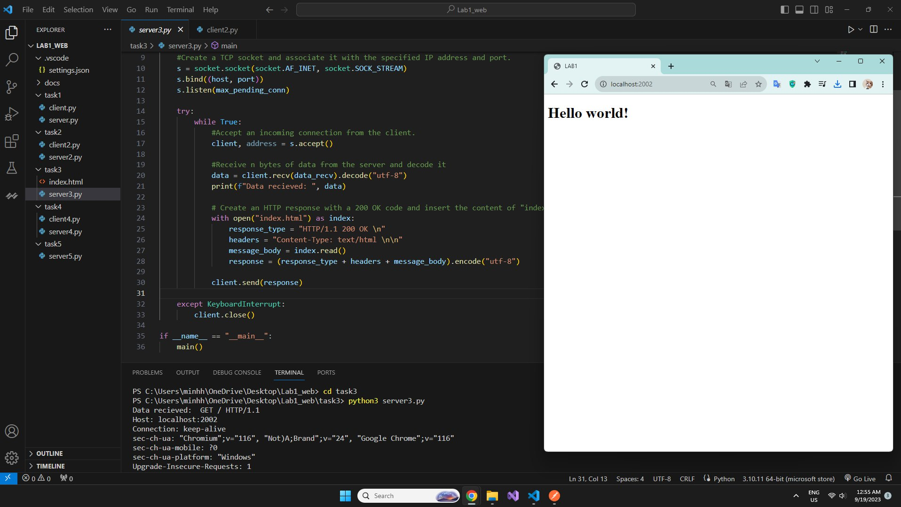

## Задача №3

Реализовать серверную часть приложения. Клиент подключается к серверу. 
В ответ клиент получает http-сообщение, содержащее html-страницу, 
которую сервер подгружает из файла index.html.

## Решение

1. Сервер

```python
import socket

port = 2002
data_recv = 2048
max_pending_conn = 8
host = "127.0.0.1"

def main():
    #Create a TCP socket and associate it with the specified IP address and port.
    s = socket.socket(socket.AF_INET, socket.SOCK_STREAM)
    s.bind((host, port))
    s.listen(max_pending_conn)

    try:
        while True:
            #Accept an incoming connection from the client.
            client, address = s.accept()

            #Receive n bytes of data from the server and decode it
            data = client.recv(data_recv).decode("utf-8")
            print(f"Data recieved: ", data)
            
            # Create an HTTP response with a 200 OK code and insert the content of "index.html" into the response.
            with open("index.html") as index:
                response_type = "HTTP/1.1 200 OK \n"
                headers = "Content-Type: text/html \n\n"
                message_body = index.read()
                response = (response_type + headers + message_body).encode("utf-8")
            
            client.send(response)
            
    except KeyboardInterrupt:
        client.close()

if __name__ == "__main__":
    main()
```

## Демонстрация работы
