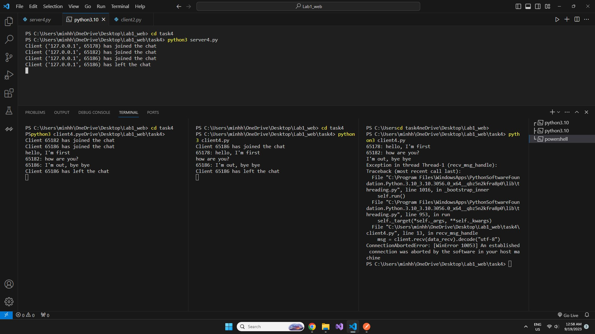

## Задача №3

Реализовать двухпользовательский или многопользовательский чат. 
Реализация многопользовательского чата позволяет получить максимальное количество баллов.


## Решение

1. Сервер

```python
import socket
import threading

port = 2002
data_recv = 2048
host = "127.0.0.1"
max_pending_conn = 8
lock = threading.Lock() #Synchronizing Threads
clients_list = []

def announce(msg):
    global clients_list
    for c in clients_list:
        c.send(msg.encode("utf-8"))

#Function for handling sending messages between clients.
def send_msg_handle(client, address):
    global clients_list
    while True:
        try:
            #Receive data from the client.
            msg = client.recv(data_recv).decode("utf-8")

            #Check if message is null
            if not msg:
                raise Exception

            #Send a message from the client to all other clients.
            with lock:
                for c in clients_list:
                    if c != client:
                        c.send(f"{address[1]}: {msg}".encode("utf-8"))
        except:
            tmp = clients_list
            clients_list = [i for i in tmp if i != client]
            print(f"Client {address} has left the chat")
            announce(f"Client {address[1]} has left the chat")
            break

def main():
    global clients_list

    #Create a TCP socket and associate it with the specified IP address and port.
    s = socket.socket(socket.AF_INET, socket.SOCK_STREAM)
    s.bind((host, port))
    s.listen(max_pending_conn)

    while True:
        try:
            #Accept an incoming connection from the client.
            client, address = s.accept()
            print(f"Client {address} has joined the chat")
            announce(f"Client {address[1]} has joined the chat")

            #Add the client socket to the list of clients.
            with lock:
                clients_list.append(client)
            
            #Start a separate thread to handle sending messages between clients.
            threading.Thread(target=send_msg_handle, args=(
                client, address)).start()
        except KeyboardInterrupt:
            s.close()
            break

if __name__ == "__main__":
    main()

```

2. Клиент

```python
import socket
import threading

port = 2002
data_recv = 2048
host = "127.0.0.1"
lock = threading.Lock()

#Function for handling incoming messages from the server
def recv_msg_handle(client):
    while True:
        #Receive a message from the server and decode it from a byte string
        msg = client.recv(data_recv).decode("utf-8")
        print(msg)

def main():
    #Create a TCP socket and establish a connection to the server.
    s = socket.socket(socket.AF_INET, socket.SOCK_STREAM)
    s.connect((host, port))

    #Create a separate thread to receive messages from the server
    receive_thread = threading.Thread(target=recv_msg_handle, args=(s,))
    receive_thread.start()

    while True:
        try:
            #Read the message from the keyboard
            message = input()

            #Encoding it into bytes and send the message to the server
            s.send(message.encode("utf-8"))

        except KeyboardInterrupt:
            s.close()
            break

if __name__ == "__main__":
    main()
```


## Демонстрация работы
