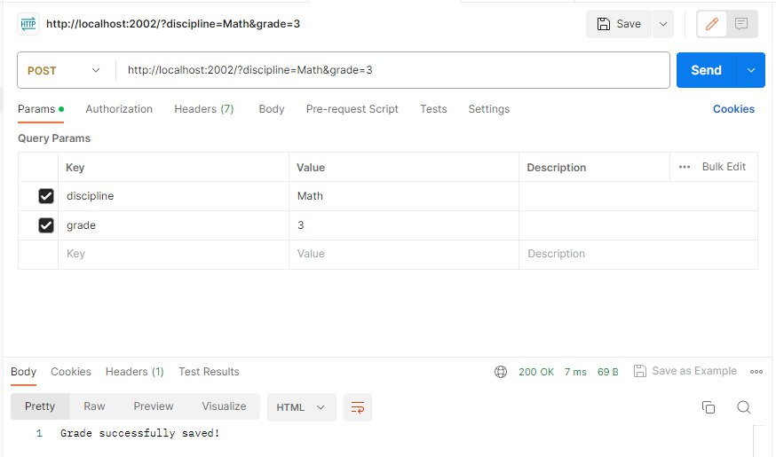
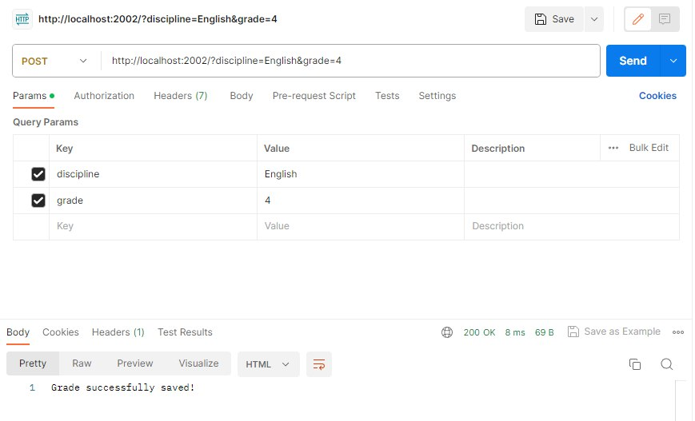
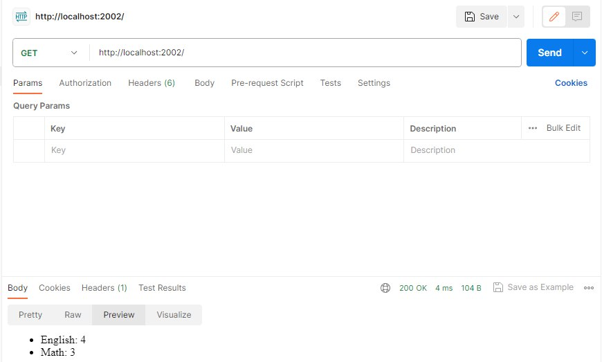

## Задание №5

Необходимо написать простой web-сервер для обработки GET и POST http
запросов средствами Python и библиотеки socket.

## Решение

1. http-server

```python
import socket

class MyHTTPServer:
    #The constructor of the MyHTTPServer class. It creates a socket object and sets options for it, then binds the socket to the given address and port, and listens on that port. Additionally, it initializes a dictionary (self.grades) to store the scores.
    def __init__(self, host, port):
        self.conn = socket.socket(socket.AF_INET, socket.SOCK_STREAM)
        self.conn.setsockopt(socket.SOL_SOCKET, socket.SO_REUSEADDR, 1)
        self.conn.bind((host, port))
        self.conn.listen(1)
        self.grades = {}

    #This function is the main loop of the server. It listens for and accepts connections from clients and calls the serve_client function to serve the client's request.
    def serve_forever(self):
        while True:
            client, address = self.conn.accept()
            self.serve_client(client)

    #This function reads data sent from the client, then calls the parse_request function to parse the HTTP request.
    def serve_client(self, client):
        data = client.recv(1024).decode("utf-8")
        self.parse_request(client, data)

    #This function parses the HTTP request to extract the method, URL, and HTTP version. It also tries to extract parameters from the URL if any.
    def parse_request(self, client, data):
        lines = data.split("\n")
        method, url, version = lines[0].split()
        params = (
            {p.split("=")[0]: p.split("=")[1] for p in url.split("?")[1].split("&")}
            if "?" in url
            else None
        )
        self.handle_request(client, method, params)

    #This function processes the HTTP request based on the method (GET or POST) and extracted parameters. If the method is GET, it sends the score list as HTML. If the method is POST, it stores the grade into the self.grades dictionary and sends a confirmation message.
    def handle_request(self, client, method, params):
        if method == "GET":
            self.send_response(client, 200, "OK", self.grades_to_html())
        elif method == "POST":
            discipline = params.get("discipline")
            grade = params.get("grade")
            self.grades[discipline] = grade
            self.send_response(client, 200, "OK", "Grade successfully saved!")
        else:
            self.send_response(client, 404, "Not Found", "Incorrect method, try a different method.")

    #This function sends an HTTP response to the client with a status code, reason, and specific content. The response is sent as an HTTP string.
    def send_response(self, client, code, reason, body):
        response = f"HTTP/1.1 {code} {reason}\nContent-Type: text/html\n\n{body}"
        client.send(response.encode("utf-8"))
        client.close()

    #This function creates an HTML page containing a list of grades from the self.grades dictionary.
    def grades_to_html(self):
        page = (
            f"<html><body><ul>"
            f"{''.join([f'<li>{discipline}: {grade}' for discipline, grade in self.grades.items()])}"
            f"</ul></body></html>"
        )
        return page


def main():
    host = "127.0.0.1"
    port = 2002
    server = MyHTTPServer(host, port)
    try:
        server.serve_forever()
    except KeyboardInterrupt:
        server.conn.close()
        
if __name__ == "__main__":
    main()
```

## Демонстрация работы


