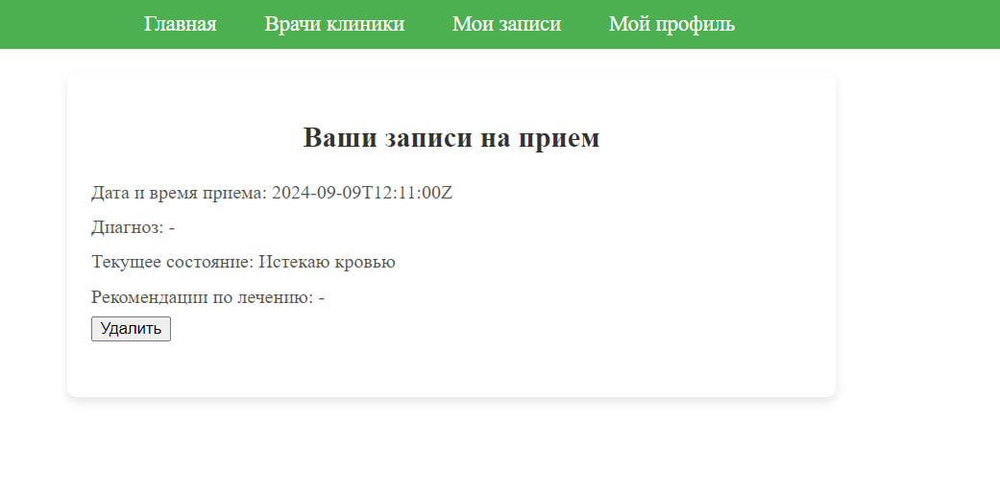
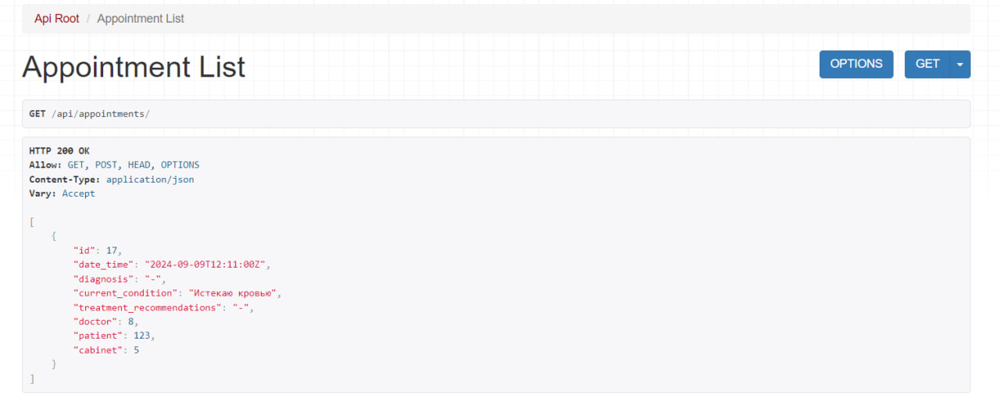

# ListAppointment.vue




``` 
<template>
  <div>
    <h2>Ваши записи на прием</h2>
    <ul v-if="appointments.length">
      <li v-for="(appointment, index) in appointments" :key="index">
        <p>Дата и время приема: {{ appointment.date_time }}</p>
        <p>Диагноз: {{ appointment.diagnosis }}</p>
        <p>Текущее состояние: {{ appointment.current_condition }}</p>
        <p>Рекомендации по лечению: {{ appointment.treatment_recommendations }}</p>
        <button @click="deleteAppointment(appointment.id)">Удалить</button>
      </li>
    </ul>
    <p v-else>Нет записей</p>
  </div>
</template>

<style scoped>
div {
  max-width: 600px;
  margin: 20px auto;
  padding: 20px;
  border-radius: 8px;
  box-shadow: 0 4px 8px rgba(0, 0, 0, 0.1);
  background-color: #fff;
}

h2 {
  text-align: center;
  color: #333;
  margin-bottom: 20px;
}

ul {
  list-style-type: none;
  padding: 0;
}

li {
  border-bottom: 1px solid #eee;
  padding-bottom: 10px;
  margin-bottom: 10px;
}

li:last-child {
  border-bottom: none;
}

p {
  margin: 5px 0;
  color: #555;
}

p strong {
  color: #333;
  font-weight: bold;
}

p v-else {
  text-align: center;
  color: #666;
}
</style>


<script>

import axios from 'axios';

export default {
  data() {
    return {
      appointments: [],
      token: null 
    }
  },
  methods: {
    async loginAndGetToken() {
  try {
    const userData = JSON.parse(localStorage.getItem('userData'));
    if (!userData || !userData.username || !userData.password) {
      console.error('Данные пользователя не найдены в localStorage.');
      return;
    }
    console.log('Отправка данных для аутентификации:', userData); 

    const response = await axios.post('http://127.0.0.1:8000/auth/token/login/', {
      username: userData.username,
      password: userData.password,
    });

    if (response.data && response.data.auth_token) {
      this.token = response.data.auth_token;
      
    } else {
      console.error('Токен не найден в ответе сервера:', response.data);
    }
  } catch (error) {
    console.error('Ошибка при получении токена:', error.response ? error.response.data : error);
  }
},
    getProfile() {
      const userData = JSON.parse(localStorage.getItem('userData'));
      if (!userData || !userData.id) {
        console.error('Данные пользователя не найдены в localStorage.');
        return;
      }

      const token = localStorage.getItem('authToken'); 
      if (!token) {
        console.error('Токен не найден в localStorage.');
        return;
      }

      axios.get(`http://127.0.0.1:8000/api/appointments/?patient=${userData.id}`, {
        headers: {
          Authorization: `Token ${token}`,
        }
      })
      .then(response => {
        this.appointments = response.data;
      })
      .catch(error => {
        console.error('Ошибка:', error);
      });
    },
  async deleteAppointment(appointmentId) {
  if (!this.token) {
    console.error('Токен не найден');
    return;
  }

  try {
    const response = await axios.delete(`http://127.0.0.1:8000/api/appointments/${appointmentId}/`, {
      headers: {
        Authorization: `Token ${this.token}`
      }
    });

    if (response.status === 204) {
      this.appointments = this.appointments.filter(appointment => appointment.id !== appointmentId);
    }
  } catch (error) {
    console.error('Ошибка при удалении записи:', error);
  }
},
  },
  mounted() {
    this.loginAndGetToken();
    this.getProfile();
  }
}
</script>
```