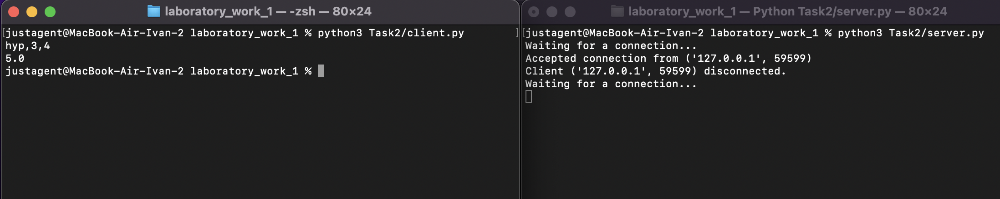
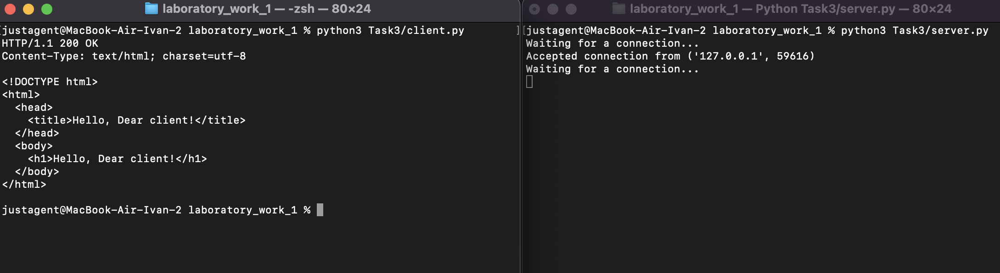
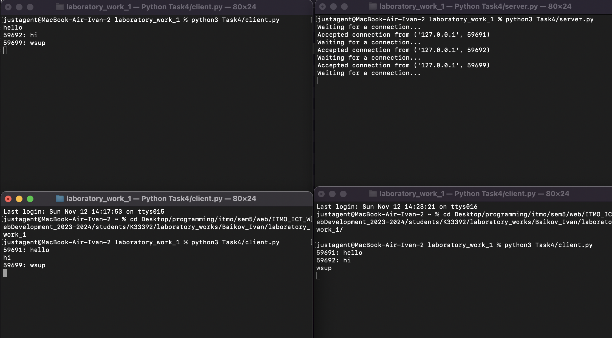
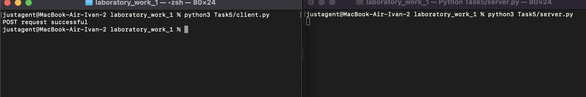

# Задание 1

Реализовать клиентскую и серверную часть приложения. Клиент отсылает серверу
сообщение «Hello, server». Сообщение должно отразиться на стороне сервера.
Сервер в ответ отсылает клиенту сообщение «Hello, client». Сообщение должно
отобразиться у клиента.

Обязательно использовать библиотеку socket

Реализовать с помощью протокола UDP

## Ход выполнения работы

### Код server.py

```python
    from socket import *

    ip = '127.0.0.1'
    port = 3000

    server = socket(AF_INET, SOCK_DGRAM)
    server.bind((ip, port))

    while True:
        msg, addr = server.recvfrom(1024)
        print(msg.decode("utf-8"))
        server.sendto(b"Hello, client", addr)
```

### Код client.py

```python
    from socket import *

    ip= '127.0.0.1'
    port = 3000

    client = socket(AF_INET, SOCK_DGRAM)
    client.connect((ip, port))
    client.send(b"Hello, server")
    server_message = client.recvfrom(1024)
    msg = server_message[0].decode()
    print(msg)
```

## Результат


# Задание 2

Реализовать клиентскую и серверную часть приложения. Клиент запрашивает у
сервера выполнение математической операции, параметры, которые вводятся с
клавиатуры. Сервер обрабатывает полученные данные и возвращает результат
клиенту. Вариант: Теорема Пифагора

Обязательно использовать библиотеку socket

Реализовать с помощью протокола TCP

## Ход выполнения работы

### Код server.py

```python
    from socket import *
    from calculate import calculate

    if __name__ == "__main__":
        ip = '127.0.0.1'
        port = 3000

        server = socket(AF_INET, SOCK_STREAM)
        server.bind((ip, port))
        server.listen()

        while True:
            try:
                print("Waiting for a connection...")
                client, addr = server.accept()
                print(f"Accepted connection from {addr}")

                while True:
                    data = client.recv(1024).decode("utf-8")

                    if not data:
                        print(f"Client {addr} disconnected.")
                        break

                    operation, a, b = data.split(',')
                    a, b = float(a), float(b)

                    if operation == "hyp":
                        result = calculate(cath1=a, cath2=b)
                    elif operation == "cath":
                        result = calculate(cath1=a, hyp=b)
                    else:
                        result = "Invalid operation"

                    client.send(bytes(str(result), encoding="utf-8"))

            except KeyboardInterrupt:
                print("Server terminated by user.")
                break
            except Exception as e:
                print(f"Error: {e}")

        server.close()

```

### Код client.py

```python
    from socket import *
    if __name__ == "__main__":
        ip= '127.0.0.1'
        port = 3000

        client = socket(AF_INET, SOCK_STREAM)
        client.connect((ip, port))

        input = input()

        client.sendall(input.encode())

        answer = client.recv(1024).decode()
        print(answer)
```

## Результат



# Задание 3

Реализовать серверную часть приложения. Клиент подключается к серверу. В ответ
клиент получает http-сообщение, содержащее html-страницу, которую сервер
подгружает из файла index.html.

Обязательно использовать библиотеку socket

## Ход выполнения работы

### Код server.py

```python
    from socket import *
    content = open("Task3/index.html").read()

    if __name__ == "__main__":
        ip = '127.0.0.1'
        port = 3000

        server = socket(AF_INET, SOCK_STREAM)
        server.bind((ip, port))
        server.listen()

        while True:
            try:
                print("Waiting for a connection...")
                client, addr = server.accept()
                print(f"Accepted connection from {addr}")

                response = "HTTP/1.1 200 OK\nContent-Type: text/html; charset=utf-8\n\n" + content

                client.send(response.encode())

                client.close()

            except KeyboardInterrupt:
                print("Server terminated by user.")
                break
            except Exception as e:
                print(f"Error: {e}")

        server.close()

```

### Код client.py

```python
    from socket import *
    if __name__ == "__main__":
        ip= '127.0.0.1'
        port = 3000

        client = socket(AF_INET, SOCK_STREAM)
        client.connect((ip, port))

        request = "GET / HTTP/1.1\r\nHost: localhost\r\n\r\n"
        client.send(request.encode('utf-8'))

        response = client.recv(1024).decode('utf-8')
        print(response)

```

### Код index.html

```html
<!DOCTYPE html>
<html>
  <head>
    <title>Hello, Dear client!</title>
  </head>
  <body>
    <h1>Hello, Dear client!</h1>
  </body>
</html>
```

## Результат



# Задание 4

Реализовать двухпользовательский или многопользовательский чат. Реализация
многопользовательского часа позволяет получить максимальное количество
баллов.

Обязательно использовать библиотеку threading

## Ход выполнения работы

### Код server.py

```python
    import socket
    import threading

    if __name__ == "__main__":
        clients_list = []
        lock = threading.Lock()

        server_ip = "127.0.0.1"
        server_port = 3003

        def send_message_handler(client, addr, clients_list):
            while True:
                data = client.recv(1024).decode("utf-8")
                if not data:
                    break
                with lock:
                    for c in clients_list:
                        if c != client:
                            c.send(f"{addr[1]}: {data}".encode("utf-8"))

        conn = socket.socket(socket.AF_INET, socket.SOCK_STREAM)
        conn.setsockopt(socket.SOL_SOCKET, socket.SO_REUSEADDR, 1)
        conn.bind((server_ip, server_port))
        conn.listen(10)

        while True:
            try:
                print("Waiting for a connection...")
                client, addr = conn.accept()
                print(f"Accepted connection from {addr}")
                with lock:
                    clients_list.append(client)
                threading.Thread(target=send_message_handler, args=(client, addr, clients_list)).start()
            except KeyboardInterrupt:
                conn.close()
                break
```

## Код client.py

```python
    from socket import *
    from threading import *

    def message_handler(client):
        while True:
            msg = client.recv(1024).decode("utf-8")
            print(msg)


    if __name__ == "__main__":
        ip= '127.0.0.1'
        port = 3003

        conn = socket(AF_INET, SOCK_STREAM)
        conn.connect((ip, port))

        receive_thread = Thread(target=message_handler, args=(conn,))
        receive_thread.start()

        while True:
            try:
                message = input()
                conn.send(message.encode("utf-8"))

            except KeyboardInterrupt:
                conn.close()
                print("Terminated by user.")
                break
            except Exception as e:
                print(f"Error: {e}")
                break

```

## Результат



# Задание 5

Необходимо написать простой web-сервер для обработки GET и POST http
запросов средствами Python и библиотеки socket.

Задание: сделать сервер, который может:
● Принять и записать информацию о дисциплине и оценке по дисциплине.
● Отдать информацию обо всех оценах по дсициплине в виде html-страницы.

## Ход выполнения работы

### Код server.py

```python
    import socket

    class MyHTTPServer:
        def __init__(self, server_ip, server_port, num_listen=1):
            self.conn = socket.socket(socket.AF_INET, socket.SOCK_STREAM)
            self.conn.setsockopt(socket.SOL_SOCKET, socket.SO_REUSEADDR, 1)
            self.conn.bind((host, port))
            self.conn.listen(num_listen)
            self.grades = {}

        def serve_forever(self):
            while True:
                client, addr = self.conn.accept()
                self.serve_client(client)

        def serve_client(self, client):
            data = client.recv(2 * 16384).decode(encoding="utf-8", errors="ignore")
            self.parse_request(client, data)

        def parse_request(self, client, data):
            lines = data.split("\n")
            method, url, version = lines[0].split()

            if method == "GET":
                params = (
                    {p.split("=")[0]: p.split("=")[1] for p in url.split("?")[1].split("&")}
                    if "?" in url
                    else None
                )
            elif method == "POST":
                body = data.split("\n")[-1]
                params = {p.split("=")[0]: p.split("=")[1] for p in body.split("&")}
            else:
                params = None

            self.handle_request(client, method, params)

        def handle_request(self, client, method, params):
            if method == "GET":
                self.send_response(client, 200, "OK", self.grades_to_html())
            elif method == "POST":
                discipline = params.get("discipline")
                grade = params.get("grade")
                self.grades[discipline] = grade
                self.send_response(client, 200, "OK", "Содержимое сохранено!")
            else:
                self.send_response(client, 404, "Not Found", "Некорректный метод, попробуйте снова.")

        def send_response(self, client, code, reason, body):
            response = f"HTTP/1.1 {code} {reason}\nContent-Type: text/html\n\n{body}"
            client.send(response.encode("utf-8"))
            client.close()

        def grades_to_html(self):
            page = (
                f"<html><body><p>Grades:</p><ul>"
                f"{''.join([f'<li>{discipline}: {grade}' for discipline, grade in self.grades.items()])}"
                f"</ul></body></html>"
            )
            return page

    if __name__ == "__main__":
        host = "127.0.0.1"
        port = 3000
        server = MyHTTPServer(host, port)
        try:
            server.serve_forever()
        except KeyboardInterrupt:
            server.conn.close()
```

### Код client.py

```python
    import requests

    if __name__ == "__main__":
        url = "http://localhost:3000"
        params = {
            "discipline": "math",
            "grade": "3"
        }

        try:
            response = requests.post(url, data=params)

            if response.status_code == 200:
                print("POST request successful")
            else:
                print(f"POST request failed with status code: {response.status_code}")

        except Exception as e:
            print(f"An error occurred: {e}")

```

## Результат



