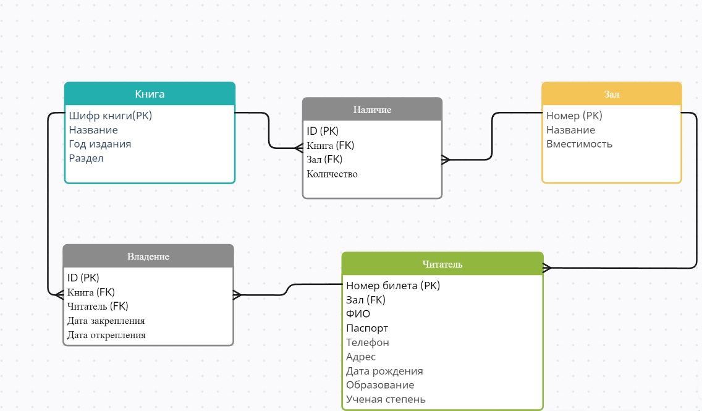
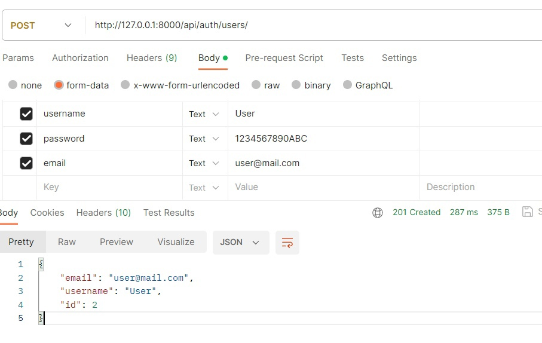
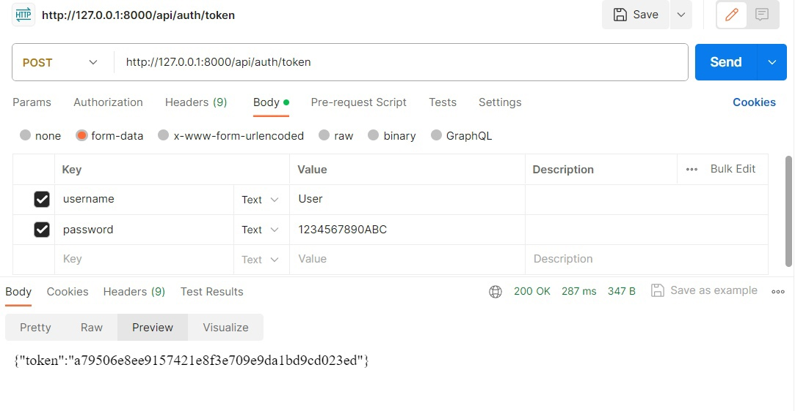
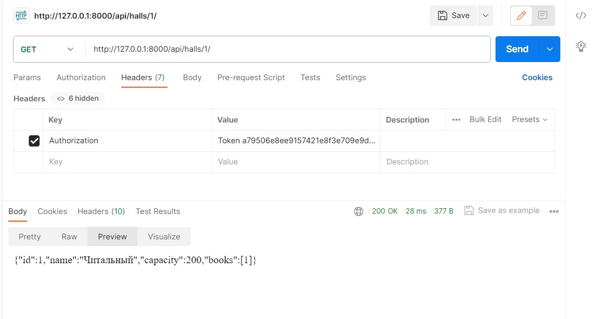
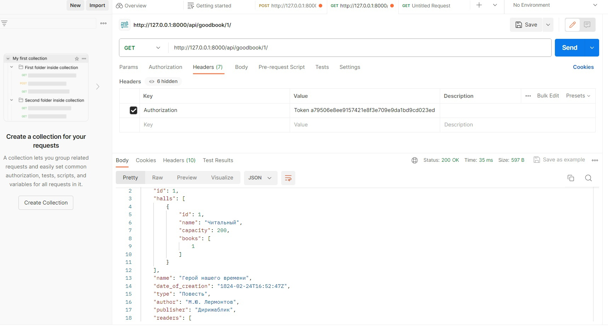

# Задание

```
Создать программную систему, предназначенную для работников библиотеки.
Такая система должна обеспечивать хранение сведений об имеющихся в библиотеке
книгах, о читателях библиотеки и читальных залах.
Для каждой книги в БД должны храниться следующие сведения: название книги,
автор (ы), издательство, год издания, раздел, число экземпляров этой книги в каждом зале
библиотеки, а также шифр книги и дата закрепления книги за читателем. Книги могут
перерегистрироваться в другом зале.
Сведения о читателях библиотеки должны включать номер читательского билета,
ФИО читателя, номер паспорта, дату рождения, адрес, номер телефона, образование,
наличие ученой степени.
Читатели закрепляются за определенным залом, могут переписаться в другой зал и
могут записываться и выписываться из библиотеки.
Библиотека имеет несколько читальных залов, которые характеризуются номером,
названием и вместимостью, то есть количеством людей, которые могут одновременно
работать в зале.
Библиотека может получать новые книги и списывать старые. Шифр книги может
измениться в результате переклассификации, а номер читательского билета в результате
перерегистрации.
```

## Схема базы данных



## Сериалайзеры

```python
from rest_framework import serializers

from library_app.models import Book, Reader, Hall, Ownership, Availability


class BookSerializer(serializers.ModelSerializer):
    class Meta:
        model = Book
        fields = '__all__'

class ReaderSerializer(serializers.ModelSerializer):
    class Meta:
        model = Reader
        fields = '__all__'

class HallSerializer(serializers.ModelSerializer):
    class Meta:
        model = Hall
        fields = '__all__'

class OwnershipSerializer(serializers.ModelSerializer):
    class Meta:
        model = Ownership
        fields = '__all__'

class AvailabilitySerializer(serializers.ModelSerializer):
    class Meta:
        model = Availability
        fields = '__all__'


class GoodBookSerializer(serializers.ModelSerializer):
    halls = HallSerializer(many=True)
    class Meta:
        model = Book
        fields = '__all__'


```

## API view

```python
from django.shortcuts import render
from rest_framework import generics, status, permissions
from rest_framework.response import Response
from rest_framework.views import APIView

from library_app.models import Book, Hall, Reader, Ownership, Availability
from library_app.serializers import BookSerializer, HallSerializer, ReaderSerializer, OwnershipSerializer, \
    AvailabilitySerializer, GoodBookSerializer


class BookListView(generics.ListAPIView):
    queryset = Book.objects.all()
    serializer_class = BookSerializer
    permission_classes = [permissions.IsAuthenticated, ]

class BookRetrieveView(generics.RetrieveAPIView):
    queryset = Book.objects.all()
    serializer_class = BookSerializer
    permission_classes = [permissions.IsAuthenticated, ]

class BookCreateView(generics.CreateAPIView):
    queryset = Book.objects.all()
    serializer_class = BookSerializer
    permission_classes = [permissions.IsAuthenticated, ]

class BookUpdateView(generics.UpdateAPIView):
    queryset = Book.objects.all()
    serializer_class = BookSerializer
    permission_classes = [permissions.IsAuthenticated, ]

class BookDeleteView(generics.DestroyAPIView):
    queryset = Book.objects.all()
    serializer_class = BookSerializer
    permission_classes = [permissions.IsAuthenticated, ]


class HallListView(generics.ListAPIView):
    queryset = Hall.objects.all()
    serializer_class = HallSerializer
    permission_classes = [permissions.IsAuthenticated, ]

class HallRetrieveView(generics.RetrieveAPIView):
    queryset = Hall.objects.all()
    serializer_class = HallSerializer
    permission_classes = [permissions.IsAuthenticated, ]

class HallCreateView(generics.CreateAPIView):
    queryset = Hall.objects.all()
    serializer_class = HallSerializer
    permission_classes = [permissions.IsAuthenticated, ]

class HallUpdateView(generics.UpdateAPIView):
    queryset = Hall.objects.all()
    serializer_class = HallSerializer
    permission_classes = [permissions.IsAuthenticated, ]

class HallDeleteView(generics.DestroyAPIView):
    queryset = Hall.objects.all()
    serializer_class = HallSerializer
    permission_classes = [permissions.IsAuthenticated, ]


class ReaderListView(generics.ListAPIView):
    queryset = Reader.objects.all()
    serializer_class = ReaderSerializer
    permission_classes = [permissions.IsAuthenticated, ]

class ReaderRetrieveView(generics.RetrieveAPIView):
    queryset = Reader.objects.all()
    serializer_class = ReaderSerializer
    permission_classes = [permissions.IsAuthenticated, ]

class ReaderCreateView(generics.CreateAPIView):
    queryset = Reader.objects.all()
    serializer_class = ReaderSerializer
    permission_classes = [permissions.IsAuthenticated, ]

class ReaderUpdateView(generics.UpdateAPIView):
    queryset = Reader.objects.all()
    serializer_class = ReaderSerializer
    permission_classes = [permissions.IsAuthenticated, ]

class ReaderDeleteView(generics.DestroyAPIView):
    queryset = Reader.objects.all()
    serializer_class = HallSerializer
    permission_classes = [permissions.IsAuthenticated, ]


class OwnershipListView(generics.ListAPIView):
    queryset = Ownership.objects.all()
    serializer_class = OwnershipSerializer
    permission_classes = [permissions.IsAuthenticated, ]

class OwnershipRetrieveView(generics.RetrieveAPIView):
    queryset = Ownership.objects.all()
    serializer_class = OwnershipSerializer
    permission_classes = [permissions.IsAuthenticated, ]

class OwnershipCreateView(generics.CreateAPIView):
    queryset = Ownership.objects.all()
    serializer_class = OwnershipSerializer
    permission_classes = [permissions.IsAuthenticated, ]

class OwnershipUpdateView(generics.UpdateAPIView):
    queryset = Ownership.objects.all()
    serializer_class = OwnershipSerializer
    permission_classes = [permissions.IsAuthenticated, ]

class OwnershipDeleteView(generics.DestroyAPIView):
    queryset = Ownership.objects.all()
    serializer_class = OwnershipSerializer
    permission_classes = [permissions.IsAuthenticated, ]


class AvailabilityListView(generics.ListAPIView):
    queryset = Availability.objects.all()
    serializer_class = AvailabilitySerializer
    permission_classes = [permissions.IsAuthenticated, ]

class AvailabilityRetrieveView(generics.RetrieveAPIView):
    queryset = Availability.objects.all()
    serializer_class = AvailabilitySerializer
    permission_classes = [permissions.IsAuthenticated, ]

class AvailabilityCreateView(generics.CreateAPIView):
    queryset = Availability.objects.all()
    serializer_class = AvailabilitySerializer
    permission_classes = [permissions.IsAuthenticated, ]

class AvailabilityUpdateView(generics.UpdateAPIView):
    queryset = Availability.objects.all()
    serializer_class = AvailabilitySerializer
    permission_classes = [permissions.IsAuthenticated, ]

class AvailabilityDeleteView(generics.DestroyAPIView):
    queryset = Availability.objects.all()
    serializer_class = AvailabilitySerializer
    permission_classes = [permissions.IsAuthenticated, ]

class LogOut(APIView):
    def get(self, request, format=None):
        request.user.auth_token.delete()
        return Response(status=status.HTTP_200_OK)


class GoodBookRetrieveView(generics.RetrieveAPIView):
    queryset = Book.objects.all()
    serializer_class = GoodBookSerializer
    permission_classes = [permissions.IsAuthenticated, ]

class AvailableBooks(generics.ListAPIView):

    serializer_class = BookSerializer
    permission_classes = [permissions.IsAuthenticated, ]
    def get_queryset(self):
       reader = self.kwargs['reader']
       reader = Reader.objects.get(pk=reader)
       books = reader.hall.books
       return books
```

## URLS

```python
from django.urls import path, include
from rest_framework.authtoken.views import obtain_auth_token
from .views import *

urlpatterns = [

    path('books/all/', BookListView.as_view(), name='books_list'),
    path('books/<int:pk>/', BookRetrieveView.as_view(), name='books_detail'),
    path('books/create/', BookCreateView.as_view(), name='books_create'),
    path('books/update/<int:pk>/', BookUpdateView.as_view(), name='books_update'),
    path('books/delete/<int:pk>/', BookDeleteView.as_view(), name='books_delete'),

    path('halls/all/', HallListView.as_view(), name='halls_list'),
    path('halls/<int:pk>/', HallRetrieveView.as_view(), name='halls_detail'),
    path('halls/create/', HallCreateView.as_view(), name='halls_create'),
    path('halls/update/<int:pk>/', HallUpdateView.as_view(), name='halls_update'),
    path('halls/delete/<int:pk>/', HallDeleteView.as_view(), name='halls_delete'),

    path('readers/all/', ReaderListView.as_view(), name='readers_list'),
    path('readers/<int:pk>/', ReaderRetrieveView.as_view(), name='readers_detail'),
    path('readers/create/', ReaderCreateView.as_view(), name='readers_create'),
    path('readers/update/<int:pk>/', ReaderUpdateView.as_view(), name='readers_update'),
    path('readers/delete/<int:pk>/', ReaderDeleteView.as_view(), name='readers_delete'),

    path('ownerships/all/', OwnershipListView.as_view(), name='ownerships_list'),
    path('ownerships/<int:pk>/', OwnershipRetrieveView.as_view(), name='ownerships_detail'),
    path('ownerships/create/', OwnershipCreateView.as_view(), name='ownerships_create'),
    path('ownerships/update/<int:pk>/', OwnershipUpdateView.as_view(), name='ownerships_update'),
    path('ownerships/delete/<int:pk>/', OwnershipDeleteView.as_view(), name='ownerships_delete'),

    path('availabilities/all/', AvailabilityListView.as_view(), name='availabilities_list'),
    path('availabilities/<int:pk>/', AvailabilityRetrieveView.as_view(), name='availabilities_detail'),
    path('availabilities/create/', AvailabilityCreateView.as_view(), name='availabilities_create'),
    path('availabilities/update/<int:pk>/', AvailabilityUpdateView.as_view(), name='availabilities_update'),
    path('availabilities/delete/<int:pk>/', AvailabilityDeleteView.as_view(), name='availabilities_delete'),

    path('good_book/<int:pk>/', GoodBookRetrieveView.as_view(), name='good_book'),
    path('available_books/<int:reader>/', AvailableBooks.as_view(), name='available_books'),

    path('auth/', include('djoser.urls')),
    path('auth/token', obtain_auth_token, name='token'),
    path('logout', LogOut.as_view()),
]
```

##Примеры выполнения работы
###Авторизация пользователя


### Получение токена



###Просмотр зала по id


### Подробный просмотр книги с залами, в которых она доступна



### Список доступных определенному читателю книг


