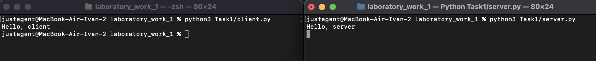

# Задание 1

Реализовать клиентскую и серверную часть приложения. Клиент отсылает серверу
сообщение «Hello, server». Сообщение должно отразиться на стороне сервера.
Сервер в ответ отсылает клиенту сообщение «Hello, client». Сообщение должно
отобразиться у клиента.

Обязательно использовать библиотеку socket

Реализовать с помощью протокола UDP

## Ход выполнения работы

### Код server.py

```python
    from socket import *

    ip = '127.0.0.1'
    port = 3000

    server = socket(AF_INET, SOCK_DGRAM)
    server.bind((ip, port))

    while True:
        msg, addr = server.recvfrom(1024)
        print(msg.decode("utf-8"))
        server.sendto(b"Hello, client", addr)
```

### Код client.py

```python
    from socket import *

    ip= '127.0.0.1'
    port = 3000

    client = socket(AF_INET, SOCK_DGRAM)
    client.connect((ip, port))
    client.send(b"Hello, server")
    server_message = client.recvfrom(1024)
    msg = server_message[0].decode()
    print(msg)
```

## Результат


