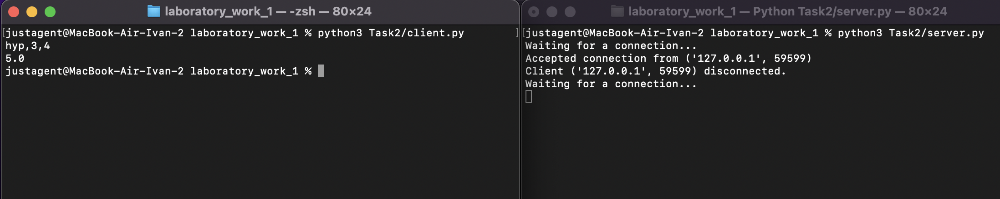

# Задание 2

Реализовать клиентскую и серверную часть приложения. Клиент запрашивает у
сервера выполнение математической операции, параметры, которые вводятся с
клавиатуры. Сервер обрабатывает полученные данные и возвращает результат
клиенту. Вариант: Теорема Пифагора

Обязательно использовать библиотеку socket

Реализовать с помощью протокола TCP

## Ход выполнения работы

### Код server.py

```python
    from socket import *
    from calculate import calculate

    if __name__ == "__main__":
        ip = '127.0.0.1'
        port = 3000

        server = socket(AF_INET, SOCK_STREAM)
        server.bind((ip, port))
        server.listen()

        while True:
            try:
                print("Waiting for a connection...")
                client, addr = server.accept()
                print(f"Accepted connection from {addr}")

                while True:
                    data = client.recv(1024).decode("utf-8")

                    if not data:
                        print(f"Client {addr} disconnected.")
                        break

                    operation, a, b = data.split(',')
                    a, b = float(a), float(b)

                    if operation == "hyp":
                        result = calculate(cath1=a, cath2=b)
                    elif operation == "cath":
                        result = calculate(cath1=a, hyp=b)
                    else:
                        result = "Invalid operation"

                    client.send(bytes(str(result), encoding="utf-8"))

            except KeyboardInterrupt:
                print("Server terminated by user.")
                break
            except Exception as e:
                print(f"Error: {e}")

        server.close()

```

### Код client.py

```python
    from socket import *
    if __name__ == "__main__":
        ip= '127.0.0.1'
        port = 3000

        client = socket(AF_INET, SOCK_STREAM)
        client.connect((ip, port))

        input = input()

        client.sendall(input.encode())

        answer = client.recv(1024).decode()
        print(answer)
```

## Результат


