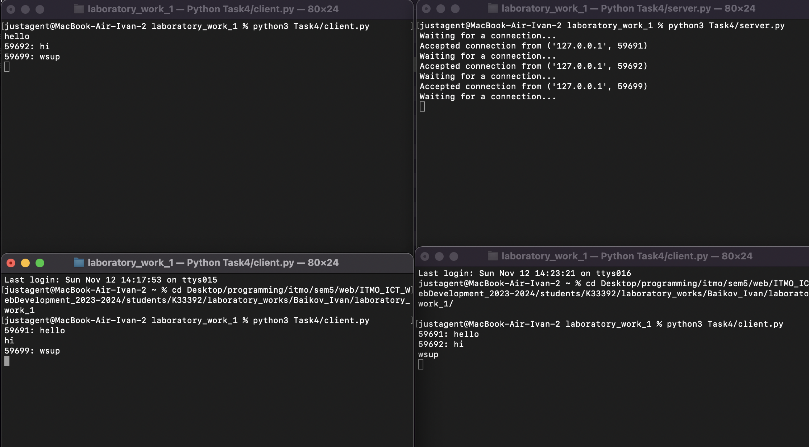

# Задание 4

Реализовать двухпользовательский или многопользовательский чат. Реализация
многопользовательского часа позволяет получить максимальное количество
баллов.

Обязательно использовать библиотеку threading

## Ход выполнения работы

### Код server.py

```python
    import socket
    import threading

    if __name__ == "__main__":
        clients_list = []
        lock = threading.Lock()

        server_ip = "127.0.0.1"
        server_port = 3003

        def send_message_handler(client, addr, clients_list):
            while True:
                data = client.recv(1024).decode("utf-8")
                if not data:
                    break
                with lock:
                    for c in clients_list:
                        if c != client:
                            c.send(f"{addr[1]}: {data}".encode("utf-8"))

        conn = socket.socket(socket.AF_INET, socket.SOCK_STREAM)
        conn.setsockopt(socket.SOL_SOCKET, socket.SO_REUSEADDR, 1)
        conn.bind((server_ip, server_port))
        conn.listen(10)

        while True:
            try:
                print("Waiting for a connection...")
                client, addr = conn.accept()
                print(f"Accepted connection from {addr}")
                with lock:
                    clients_list.append(client)
                threading.Thread(target=send_message_handler, args=(client, addr, clients_list)).start()
            except KeyboardInterrupt:
                conn.close()
                break
```

## Код client.py

```python
    from socket import *
    from threading import *

    def message_handler(client):
        while True:
            msg = client.recv(1024).decode("utf-8")
            print(msg)


    if __name__ == "__main__":
        ip= '127.0.0.1'
        port = 3003

        conn = socket(AF_INET, SOCK_STREAM)
        conn.connect((ip, port))

        receive_thread = Thread(target=message_handler, args=(conn,))
        receive_thread.start()

        while True:
            try:
                message = input()
                conn.send(message.encode("utf-8"))

            except KeyboardInterrupt:
                conn.close()
                print("Terminated by user.")
                break
            except Exception as e:
                print(f"Error: {e}")
                break

```

## Результат


