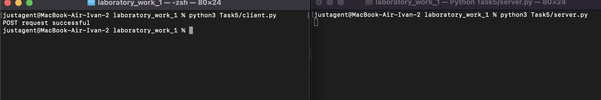

# Задание 5

Необходимо написать простой web-сервер для обработки GET и POST http
запросов средствами Python и библиотеки socket.

Задание: сделать сервер, который может:
● Принять и записать информацию о дисциплине и оценке по дисциплине.
● Отдать информацию обо всех оценах по дсициплине в виде html-страницы.

## Ход выполнения работы

### Код server.py

```python
    import socket

    class MyHTTPServer:
        def __init__(self, server_ip, server_port, num_listen=1):
            self.conn = socket.socket(socket.AF_INET, socket.SOCK_STREAM)
            self.conn.setsockopt(socket.SOL_SOCKET, socket.SO_REUSEADDR, 1)
            self.conn.bind((host, port))
            self.conn.listen(num_listen)
            self.grades = {}

        def serve_forever(self):
            while True:
                client, addr = self.conn.accept()
                self.serve_client(client)

        def serve_client(self, client):
            data = client.recv(2 * 16384).decode(encoding="utf-8", errors="ignore")
            self.parse_request(client, data)

        def parse_request(self, client, data):
            lines = data.split("\n")
            method, url, version = lines[0].split()

            if method == "GET":
                params = (
                    {p.split("=")[0]: p.split("=")[1] for p in url.split("?")[1].split("&")}
                    if "?" in url
                    else None
                )
            elif method == "POST":
                body = data.split("\n")[-1]
                params = {p.split("=")[0]: p.split("=")[1] for p in body.split("&")}
            else:
                params = None

            self.handle_request(client, method, params)

        def handle_request(self, client, method, params):
            if method == "GET":
                self.send_response(client, 200, "OK", self.grades_to_html())
            elif method == "POST":
                discipline = params.get("discipline")
                grade = params.get("grade")
                self.grades[discipline] = grade
                self.send_response(client, 200, "OK", "Содержимое сохранено!")
            else:
                self.send_response(client, 404, "Not Found", "Некорректный метод, попробуйте снова.")

        def send_response(self, client, code, reason, body):
            response = f"HTTP/1.1 {code} {reason}\nContent-Type: text/html\n\n{body}"
            client.send(response.encode("utf-8"))
            client.close()

        def grades_to_html(self):
            page = (
                f"<html><body><p>Grades:</p><ul>"
                f"{''.join([f'<li>{discipline}: {grade}' for discipline, grade in self.grades.items()])}"
                f"</ul></body></html>"
            )
            return page

    if __name__ == "__main__":
        host = "127.0.0.1"
        port = 3000
        server = MyHTTPServer(host, port)
        try:
            server.serve_forever()
        except KeyboardInterrupt:
            server.conn.close()
```

### Код client.py

```python
    import requests

    if __name__ == "__main__":
        url = "http://localhost:3000"
        params = {
            "discipline": "math",
            "grade": "3"
        }

        try:
            response = requests.post(url, data=params)

            if response.status_code == 200:
                print("POST request successful")
            else:
                print(f"POST request failed with status code: {response.status_code}")

        except Exception as e:
            print(f"An error occurred: {e}")

```

## Результат



