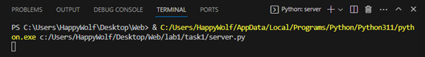
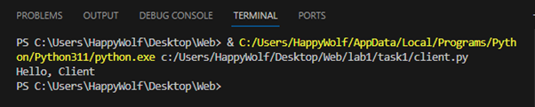
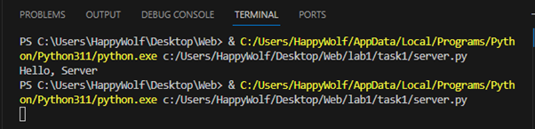

##Задание 1
Реализовать клиентскую и серверную часть приложения. Клиент отсылает серверу
    сообщение «Hello, server». Сообщение должно отразиться на стороне сервера.
    Сервер в ответ отсылает клиенту сообщение «Hello, client». Сообщение должно
    отобразиться у клиента.
    Обязательно использовать библиотеку socket
    Реализовать с помощью протокола UDP

##Сервер
```py
import socket

IP = "127.0.0.1"

PORT = 14900
buffSize = 16384

listener = socket.socket(socket.AF_INET, socket.SOCK_DGRAM)

IP = socket.gethostbyname(socket.gethostname())
#print(IP)

listener.bind((IP, PORT))

data = (listener.recvfrom(buffSize))
print(data[0].decode("utf-8"))
address = data[1]

ms = "Hello, Client"
listener.sendto(ms.encode('utf-8'), address)
```

##Клиент
```py
import socket
from time import sleep

serverIP = "192.168.56.1"
PORT = 14900
buffSize = 16384

connection = socket.socket(socket.AF_INET, socket.SOCK_DGRAM)
connection.connect((serverIP, PORT))

ms = "Hello, Server"
connection.sendto(ms.encode('utf-8'), (serverIP, PORT) )

data = (connection.recv(buffSize)).decode("utf-8")
print(data)
```

##Пример работы


