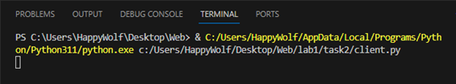
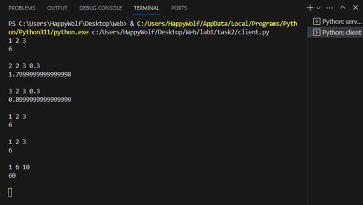

##Задание 2
Реализовать клиентскую и серверную часть приложения. Клиент запрашивает у
сервера выполнение математической операции, параметры, которые вводятся с
клавиатуры. Сервер обрабатывает полученные данные и возвращает результат
клиенту. Вариант: Поиск площади параллелограмма.
Обязательно использовать библиотеку socket
Реализовать с помощью протокола TCP

##Сервер
```py
import socket
from time import sleep

def Area(udata):
    rez = 0.0
    tp = int(udata[0])
    match tp:
        case 1:
            rez = int(udata[1]) * int(udata[2])
        case 2:
            rez = int(udata[1]) * int(udata[2]) * float(udata[3])
        case 3:
            rez = 0.5 * int(udata[1]) * int(udata[2]) * float(udata[3])
        case _:
            rez = -1
    
    rezMs = ""
    if (rez == -1):
        rezMs = "Error"
    else:
        rezMs = str(rez)
    
    return(rezMs)

IP = "127.0.0.1"

PORT = 14900
buffSize = 16384

listener = socket.socket(socket.AF_INET, socket.SOCK_STREAM)
listener.setsockopt(socket.SOL_SOCKET, socket.SO_REUSEADDR, 1)

IP = socket.gethostbyname(socket.gethostname())
print(IP)

listener.bind((IP, PORT))
listener.listen(10)

connection, address = listener.accept()

while True:
    try:
        data = connection.recv(16384).decode("utf-8")
        udata = list(data.split(' '))
        ms = Area(udata)
        connection.send(ms.encode("utf-8"))

    except KeyboardInterrupt:
        listener.close()
        print("Nope")
        break

```

##Клиент
```py
import socket
from time import sleep

serverIP = "192.168.56.1"
PORT = 14900
buffSize = 16384

connection = socket.socket(socket.AF_INET, socket.SOCK_STREAM)
connection.connect((serverIP, PORT))

while True:
    ms = input()
    connection.send(ms.encode('utf8'))
    data = connection.recv(buffSize)
    print(data.decode("utf-8") + '\n')

```


##Пример работы


